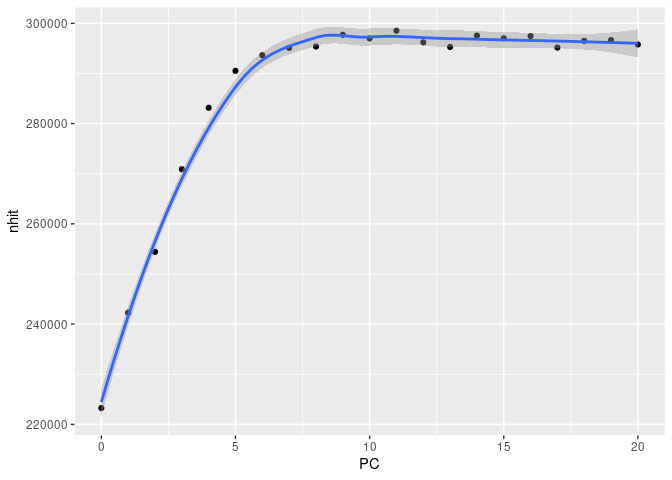

MatrixEQTL Data Prep
================

# TERRE

``` r
terre_ancestry <- fread("~/genotype_qc/TERRE_QC/raw_data.geno.maf.mind.sex_check.het_filter.ibd_filter.eigenvec")
terre_meta <- fread("/home1/NEURO/SHARE_DECIPHER/terre_meta_master.csv")
terre_ctp <- fread("/home1/NEURO/SHARE_DECIPHER/processed_DNAm_data/TERRE/TERRE_funnorm_processed/meta_TERRE_funnorm_robCTP.txt")
terre_meta$IID <- gsub(".*_(PAE.*)","\\1",terre_meta$IID)
terre_meta <- terre_meta %>% right_join(terre_ancestry,by=c("IID"="V2")) %>% left_join(terre_ctp[,.(patient,CTP_PC1, CTP_PC2, CTP_PC3, CTP_PC4, CTP_PC5)],by="patient")
load("/home1/NEURO/SHARE_DECIPHER/processed_DNAm_data/TERRE/TERRE_funnorm_processed/betas_combat.RData")#betas_combat
genotype <- fread("terre_data/raw_data.imputed.r2_30.maf_mismatch.traw")
```

## Match Samples

``` r
colnames(genotype) <- gsub(".*_(PAE.*)","\\1",colnames(genotype))
colnames(genotype)
```

    ##   [1] "CHR"       "SNP"       "(C)M"      "POS"       "COUNTED"   "ALT"      
    ##   [7] "PAE_015_1" "PAE_015_2" "PAE_015_3" "PAE_037_1" "PAE_037_2" "PAE_037_3"
    ##  [13] "PAE_037_4" "PAE_038_1" "PAE_038_2" "PAE_038_3" "PAE_041_1" "PAE_041_2"
    ##  [19] "PAE_041_3" "PAE_041_4" "PAE_043_1" "PAE_043_2" "PAE_043_3" "PAE_043_4"
    ##  [25] "PAE_051_2" "PAE_051_3" "PAE_051_4" "PAE_065_2" "PAE_065_3" "PAE_065_4"
    ##  [31] "PAE_075_3" "PAE_075_4" "PAE_076_3" "PAE_076_4" "PAE_084_1" "PAE_084_3"
    ##  [37] "PAE_095_3" "PAE_095_4" "PAE_098_1" "PAE_098_2" "PAE_098_4" "PAE_107_1"
    ##  [43] "PAE_107_2" "PAE_107_3" "PAE_107_4" "PAE_115_1" "PAE_115_2" "PAE_115_3"
    ##  [49] "PAE_115_4" "PAE_117_2" "PAE_117_4" "PAE_142_1" "PAE_142_3" "PAE_142_4"
    ##  [55] "PAE_143_1" "PAE_143_2" "PAE_143_3" "PAE_143_4" "PAE_150_1" "PAE_150_3"
    ##  [61] "PAE_150_4" "PAE_155_1" "PAE_155_2" "PAE_155_3" "PAE_155_4" "PAE_167_1"
    ##  [67] "PAE_167_2" "PAE_167_3" "PAE_167_4" "PAE_168_1" "PAE_168_2" "PAE_168_4"
    ##  [73] "PAE_175_4" "PAE_185_1" "PAE_185_2" "PAE_185_3" "PAE_196_1" "PAE_196_3"
    ##  [79] "PAE_196_4" "PAE_199_1" "PAE_199_3" "PAE_199_4" "PAE_211_1" "PAE_211_3"
    ##  [85] "PAE_211_4" "PAE_213_1" "PAE_213_2" "PAE_213_4" "PAE_216_1" "PAE_216_2"
    ##  [91] "PAE_216_3" "PAE_216_4" "PAE_225_1" "PAE_225_2" "PAE_227_2" "PAE_227_4"
    ##  [97] "PAE_233_1" "PAE_233_2" "PAE_233_3" "PAE_233_4" "PAE_235_2" "PAE_235_3"
    ## [103] "PAE_235_4" "PAE_240_1" "PAE_240_3" "PAE_240_4" "PAE_242_1" "PAE_242_2"
    ## [109] "PAE_242_4" "PAE_246_1" "PAE_246_2" "PAE_246_4" "PAE_253_1" "PAE_253_2"
    ## [115] "PAE_253_4" "PAE_254_2" "PAE_254_3" "PAE_254_4" "PAE_256_1" "PAE_256_3"
    ## [121] "PAE_256_4" "PAE_269_3" "PAE_269_4" "PAE_276_1" "PAE_276_3" "PAE_276_4"
    ## [127] "PAE_320_1" "PAE_320_2" "PAE_320_3" "PAE_321_1" "PAE_321_3" "PAE_321_4"
    ## [133] "PAE_323_1" "PAE_323_3" "PAE_323_4" "PAE_326_1" "PAE_326_2" "PAE_326_3"
    ## [139] "PAE_327_1" "PAE_327_3" "PAE_329_2" "PAE_329_3" "PAE_329_4" "PAE_344_3"
    ## [145] "PAE_344_4" "PAE_346_3" "PAE_346_4" "PAE_357_1" "PAE_357_2" "PAE_357_3"
    ## [151] "PAE_358_1" "PAE_358_4" "PAE_359_1" "PAE_359_2" "PAE_359_3" "PAE_362_3"
    ## [157] "PAE_368_1" "PAE_368_2" "PAE_368_3" "PAE_368_4" "PAE_370_1" "PAE_370_3"
    ## [163] "PAE_370_4" "PAE_378_1" "PAE_378_2" "PAE_378_3" "PAE_378_4" "PAE_379_2"
    ## [169] "PAE_379_3" "PAE_379_4" "PAE_380_2" "PAE_380_4" "PAE_382_1" "PAE_382_2"
    ## [175] "PAE_382_3" "PAE_383_1" "PAE_383_2" "PAE_383_3" "PAE_387_1" "PAE_387_3"
    ## [181] "PAE_387_4" "PAE_417_1" "PAE_417_3" "PAE_417_4" "PAE_422_1" "PAE_422_3"
    ## [187] "PAE_422_4" "PAE_426_1" "PAE_426_2" "PAE_426_4" "PAE_434_1" "PAE_434_2"
    ## [193] "PAE_434_3" "PAE_439_1" "PAE_439_2" "PAE_439_4" "PAE_449_1" "PAE_449_4"
    ## [199] "PAE_468_1" "PAE_468_2" "PAE_468_3" "PAE_470_1" "PAE_470_2" "PAE_470_4"
    ## [205] "PAE_471_1" "PAE_471_2" "PAE_474_1" "PAE_474_3" "PAE_476_1" "PAE_476_2"
    ## [211] "PAE_476_4" "PAE_477_1" "PAE_477_2" "PAE_477_3" "PAE_481_1" "PAE_481_2"
    ## [217] "PAE_481_4" "PAE_482_2" "PAE_482_3" "PAE_498_4" "PAE_512_1" "PAE_512_3"
    ## [223] "PAE_512_4" "PAE_516_1" "PAE_516_2" "PAE_516_4" "PAE_520_2" "PAE_520_3"
    ## [229] "PAE_520_4" "PAE_554_1" "PAE_554_3" "PAE_554_4" "PAE_570_2" "PAE_570_4"
    ## [235] "PAE_589_1" "PAE_589_3" "PAE_589_4" "PAE_599_1" "PAE_599_2" "PAE_599_4"
    ## [241] "PAE_602_1" "PAE_602_3" "PAE_602_4" "PAE_603_1" "PAE_603_4" "PAE_604_2"
    ## [247] "PAE_604_3" "PAE_604_4" "PAE_623_2" "PAE_652_2" "PAE_652_3"

``` r
setcolorder(genotype,neworder = c(colnames(genotype)[1:6],terre_meta$IID))
betas_combat <- betas_combat[,colnames(betas_combat) %in% terre_meta$patient]
colnames(betas_combat) <- terre_meta$IID[match(colnames(betas_combat),terre_meta$patient)]
betas_combat <- betas_combat[,match(colnames(betas_combat),terre_meta$IID)]
```

``` r
all(colnames(betas_combat) == terre_meta$IID)
```

    ## [1] TRUE

``` r
all(colnames(betas_combat) == colnames(genotype)[-c(1:6)])
```

    ## [1] TRUE

## Compute PCs

``` r
methy_PC <- prcomp(t(betas_combat), center=T,rank.= 20)
```

## Write Covars

``` r
cat_vars <- model.matrix(~0+plate, data=terre_meta %>% mutate(plate= as.factor(plate)))
for(i in 0:20){
  if(i == 0){
    covar<- cbind(cat_vars,terre_meta[,c("V3","V4","V5","age","men")])
  }
  else{
    pcs <- methy_PC$x[,1:i]
    covar<- cbind(pcs,cat_vars,terre_meta[,c("V3","V4","V5","age","head_trauma_loc","men")])
  }
  write_delim(t(covar) %>% as.data.frame() %>% rownames_to_column("id"),sprintf("terre_data/covariates_%d_methy_PC.txt",i))
}
write_delim(cbind(cat_vars,terre_meta[,c("V3","V4","V5","age","head_trauma_loc","men","CTP_PC1", "CTP_PC2", "CTP_PC3", "CTP_PC4", "CTP_PC5")]),"terre_data/covariates_CTP.txt")
```

## Write data

``` r
methy_annot <- fread("~/MethylationEPIC_v-1-0_B4.csv", skip = 7)
```

    ## Warning in fread("~/MethylationEPIC_v-1-0_B4.csv", skip = 7): Detected 48 column
    ## names but the data has 47 columns. Filling rows automatically. Set fill=TRUE
    ## explicitly to avoid this warning.

``` r
#SNP POS
write_delim(genotype[,.(SNP,CHR=paste0("chr",CHR),POS)],"terre_data/snp_pos.txt")
#SNPs
geno_vars <- colnames(genotype)[-c(1,3:6)]
fwrite(genotype[,..geno_vars],"terre_data/all_imputed_matrixeQTL.txt",sep = " ",quote = F)
#Methy POS
fwrite(methy_annot[Name %in% rownames(betas_combat),.(geneid=Name, chr=paste0("chr",CHR),s1=MAPINFO,s2=MAPINFO)], "terre_data/probe_pos.txt",sep = " ",quote=F)
#methy
fwrite(betas_combat %>% as.data.frame() %>%rownames_to_column("cpg"),"terre_data/methylation_combat.txt",sep=" ",quote=F)

#SNP POS
write_delim(genotype[CHR==21,.(SNP,CHR=paste0("chr",CHR),POS)],"terre_data/snp_pos_chr21.txt")
#SNPs
geno_vars <- colnames(genotype)[-c(1,3:6)]
write_delim(genotype[CHR==21,..geno_vars],"terre_data/all_imputed_matrixeQTL_chr21.txt")
#Methy POS
write_delim(methy_annot[Name %in% rownames(betas_combat),.(geneid=Name, chr=paste0("chr",CHR),s1=MAPINFO,s2=MAPINFO)][chr=="chr21"], "terre_data/probe_pos_chr21.txt")
chr21_cpg <- methy_annot[Name %in% rownames(betas_combat) & CHR == 21,]$Name
#methy
write_delim(betas_combat %>% as.data.frame() %>%rownames_to_column("cpg") %>% filter(cpg %in% chr21_cpg),"terre_data/methylation_combat_chr21.txt")
```

\#Checking number of PCs

``` r
pc_res <- lapply(0:20,function(i)fread(sprintf("terre_data/cis_all_impute_mQTL_results_%d_methy_PC_chr21.txt",i)))
results_df <- data.frame(PC=0:20,nhit = sapply(pc_res,function(dt)nrow(dt[FDR < 0.05])))
ggplot(results_df,aes(PC,nhit)) + geom_point() +geom_smooth()
```

    ## `geom_smooth()` using method = 'loess' and formula 'y ~ x'

<!-- -->
