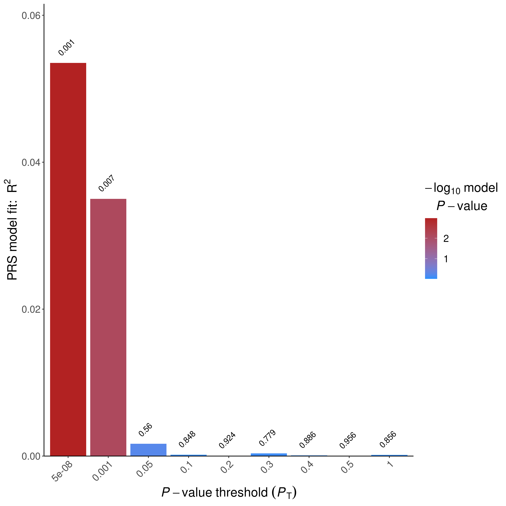
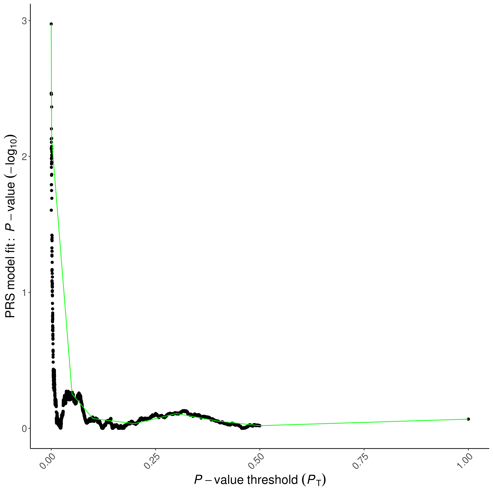
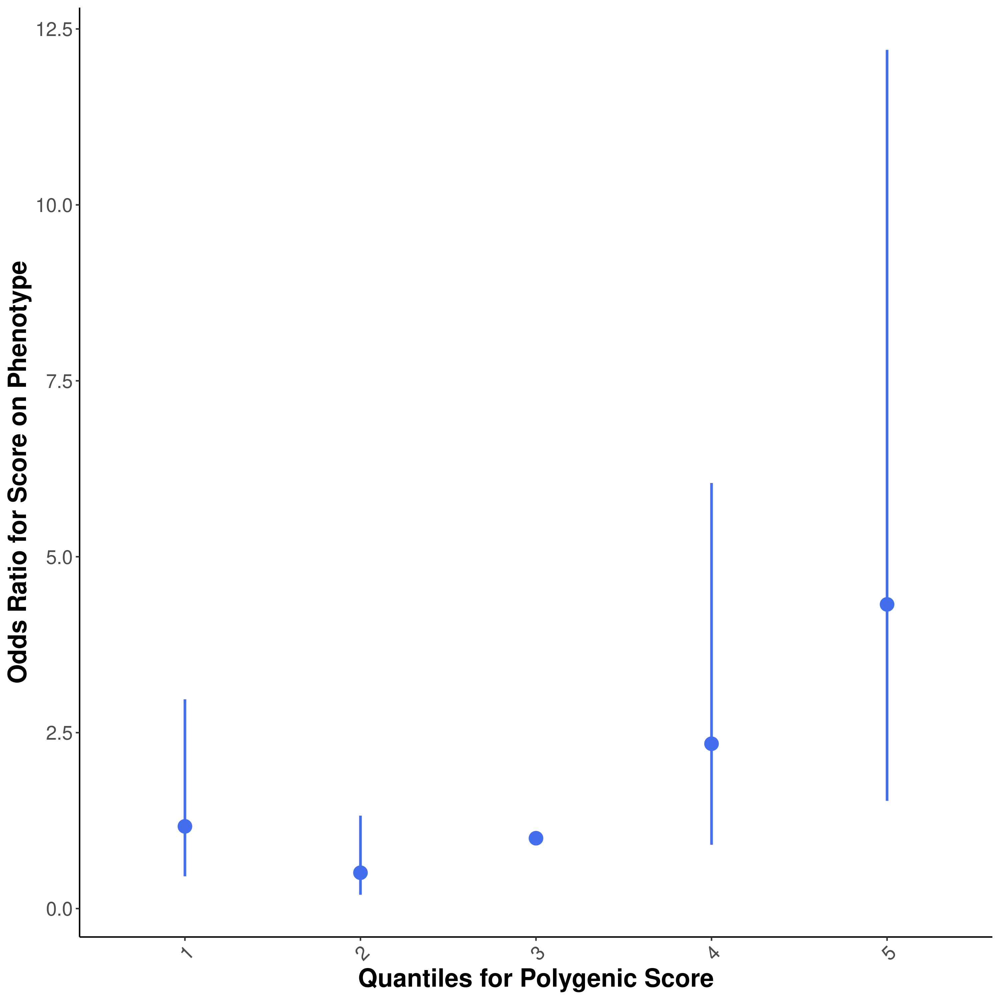
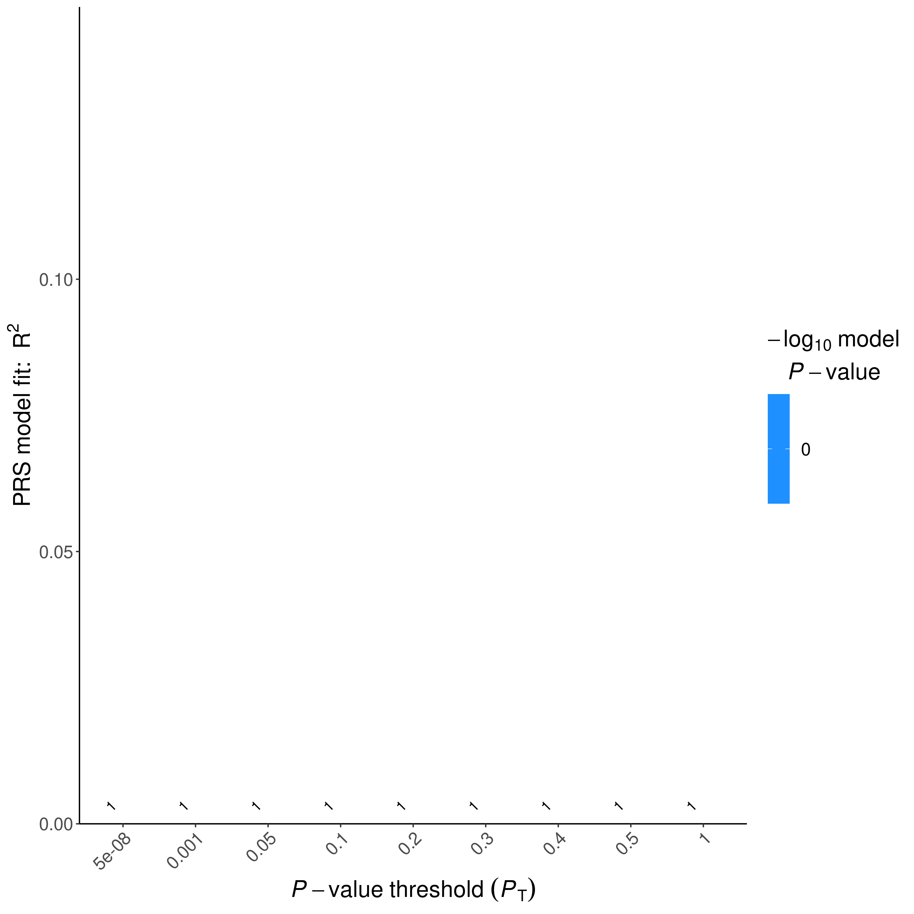
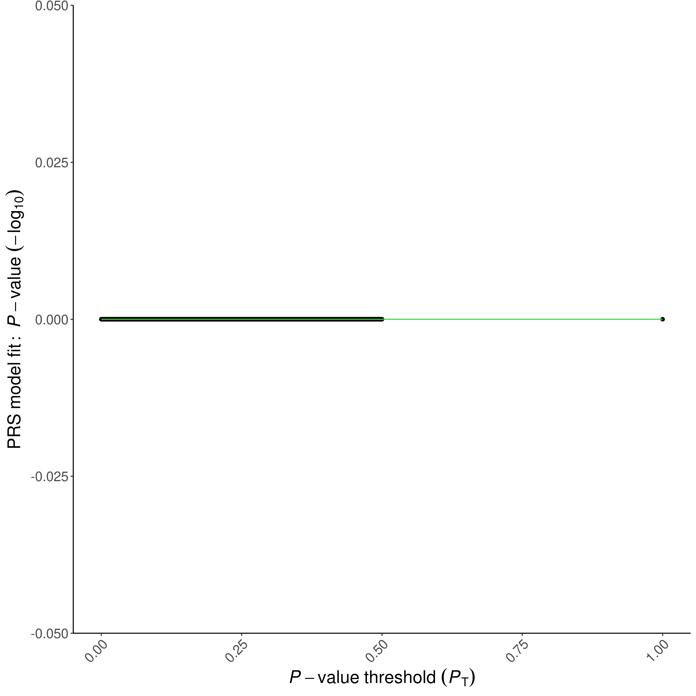
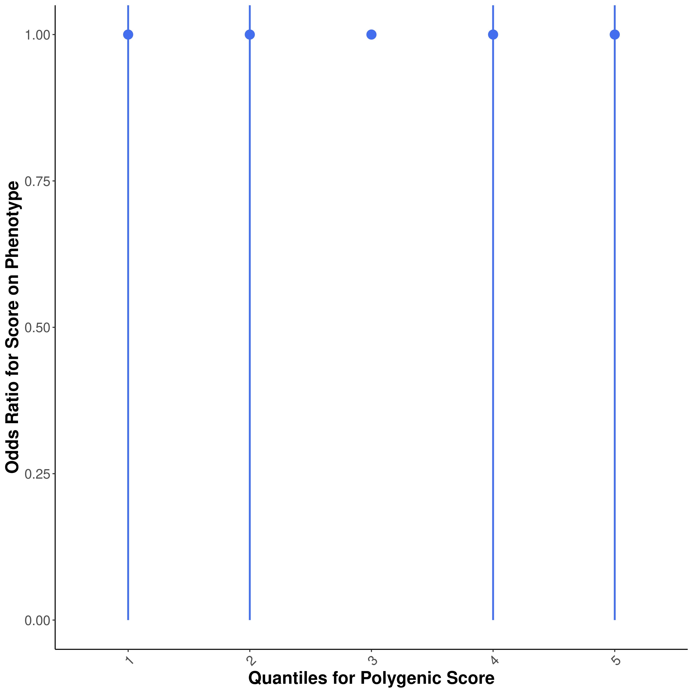

```{r setup, include=FALSE}
library(tidyverse)
library(ggrepel)
library(data.table)
library(knitr)
library(limma)
library(foreach)
library(doParallel)
library(RSpectra)
Sys.setlocale("LC_MESSAGES", "en_US.utf8")
knitr::opts_chunk$set(echo = TRUE)
```

# Step 0: Prepare covariates and input files
```{r}
IDs <- fread("~/genotype_qc/DIGPD_merged_post_imputation_QC/all_imputed_r2_30_rsid.fam")[, .(FID = V1, IID = V2)]
load("/home1/NEURO/SHARE_DECIPHER/processed_DNAm_data/2022/DIGPD_processed_2022/1-DIGPD_RG_filtered.RData") #DIGPD_RG_filtered
methy <- minfi::getM(DIGPD_RG_filtered)
digpd_pcs <- fread("~/genotype_qc/DIGPD_merged_post_imputation_QC/raw_data.preimpute.pcs")
digpd_metadata <- fread("/home1/NEURO/SHARE_DECIPHER/digpd_meta_master.csv") %>%
  filter(is.na(visite) | visite == 1) %>%
  mutate(FID=gsub("PAL_[0-9]*_", "", FID),IID = gsub("PAL_[0-9]*_", "", IID),patient=paste0(patient,".visit",visite)) %>%
  left_join(digpd_pcs %>% mutate(GPC1=PC1,GPC2=PC2,GPC3=PC3) %>%select(FID,IID,GPC1,GPC2,GPC3) ,by=c("FID","IID"))
methy <- methy[,colnames(methy) %in% digpd_metadata$patient]
meta <- digpd_metadata[digpd_metadata$patient %in% colnames(methy)]
ix <- na.omit(match(colnames(methy),meta$patient))
methy <- methy[apply(methy,1,function(x)!any(is.infinite(x))),ix]
colnames(methy) <- meta$IID[na.omit(match(meta$patient,colnames(methy)))]
PCs <- prcomp(methy,center = TRUE,rank. = 10)
prsice_cov <- na.omit(cbind(PCs$rotation,meta)[!duplicated(IID),.(FID,IID,sex=men,age=Age,GPC1,GPC2,GPC3,PC1,PC2,PC3,PC4,PC5,PC6,PC7,PC8,PC9,PC10,PD)])
covariate <- prsice_cov[,.(IID,sex,age,GPC1,GPC2,GPC3,PC1,PC2,PC3,PC4,PC5,PC6,PC7,PC8,PC9,PC10)]

PD <- prsice_cov[,.(FID,IID,PD)]

head(covariate)
head(PD)
fwrite(na.omit(PD), "DIGPD.pheno", sep = "\t")
fwrite(prsice_cov[sex==1,.(FID,IID,PD)],"DIGPD_male.pheno", sep = "\t")
fwrite(prsice_cov[sex==0,.(FID,IID,PD)],"DIGPD_female.pheno", sep = "\t")
fwrite(na.omit(covariate), "DIGPD.covariate", sep = "\t")
fwrite(prsice_cov[sex==1] %>%select(-sex),"DIGPD_male.covariate", sep = "\t")
fwrite(prsice_cov[sex==0] %>% select(-sex),"DIGPD_female.covariate", sep = "\t")
```

## Checking covariates and sample numbers
```{r}
library(corrplot)
f_cell_type <- fread("/home1/NEURO/SHARE_DECIPHER/processed_DNAm_data/2022/DIGPD_processed_2022/3-digpd_meta_visit1_F_logit_matched.csv")
m_cell_type <- fread("/home1/NEURO/SHARE_DECIPHER/processed_DNAm_data/2022/DIGPD_processed_2022/3-digpd_meta_visit1_M_logit_matched.csv")
f_cell_type[,.(.N,sum(PD))]
m_cell_type[,.(.N,sum(PD))]
all_cell_type <- rbind(f_cell_type, m_cell_type)
meta[prsice_cov$IID,on=.(IID),nomatch=0][visite == 1 | is.na(visite)][,.(.N,sum(PD),.N - sum(PD),sum(men),sum(GBA,na.rm=T),sum(LRKK2,na.rm=T),sum(dis_duration >= 2,na.rm=T))]
summary(na.omit(meta[prsice_cov$IID,on=.(IID),nomatch=0][visite == 1 | is.na(visite)]$pesticides == 1))
PC_cmp <- PCs$rotation[paste0(all_cell_type$patient,".visit",all_cell_type$visite),]
to_cor <- model.matrix(~0+.,data=all_cell_type[,.(CD8T,CD4T,NK,Bcell,Mono,Neu,plate=factor(plate),row=factor(SentrixPosition_A))])
corrplot(cor(to_cor,PC_cmp),method = "number")
head(all_cell_type)
```


```{r}
library(ggpubr)
to_plot <- melt(all_cell_type,measure.vars=c("CD8T","CD4T","NK","Bcell","Mono","Neu"),id.vars=c("PD","reportedSex"))
to_plot<- to_plot %>% mutate(PD = ifelse(PD == 1,"Case","Control"),Sex=factor(ifelse(reportedSex=="F","Female","Male"),levels=c("Male","Female"))) %>% select(-reportedSex)
ggboxplot(to_plot,"PD","value",color="PD",facet.by = "variable") +
  stat_compare_means(vjust=0.5)+
  scale_color_manual(values=c("Case"="gray50","Control"="gray80"))+
  labs(y="Estimated Proportion",x="PD status")

ggboxplot(to_plot,"Sex","value",color="Sex",facet.by = "variable") +
  stat_compare_means(vjust=0.5)+
  scale_color_manual(values=c("Male"="lightblue","Female"="pink"))+
  labs(y="Estimated Proportion",x="Sex")
```

# Step 1: Run PRSice-2 on Nalls et al 2019 Sumstats
```{bash,eval=FALSE}
Rscript /home1/NEURO/casazza/PRSice.R \
    --prsice /home1/NEURO/casazza/PRSice_linux\
    --base /home1/NEURO/casazza/nalls_PD.QC.gz\
    --base-info INFO:0.8 \
    --base-maf MAF:0.01 \
    --cov DIGPD.covariate \
    --binary-target T\
    --beta  \
    --ld /home1/NEURO/casazza/1000G_plink/EUR_phase3  \
    --out DIGPD_PRSice \
    -q 5\
    --all-score\
    --pheno DIGPD.pheno \
    --snp SNP \
    --stat b \
    --pvalue p\
    --target /home1/NEURO/casazza/genotype_qc/DIGPD_merged_post_imputation_QC/all_imputed_r2_90_rsid_hard_call \
    --thread 32
```
# Step 2: Evaluate output
```{r, out.width="400px"}









include_graphics("prsice_images/DIGPD_PRSice_nalls_female_HIGH-RES_PLOT_2022-11-15.png")

```
## Plotting PRSice Data on my own
```{r}
library(ggnewscale)
prsice_male_meta <- fread("prsice_nalls_male_data/DIGPD_PRSice_nalls_male.prsice")
ggplot(prsice_male_meta[Threshold <= 0.5], aes(Threshold, Num_SNP, color = -log10(P))) +
  geom_point() +
  scale_y_continuous(breaks = c(seq(0, 1e5, 2.5e4), seq(2e5, 6e5, 1e5))) +
  theme_minimal()

prsice_female_meta <- fread("prsice_nalls_female_data/DIGPD_PRSice_nalls_female.prsice")
ggplot(prsice_female_meta[Threshold <= 0.5], aes(Threshold, Num_SNP, color = -log10(P))) +
  geom_point() +
  scale_y_continuous(breaks = c(seq(0, 1e5, 2.5e4), seq(2e5, 6e5, 1e5))) +
  theme_minimal()

prsice_meta <- fread("prsice_data/DIGPD_PRSice.prsice")
ggplot(mapping = aes(Threshold, R2, color = -log10(P))) +
  geom_point(data = prsice_female_meta, size = 1) +
  scale_color_gradient(low = "lightpink4", high = "lightpink") +
  labs(color = bquote("Female log"["10"] ~ "(P)")) +
  new_scale_color() +
  geom_point(data = prsice_male_meta, size = 1, aes(color = -log10(P))) +
  scale_color_gradient(low = "lightblue4", high = "lightblue") +
  labs(y = bquote("R"^2), x = "GWAS P-Value Threshold", color = bquote("Male -log"["10"] ~ "(P)")) +
  theme_minimal() +
  theme(legend.position = "top")
ggplot(mapping = aes(Threshold, R2, color = -log10(P))) +
  geom_point(data = prsice_female_meta, size = 1) +
  scale_color_gradient(low = "lightpink4", high = "lightpink",guide = guide_colorbar(order=3)) +
  labs(color = bquote("Female -log"["10"] ~ "(P)")) +
  new_scale_color() +
  geom_point(data = prsice_male_meta, size = 1, aes(color = -log10(P))) +
  scale_color_gradient(low = "lightblue4", high = "lightblue",guide = guide_colorbar(order=2)) +
  labs(color = bquote("Male -log"["10"] ~ "(P)")) +
  new_scale_color() +
  geom_point(data = prsice_meta, size = 1, aes(color = -log10(P))) +
  scale_color_gradient(low = "gray40", high = "gray80",guide = guide_colorbar(order=1)) +
  labs(y = bquote("R"^2), x = "GWAS P-Value Threshold", color = bquote("Cross-sex -log"["10"] ~ "(P)")) +
  theme_minimal() +
  theme(legend.position = "top",legend.title = element_text(size=7))
```

# Step 3 run linear model at different thresholds for SNP inclusion

Let's check how the data looks for the first 5 subjects:
```{r}
colnames(methy) <- meta$IID
ggplot(methy[, 1:5] %>% as.data.table(keep.rownames = T) %>% melt(id.vars = "rn", value.name = "betas", variable.name = "subject"), aes(betas, color = subject))+
  geom_density()
```

### Match DNA, PRS, and metadata
```{r}
# prsice_best=0.00030005
prsice_all <- fread("prsice_data/DIGPD_PRSice.all_score")
methy <- methy[,colnames(methy) %in%prsice_all$IID]
prsice_all <-prsice_all[match(colnames(methy), IID,nomatch=0), .(FID, IID, `Pt_5e-08`, `Pt_5.005e-05`, `Pt_0.00010005`, `Pt_0.00100005`, `Pt_0.00030005`,`Pt_0.0101501`, `Pt_0.1`, `Pt_0.2`, `Pt_0.3`, `Pt_0.4`, `Pt_0.5`, `Pt_1`)]
covariate<- covariate[match(colnames(methy),IID,nomatch=0),]

all(covariate$IID == colnames(methy))
all(covariate$IID == prsice_all$IID)
betas_combat <- methy[,covariate$IID]
covariate_male <- covariate[sex == 1] %>% select(-sex)
betas_male <- methy[, covariate_male$IID]
# best = 0.0335001
prsice_male_all <-fread("prsice_nalls_male_data/DIGPD_PRSice_nalls_male.all_score")[match(colnames(betas_male), IID,nomatch=0), .(FID, IID, `Pt_5e-08`, `Pt_5.005e-05`, `Pt_0.00010005`, `Pt_0.00100005`, `Pt_0.0101501`, `Pt_0.0335001`, `Pt_0.1`, `Pt_0.2`, `Pt_0.3`, `Pt_0.4`, `Pt_0.5`, `Pt_1`)]

covariate_male <- covariate_male[match(colnames(betas_male), IID,nomatch=0)]
all(covariate_male$IID == colnames(betas_male))
all(covariate_male$IID == prsice_male_all$IID)

covariate_female <- covariate[sex == 0] %>% select(-sex) #%>% filter(IID %in% prsice_female_best$IID)
betas_female <- methy[, covariate_female$IID]
#best = 0.00035005

prsice_female_all <- fread("prsice_nalls_female_data/DIGPD_PRSice_nalls_female.all_score")[match(colnames(betas_female), IID,nomatch=0), .(FID, IID, `Pt_5e-08`, `Pt_5.005e-05`, `Pt_0.00010005`, `Pt_0.00035005`, `Pt_0.00100005`, `Pt_0.0101501`, `Pt_0.1`, `Pt_0.2`, `Pt_0.3`, `Pt_0.4`, `Pt_0.5`, `Pt_1`)]
covariate_female <- covariate_female[match(colnames(betas_female), IID,nomatch=0)]
all(covariate_female$IID == colnames(betas_female))
all(covariate_female$IID == prsice_female_all$IID)


```
### Model fits and fits on liability scale
```{r}
pd_h2 <- function(R2O, case_prop, prevalence = 0.22) {
  K <- prevalence
  P <- case_prop
  thd <- -1 * qnorm(K, 0, 1)
  zv <- dnorm(thd) # z (normal density)
  mv <- zv / K # mean liability for case
  theta <- mv * (P - K) / (1 - K) * (mv * (P - K) / (1 - K) - thd) # θ in equation
  cv <- K * (1 - K) / zv^2 * K * (1 - K) / (P * (1 - P)) # C in
  return(R2O * cv / (1 + R2O * theta * cv))
}
prsice_meta[Threshold == 0.00030005]$R2
pd_h2(prsice_meta[Threshold == 0.00030005]$R2, sum(PD[!is.na(PD)]$PD) / nrow(PD[!is.na(PD)]), 5 / 1000)
prsice_meta[Threshold == 5e-8]$R2
pd_h2(prsice_meta[Threshold == 5e-8]$R2, sum(PD[!is.na(PD)]$PD) / nrow(PD[!is.na(PD)]), 5 / 1000)
```

### Run limma

```{r}
mvalues <- betas_combat
prs_mat <- prsice_all[, -c(1)]
cov_mat <- covariate[, -c(1)]

mvalues_male <- betas_male
prs_mat_male <- prsice_male_all[, -c(1, 2)]
cov_mat_male <- covariate_male[, -c(1, 2)]

mvalues_female <- betas_female
prs_mat_female <- prsice_female_all[, -c(1, 2)]
cov_mat_female <- covariate_female[, -c(1, 2)]
```

```{r}
registerDoParallel(ncol(prs_mat) / 4)
hits <- foreach(prs_thresh = colnames(prs_mat)) %dopar% {
  design_prs <- model.matrix(~., data = cbind(prs_mat[, ..prs_thresh], cov_mat))
  prs_fit <- lmFit(mvalues, design_prs)
  prs_fit <- eBayes(prs_fit)
  topTable(prs_fit, coef = 2, adjust.method = "bonf", p.value = 0.05, number = Inf, genelist = rownames(mvalues))
}
names(hits) <- colnames(prs_mat)
hits_by_thresh_bonf <- rbindlist(hits, idcol = "threshold", fill = TRUE)

registerDoParallel(ncol(prs_mat_male) / 4)
hits_male <- foreach(prs_thresh = colnames(prs_mat_male)) %dopar% {
  design_prs_male <- model.matrix(~., data = cbind(prs_mat_male[, ..prs_thresh], cov_mat_male))
  prs_fit_male <- lmFit(mvalues_male, design_prs_male)
  prs_fit_male <- eBayes(prs_fit_male)
  topTable(prs_fit_male, coef = 2, adjust.method = "bonf", p.value = 0.05, number = Inf, genelist = rownames(mvalues_male))
}
names(hits_male) <- colnames(prs_mat_male)
hits_by_thresh_bonf_male <- rbindlist(hits_male, idcol = "threshold", fill = TRUE)

registerDoParallel(ncol(prs_mat_female) / 4)
hits_female <- foreach(prs_thresh = colnames(prs_mat_female)) %dopar% {
  design_prs_female <- model.matrix(~., data = cbind(prs_mat_female[, ..prs_thresh], cov_mat_female))
  prs_fit_female <- lmFit(mvalues_female, design_prs_female)
  prs_fit_female <- eBayes(prs_fit_female)
  topTable(prs_fit_female, coef = 2, adjust.method = "bonf", p.value = 0.05, number = Inf, genelist = rownames(mvalues_female))
}
names(hits_female) <- colnames(prs_mat_female)
hits_by_thresh_bonf_female <- rbindlist(hits_female, idcol = "threshold", fill = TRUE)

```

### Plotting EWAS vs Threshold Experiment by Sex
```{r}
to_plot <- rbind(
  hits_by_thresh_bonf[, .(hits = .N, Sex = "Cross-sex"), by = threshold] %>%
    mutate(threshold = recode_factor(threshold, `Pt_0.0219001` = "0.0219", `Pt_5e-08` = "5e-8", `Pt_5.005e-05` = "5e-5", `Pt_0.00010005` = "1e-4",`Pt_0.00030005`="3e-4",`Pt_0.00100005` = "1e-3", `Pt_0.0101501` = "1e-2", `Pt_0.1` = "0.1", `Pt_0.2` = "0.2", `Pt_0.3` = "0.3", `Pt_0.4` = "0.4", `Pt_0.5` = "0.5", `Pt_1` = "1.0")),
  hits_by_thresh_bonf_male[, .(hits = .N, Sex = "Male"), by = threshold] %>%
    mutate(threshold = recode_factor(threshold, `Pt_0.0219001` = "0.0219", `Pt_5e-08` = "5e-8", `Pt_5.005e-05` = "5e-5", `Pt_0.00010005` = "1e-4", `Pt_0.00100005` = "1e-3", `Pt_0.0101501` = "1e-2", `Pt_0.0335001`="3.4e-2", `Pt_0.1` = "0.1", `Pt_0.2` = "0.2", `Pt_0.3` = "0.3", `Pt_0.4` = "0.4", `Pt_0.5` = "0.5", `Pt_1` = "1.0")),
  hits_by_thresh_bonf_female[, .(hits = .N, Sex = "Female"), by = threshold] %>%
    mutate(threshold = recode_factor(threshold, `Pt_0.0219001` = "0.0219", `Pt_5e-08` = "5e-8", `Pt_5.005e-05` = "5e-5", `Pt_0.00010005` = "1e-4",`Pt_0.00035005`="3.5e-4", `Pt_0.00100005` = "1e-3", `Pt_0.0101501` = "1e-2", `Pt_0.1` = "0.1", `Pt_0.2` = "0.2", `Pt_0.3` = "0.3", `Pt_0.4` = "0.4", `Pt_0.5` = "0.5", `Pt_1` = "1.0"))
) %>% mutate(Sex = factor(Sex, levels = c("Cross-sex", "Male", "Female")))
plot_pos <-position_dodge2(width = 0.9, preserve = "single")
ggplot(to_plot, aes(threshold, hits, fill = Sex, label = hits)) +
  geom_text(position = plot_pos, vjust = -0.25) +
  geom_col(position = plot_pos) +
  labs(x = "GWAS P Value Threshold", y = "EWAS Hits") +
  scale_fill_manual(values = c("grey80", "lightblue", "lightpink")) +
  theme_minimal()
hits_by_thresh_bonf[, .(hits = .N, Sex = "Cross-sex"), by = threshold]
hits_by_thresh_bonf_male[, .(hits = .N), by = threshold]
hits_by_thresh_bonf_female[, .(hits = .N), by = threshold]
```
```{r}
display_venn <- function(x, ...) {
  library(VennDiagram)
  grid.newpage()
  venn_object <- venn.diagram(x, filename = NULL, ...)
  grid.draw(venn_object)
}

display_venn(list(`Cross-sex` = hits_by_thresh_bonf[threshold == "Pt_5e-08"]$ID, Male = hits_by_thresh_bonf_male[threshold == "Pt_5e-08"]$ID, Female = hits_by_thresh_bonf_female[threshold == "Pt_5e-08"]$ID), fill = c("gray80", "lightblue", "lightpink"))
male_ids <- hits_by_thresh_bonf_male[threshold == "Pt_5e-08"]$ID
cross_ids <- hits_by_thresh_bonf[threshold == "Pt_5e-08"]$ID
male_ids[!male_ids %in% cross_ids]
```

```{r}
get_full_fit <- function(prs_mat,cov_mat,mvalues){
  top_design_prs <- model.matrix(~., data = cbind(prs_mat[, `Pt_5e-08`], cov_mat))
  top_prs_fit <- lmFit(mvalues, top_design_prs)
  top_prs_fit <- eBayes(top_prs_fit)
  top_prs_hits <- topTable(top_prs_fit, coef = 2, adjust.method = "bonf", number = Inf, genelist = rownames(mvalues))
}
digpd_top_prs_hits <- get_full_fit(prs_mat,cov_mat,mvalues)
digpd_top_male_prs_hits <- get_full_fit(prs_mat_male, cov_mat_male, mvalues_male)
digpd_top_female_prs_hits <- get_full_fit(prs_mat_female, cov_mat_female, mvalues_female)
```

## Save main EWAS
```{r}
save(list=c("digpd_top_prs_hits","digpd_top_male_prs_hits","digpd_top_female_prs_hits"),file="digpd_prs_nalls_cross_w_sex_stratified.RData")
```
## Interaction with Sex and age
```{r}

base_model <- ~ sex + age + GPC1 + GPC2 + GPC3 + PC1 + PC2 + PC3 + PC4 + PC5 + PC6 + PC7 + PC8 + PC9 + PC10
fit_interaction  <- function(methy, term){
  
  interaction_term <- paste0("SCORE1_AVG*",term)
  design <- model.matrix(update(base_model,paste("~ . +", interaction_term)), data=cbind(data.frame(SCORE1_AVG=prs_mat$`Pt_5e-08`),cov_mat))
  fit <- lmFit(methy, design)
  fit <- eBayes(fit)
  if(paste0(term,":SCORE1_AVG") %in% colnames(fit$coefficients)){
    res <- topTable(fit, number = Inf, coef = paste0(term,":SCORE1_AVG"))
  }else{
    res <- topTable(fit, number = Inf, coef = paste0("SCORE1_AVG:",term))
  }
  main_res <- topTable(fit, number = Inf, coef = term)
  return(list(interaction_effect=res,main=main_res))
}

sex_res <- fit_interaction(mvalues,"sex")
age_res <- fit_interaction(mvalues,"age")
```
```{r}
load("digpd_prs_nalls_cross_w_sex_stratified.RData")
summarize_limma_res <- function(limma_res){
  interaction <- limma_res$interaction_effect[(digpd_top_prs_hits %>% filter(adj.P.Val < 0.05))$ID,] %>%
    rownames_to_column(var="ID") %>%
    mutate(FDR=p.adjust(P.Value,method="BH"), effect = "Interaction") %>%
    filter(FDR < 0.05)
  main <- limma_res$main[(digpd_top_prs_hits %>% filter(adj.P.Val < 0.05))$ID,] %>%
    rownames_to_column(var="ID") %>%
    mutate(FDR=p.adjust(P.Value,method="BH"),effect= "Main") %>%
    filter(FDR < 0.05)
  return(rbind(interaction,main))
}
to_summarize <- list(
  "Sex"=sex_res,
  "Age"=age_res
)
(non_pest_summary <- rbindlist(lapply(to_summarize,summarize_limma_res),idcol="Environment"))
non_pest_summary %>% count(unique("ID"))
```


##Replication section
```{r}
load("digpd_prs_nalls_cross_w_sex_stratified.RData")
load("prs_nalls_cross_w_sex_stratified.RData")
manifest <- IlluminaHumanMethylationEPICanno.ilm10b4.hg19::Other %>%
  as.data.frame() %>%
  rownames_to_column(var = "name")
```

```{r}
cross_rep <- top_prs_hits %>% filter(adj.P.Val < 0.05)%>%left_join(digpd_top_prs_hits%>% mutate(adj.P.Val =p.adjust(P.Value,method="BH")),by="ID")
male_rep <- top_male_prs_hits %>% filter(adj.P.Val < 0.05)%>%left_join(digpd_top_male_prs_hits%>% mutate(adj.P.Val =p.adjust(P.Value,method="BH")),by="ID")
female_rep <- top_female_prs_hits %>%filter(adj.P.Val < 0.05)%>%left_join(digpd_top_female_prs_hits%>% mutate(adj.P.Val =p.adjust(P.Value,method="BH")),by="ID")

(cross_cor  <- cor.test(cross_rep$logFC.x,cross_rep$logFC.y,method="spearman"))
summarize(cross_rep,nrep = sum(adj.P.Val.y < 0.05,na.rm=T),percent= sum(adj.P.Val.y < 0.05,na.rm=T) /n())
(male_cor <- cor.test(male_rep$logFC.x,male_rep$logFC.y,method="spearman"))
summarize(male_rep,nrep = sum(adj.P.Val.y < 0.05,na.rm=T),percent= sum(adj.P.Val.y < 0.05,na.rm=T) /n())
(female_cor <-cor.test(female_rep$logFC.x,female_rep$logFC.y,method="spearman"))
summarize(female_rep,nrep = sum(adj.P.Val.y < 0.05,na.rm=T),percent= sum(adj.P.Val.y < 0.05,na.rm=T) /n())
to_plot_cross <- cross_rep %>% mutate(direction = ifelse(sign(logFC.x) == sign(logFC.y),"Same","Opposite"),ID=ifelse(adj.P.Val.y < 0.05,ID,"")) %>% na.omit()
ggplot(to_plot_cross, aes(logFC.x,logFC.y,color = direction,group="")) +
  geom_point()+
  geom_point(data=to_plot_cross %>% filter(adj.P.Val.y < 0.05),color="red")+
  geom_smooth(fullrange=TRUE,linetype="dashed",color="black",method="lm",se=FALSE) +
  ggrepel::geom_text_repel(force =0.1,show.legend = FALSE,color="black",size=3,max.overlaps = Inf,aes(label=ID))+
  scale_color_manual(values=c("Opposite"="gray80","Same"="gray20")) +
  labs(x=bquote(Delta~"M"),y=bquote(Delta~"M"["Replication"]),color="Effect Direction") +
  ggtitle(bquote(rho~"="~.(round(cross_cor$estimate,3))))+
  theme_minimal()
to_plot_cross %>% filter(ID != "") %>% left_join(manifest,by=c("ID"="name"))
to_plot_male <- male_rep %>% mutate(direction = ifelse(sign(logFC.x) == sign(logFC.y),"Same","Opposite"),ID=ifelse(adj.P.Val.y < 0.05,ID,"")) %>% na.omit()
ggplot(to_plot_male, aes(logFC.x,logFC.y,color = direction,group="")) +
  geom_point()+
  geom_point(data=to_plot_male %>% filter(adj.P.Val.y < 0.05),color="red")+
  geom_smooth(fullrange=TRUE,linetype="dashed",color="black",method="lm",se=FALSE) +
  ggrepel::geom_text_repel(show.legend = FALSE,color="black",size=3,aes(label=ID),max.overlaps = Inf)+
  scale_color_manual(values=c("Opposite"="lightblue2","Same"="lightblue4")) +
  labs(x=bquote(Delta~"M"),y=bquote(Delta~"M"["Replication"]),color="Effect Direction") +
  ggtitle(bquote(rho~"="~.(round(male_cor$estimate,3))))+
  theme_minimal()
to_plot_male %>% filter(ID != "") %>% left_join(manifest,by=c("ID"="name")) %>% select(-contains(".x"),-contains(".y"))

to_plot_female <- female_rep %>% mutate(direction = ifelse(sign(logFC.x) == sign(logFC.y),"Same","Opposite")) %>% na.omit()
ggplot(to_plot_female, aes(logFC.x,logFC.y,color = direction,group="")) +
  geom_point()+
  geom_smooth(fullrange=TRUE,linetype="dashed",color="black",method="lm",se=FALSE) +
  #ggrepel::geom_text_repel(data=to_plot_female %>% filter(adj.P.Val.y < 0.05),aes(label=ID))+
  scale_color_manual(values=c("Opposite"="lightpink2","Same"="lightpink4")) +
  labs(x=bquote(Delta~"M"),y=bquote(Delta~"M"["Replication"]),color="Effect Direction") +
  ggtitle(bquote(rho~"="~.(round(female_cor$estimate,3))))+
  theme_minimal()
```
