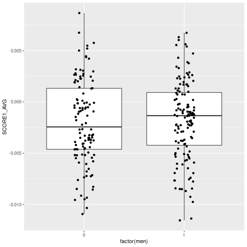

# PD risk score data and matching

```r
risk_scores <- read_xlsx("~/pd_risk_score/Supplementary materials/Table S2. Detailed summary statistics on all nominated risk variants, known and novel_.xlsx") %>% mutate(CHR = as.numeric(CHR), COUNTED = toupper(`Effect allele`), ALT = toupper(`Other allele`), POS = BP) %>% filter(!is.na(CHR))
```

```
## Warning in mask$eval_all_mutate(quo): NAs introduced by coercion
```

```r
risk_scores %>% select(SNP,COUNTED, `Beta, all studies`) %>%
  write_delim("pd_prs_file.txt", col_names = FALSE)
```

# TERRE PRS Analysis
Generate PRS using `plink2 --score`:

```bash
~/plink2 --bfile ~/genotype_qc/TERRE_QC/raw_data.imputed.r2_30.hard_call.maf_mismatch\
  --score pd_prs_file.txt\
  --out terre_prs
```
## Loading in and preparing data

```r
terre_prs <- fread("terre_prs.sscore")
terre_pcs <- fread("~/genotype_qc/TERRE_QC/raw_data.geno.maf.mind.sex_check.het_filter.ibd_filter.eigenvec")
terre_metadata <- read.csv("/home1/NEURO/SHARE_DECIPHER/terre_meta_master.csv") %>% 
  mutate(
    FID = gsub("(PAE_[0-9]*_[1-9]*)_.*","\\1",FID),
    IID = gsub("(PAE_[0-9]*_[1-9]*)_.*","\\1",IID)
  )
all_data <- terre_prs %>% left_join(terre_metadata, by=c("IID")) %>% left_join(terre_pcs,by=c("IID"= "V1"))
```
## Association analysis

```r
pd_h2 <- function(R2O,case_prop,prevalence=0.22){
  K <- prevalence
  P <- case_prop
  thd <- -1 * qnorm(K,0,1)
  zv <- dnorm(thd) #z (normal density)
  mv <- zv/K #mean liability for case
  theta <- mv*(P-K)/(1-K)*(mv*(P-K)/(1-K)-thd) #θ in equation 
  cv <- K*(1-K)/zv^2*K*(1-K)/(P*(1-P)) #C in
  return(R2O*cv/(1+R2O*theta*cv))
}
fit1 <- glm(PD ~ SCORE1_AVG + men + age + V3 + V4 + V5, data=all_data,family="binomial")
summary(fit1)
```

```
## 
## Call:
## glm(formula = PD ~ SCORE1_AVG + men + age + V3 + V4 + V5, family = "binomial", 
##     data = all_data)
## 
## Deviance Residuals: 
##     Min       1Q   Median       3Q      Max  
## -1.2848  -0.9247  -0.7438   1.2828   1.8974  
## 
## Coefficients:
##               Estimate Std. Error z value Pr(>|z|)   
## (Intercept)  -0.214332   1.389442  -0.154  0.87741   
## SCORE1_AVG  119.851470  37.440324   3.201  0.00137 **
## men           0.015331   0.282655   0.054  0.95674   
## age          -0.004509   0.020867  -0.216  0.82892   
## V3           -1.432036   2.222793  -0.644  0.51941   
## V4            3.669214   2.340954   1.567  0.11702   
## V5           -1.986483   2.311060  -0.860  0.39003   
## ---
## Signif. codes:  0 '***' 0.001 '**' 0.01 '*' 0.05 '.' 0.1 ' ' 1
## 
## (Dispersion parameter for binomial family taken to be 1)
## 
##     Null deviance: 312.35  on 244  degrees of freedom
## Residual deviance: 298.96  on 238  degrees of freedom
## AIC: 312.96
## 
## Number of Fisher Scoring iterations: 4
```

```r
fit1_null <- glm(PD ~  men + age + V3 + V4 + V5, data=all_data,family="binomial")
summary(fit1_null)
```

```
## 
## Call:
## glm(formula = PD ~ men + age + V3 + V4 + V5, family = "binomial", 
##     data = all_data)
## 
## Deviance Residuals: 
##     Min       1Q   Median       3Q      Max  
## -1.0954  -0.9182  -0.8456   1.3984   1.7004  
## 
## Coefficients:
##              Estimate Std. Error z value Pr(>|z|)
## (Intercept) -0.368143   1.354648  -0.272    0.786
## men          0.023809   0.277340   0.086    0.932
## age         -0.005088   0.020400  -0.249    0.803
## V3          -1.585982   2.183250  -0.726    0.468
## V4           2.822024   2.270368   1.243    0.214
## V5          -0.945567   2.238829  -0.422    0.673
## 
## (Dispersion parameter for binomial family taken to be 1)
## 
##     Null deviance: 312.35  on 244  degrees of freedom
## Residual deviance: 309.95  on 239  degrees of freedom
## AIC: 321.95
## 
## Number of Fisher Scoring iterations: 4
```

```r
nagelkerke(fit1,null=fit1_null)
```

```
## $Models
##                                                                             
## Model: "glm, PD ~ SCORE1_AVG + men + age + V3 + V4 + V5, binomial, all_data"
## Null:  "glm, PD ~ men + age + V3 + V4 + V5, binomial, all_data"             
## 
## $Pseudo.R.squared.for.model.vs.null
##                              Pseudo.R.squared
## McFadden                            0.0354693
## Cox and Snell (ML)                  0.0438810
## Nagelkerke (Cragg and Uhler)        0.0611331
## 
## $Likelihood.ratio.test
##  Df.diff LogLik.diff  Chisq    p.value
##       -1     -5.4969 10.994 0.00091414
## 
## $Number.of.observations
##           
## Model: 245
## Null:  245
## 
## $Messages
## [1] "Note: For models fit with REML, these statistics are based on refitting with ML"
## 
## $Warnings
## [1] "None"
```

```r
#liability R2
lin1 <- lm(PD ~ SCORE1_AVG + men + age + V3 + V4 + V5, data=all_data)
lin2 <- lm(PD ~ men + age + V3 + V4 + V5, data=all_data)
R2 <- (deviance(lin2) - deviance(lin1)) / deviance(lin2)
h2 <- pd_h2(R2,sum(all_data$status)/nrow(all_data),0.01)
fit2 <- glm(PD ~ SCORE1_AVG*men + V3+V4+V5, data = all_data, family="binomial")
summary(fit2)
```

```
## 
## Call:
## glm(formula = PD ~ SCORE1_AVG * men + V3 + V4 + V5, family = "binomial", 
##     data = all_data)
## 
## Deviance Residuals: 
##     Min       1Q   Median       3Q      Max  
## -1.2610  -0.9296  -0.7459   1.2801   1.8999  
## 
## Coefficients:
##                Estimate Std. Error z value Pr(>|z|)  
## (Intercept)     -0.5158     0.2170  -2.377   0.0175 *
## SCORE1_AVG     116.5672    52.4905   2.221   0.0264 *
## men              0.0160     0.2962   0.054   0.9569  
## V3              -1.4944     2.2231  -0.672   0.5015  
## V4               3.7077     2.3346   1.588   0.1123  
## V5              -1.9531     2.3101  -0.845   0.3978  
## SCORE1_AVG:men   6.7032    73.9033   0.091   0.9277  
## ---
## Signif. codes:  0 '***' 0.001 '**' 0.01 '*' 0.05 '.' 0.1 ' ' 1
## 
## (Dispersion parameter for binomial family taken to be 1)
## 
##     Null deviance: 312.35  on 244  degrees of freedom
## Residual deviance: 299.00  on 238  degrees of freedom
## AIC: 313
## 
## Number of Fisher Scoring iterations: 4
```

```r
fit3 <- glm(PD~SCORE1_AVG*smoking + V3+V4+V5, data=all_data, family="binomial")
summary(fit3)
```

```
## 
## Call:
## glm(formula = PD ~ SCORE1_AVG * smoking + V3 + V4 + V5, family = "binomial", 
##     data = all_data)
## 
## Deviance Residuals: 
##     Min       1Q   Median       3Q      Max  
## -1.3411  -0.9455  -0.7065   1.2100   2.1931  
## 
## Coefficients:
##                    Estimate Std. Error z value Pr(>|z|)  
## (Intercept)          0.1389     0.3692   0.376   0.7069  
## SCORE1_AVG          44.9593   100.8567   0.446   0.6558  
## smoking             -0.4668     0.2562  -1.822   0.0684 .
## V3                  -1.9876     2.2224  -0.894   0.3711  
## V4                   4.0161     2.3495   1.709   0.0874 .
## V5                  -2.2174     2.3441  -0.946   0.3442  
## SCORE1_AVG:smoking  62.8430    78.6818   0.799   0.4245  
## ---
## Signif. codes:  0 '***' 0.001 '**' 0.01 '*' 0.05 '.' 0.1 ' ' 1
## 
## (Dispersion parameter for binomial family taken to be 1)
## 
##     Null deviance: 311.53  on 243  degrees of freedom
## Residual deviance: 292.46  on 237  degrees of freedom
##   (1 observation deleted due to missingness)
## AIC: 306.46
## 
## Number of Fisher Scoring iterations: 4
```

```r
fit4 <- glm(PD~SCORE1_AVG*pesticides + V3+V4+V5, data=all_data, family="binomial")
summary(fit4)
```

```
## 
## Call:
## glm(formula = PD ~ SCORE1_AVG * pesticides + V3 + V4 + V5, family = "binomial", 
##     data = all_data)
## 
## Deviance Residuals: 
##     Min       1Q   Median       3Q      Max  
## -1.3710  -0.9186  -0.7153   1.2236   1.9920  
## 
## Coefficients:
##                       Estimate Std. Error z value Pr(>|z|)   
## (Intercept)            -0.7068     0.2701  -2.617  0.00887 **
## SCORE1_AVG            121.7047    72.6641   1.675  0.09396 . 
## pesticides              0.1518     0.1806   0.841  0.40062   
## V3                     -1.6339     2.4207  -0.675  0.49970   
## V4                      4.8800     2.4935   1.957  0.05034 . 
## V5                     -1.5242     2.4457  -0.623  0.53314   
## SCORE1_AVG:pesticides  10.8645    47.7560   0.228  0.82003   
## ---
## Signif. codes:  0 '***' 0.001 '**' 0.01 '*' 0.05 '.' 0.1 ' ' 1
## 
## (Dispersion parameter for binomial family taken to be 1)
## 
##     Null deviance: 284.23  on 223  degrees of freedom
## Residual deviance: 268.00  on 217  degrees of freedom
##   (21 observations deleted due to missingness)
## AIC: 282
## 
## Number of Fisher Scoring iterations: 4
```

```r
fit_null <- glm(PD ~ SCORE1_AVG, data=all_data, family="binomial")
summary(fit_null)
```

```
## 
## Call:
## glm(formula = PD ~ SCORE1_AVG, family = "binomial", data = all_data)
## 
## Deviance Residuals: 
##     Min       1Q   Median       3Q      Max  
## -1.2521  -0.9289  -0.7719   1.2744   1.8661  
## 
## Coefficients:
##             Estimate Std. Error z value Pr(>|z|)    
## (Intercept)  -0.5142     0.1461  -3.519 0.000433 ***
## SCORE1_AVG  108.9156    36.0925   3.018 0.002547 ** 
## ---
## Signif. codes:  0 '***' 0.001 '**' 0.01 '*' 0.05 '.' 0.1 ' ' 1
## 
## (Dispersion parameter for binomial family taken to be 1)
## 
##     Null deviance: 312.35  on 244  degrees of freedom
## Residual deviance: 302.72  on 243  degrees of freedom
## AIC: 306.72
## 
## Number of Fisher Scoring iterations: 4
```


```r
ggplot(all_data %>% mutate(PD= ifelse(PD,"CASE","CONTROL")),aes(as.factor(PD),SCORE1_AVG)) +geom_boxplot()+ geom_jitter(height=0, width=0.1)+ labs(y="Polygenic Risk Score", x = "Parkinson's Diagnosis") + ggtitle(bquote('Nagelkerke Pseudo-'*R^2*': 0.0611' ))
```


```r
ggplot(all_data,aes(factor(men),SCORE1_AVG)) +geom_boxplot()+ geom_jitter(height=0, width=0.1) 
```



```r
t.test(all_data$SCORE1_AVG[as.logical(all_data$PD)],all_data$SCORE1_AVG[!as.logical(all_data$PD)],alternative = "greater")
```

```
## 
## 	Welch Two Sample t-test
## 
## data:  all_data$SCORE1_AVG[as.logical(all_data$PD)] and all_data$SCORE1_AVG[!as.logical(all_data$PD)]
## t = 3.027, df = 149.93, p-value = 0.001454
## alternative hypothesis: true difference in means is greater than 0
## 95 percent confidence interval:
##  0.0007487552          Inf
## sample estimates:
##     mean of x     mean of y 
## -0.0007652869 -0.0024173617
```

```r
t.test(all_data$SCORE1_AVG[as.logical(all_data$men)],all_data$SCORE1_AVG[!as.logical(all_data$men)])
```

```
## 
## 	Welch Two Sample t-test
## 
## data:  all_data$SCORE1_AVG[as.logical(all_data$men)] and all_data$SCORE1_AVG[!as.logical(all_data$men)]
## t = 0.35104, df = 234.04, p-value = 0.7259
## alternative hypothesis: true difference in means is not equal to 0
## 95 percent confidence interval:
##  -0.0008301797  0.0011901588
## sample estimates:
##    mean of x    mean of y 
## -0.001780672 -0.001960662
```

## PRS vs DNAm


```r
# load("/home1/NEURO/SHARE_DECIPHER/processed_DNAm_data/TERRE/TERRE_betas_CTC.RData")# terre_betas_CTC
load("/home1/NEURO/SHARE_DECIPHER/processed_DNAm_data/TERRE_processed_2021/betas_combat.RData")# betas_sub
# load("/home1/NEURO/SHARE_DECIPHER/processed_DNAm_data/TERRE/TERRE_funnorm_processed/betas_combat.RData")
# betas_sub<- betas_combat
```
Let's check how the data looks for a random subject:

```r
ggplot(betas_sub[,c(1,2,3,4,5)] %>% as.data.table(keep.rownames = T) %>% melt(id.vars="rn",value.name = "betas", variable.name="subject"),aes(betas,color=subject)) + geom_density()
```

```
## Error in as.data.table(., keep.rownames = T): object 'betas_sub' not found
```

### Match DNA, PRS, and metadata

```r
reg_all_data <- all_data[na.omit(match(colnames(betas_sub),all_data$patient)),]
```

```
## Error in .checkTypos(e, names_x): Object 'betas_sub' not found amongst #FID, IID, ALLELE_CT, NAMED_ALLELE_DOSAGE_SUM, SCORE1_AVG and 89 more
```

```r
reg_all_data$sex <- ifelse(reg_all_data$men,"Male","Female")
```

```
## Error in ifelse(reg_all_data$men, "Male", "Female"): object 'reg_all_data' not found
```

```r
reg_all_data$PD <- ifelse(reg_all_data$PD,"CASE","CONTROL")
```

```
## Error in ifelse(reg_all_data$PD, "CASE", "CONTROL"): object 'reg_all_data' not found
```

```r
betas_sub <- betas_sub[,colnames(betas_sub) %in% reg_all_data$patient]
```

```
## Error in eval(expr, envir, enclos): object 'betas_sub' not found
```

```r
all(colnames(betas_sub) == reg_all_data$patient)
```

```
## Error in colnames(betas_sub): object 'betas_sub' not found
```
### TERRE PRS regression vs methylation

#### Differential methylation with PRS vs PD

```r
na_row <- !apply(reg_all_data[,c("SCORE1_AVG","age","plate","sex")],1,function(x)any(is.na(x)))
```

```
## Error in apply(reg_all_data[, c("SCORE1_AVG", "age", "plate", "sex")], : object 'reg_all_data' not found
```

```r
design_prs <- model.matrix(~1+SCORE1_AVG+age+plate+sex+V3+V4+V5, data=reg_all_data[na_row,])
```

```
## Error in terms.formula(object, data = data): object 'reg_all_data' not found
```

```r
prs_fit <- lmFit(betas_sub[,na_row],design_prs)
```

```
## Error in is(object, "list"): object 'betas_sub' not found
```

```r
prs_fit <- eBayes(prs_fit)
```

```
## Error in .ebayes(fit = fit, proportion = proportion, stdev.coef.lim = stdev.coef.lim, : object 'prs_fit' not found
```

```r
# Cases only
case_select <-na_row & reg_all_data$PD =="CASE"
```

```
## Error in eval(expr, envir, enclos): object 'na_row' not found
```

```r
design_prs_case <- model.matrix(~1+SCORE1_AVG+age+plate+sex+V3+V4+V5, data=reg_all_data[case_select,])
```

```
## Error in terms.formula(object, data = data): object 'reg_all_data' not found
```

```r
prs_fit_case <- lmFit(betas_sub[,case_select],design_prs_case)
```

```
## Error in is(object, "list"): object 'betas_sub' not found
```

```r
prs_fit_case <- eBayes(prs_fit_case)
```

```
## Error in .ebayes(fit = fit, proportion = proportion, stdev.coef.lim = stdev.coef.lim, : object 'prs_fit_case' not found
```

```r
# Controls only
control_select <-na_row & reg_all_data$PD =="CONTROL"
```

```
## Error in eval(expr, envir, enclos): object 'na_row' not found
```

```r
design_prs_control <- model.matrix(~1+SCORE1_AVG+age+plate+sex+V3+V4+V5, data=reg_all_data[control_select,])
```

```
## Error in terms.formula(object, data = data): object 'reg_all_data' not found
```

```r
prs_fit_control <- lmFit(betas_sub[,control_select],design_prs_control)
```

```
## Error in is(object, "list"): object 'betas_sub' not found
```

```r
prs_fit_control <- eBayes(prs_fit_control)
```

```
## Error in .ebayes(fit = fit, proportion = proportion, stdev.coef.lim = stdev.coef.lim, : object 'prs_fit_control' not found
```

```r
design_pd <- model.matrix(~1+PD+age+plate+sex, data=reg_all_data[na_row,])
```

```
## Error in terms.formula(object, data = data): object 'reg_all_data' not found
```

```r
pd_fit <- lmFit(betas_sub[,na_row],design_pd)
```

```
## Error in is(object, "list"): object 'betas_sub' not found
```

```r
pd_fit <- eBayes(pd_fit)
```

```
## Error in .ebayes(fit = fit, proportion = proportion, stdev.coef.lim = stdev.coef.lim, : object 'pd_fit' not found
```

```r
pd_res <- topTable(pd_fit,coef=2,number = Inf)
```

```
## Error in is(fit, "MArrayLM"): object 'pd_fit' not found
```

```r
prs_res <- topTable(prs_fit,coef=2,number = Inf)
```

```
## Error in is(fit, "MArrayLM"): object 'prs_fit' not found
```

```r
control_res <- topTable(prs_fit_control,coef=2,number = Inf)
```

```
## Error in is(fit, "MArrayLM"): object 'prs_fit_control' not found
```

```r
case_res <- topTable(prs_fit_case,coef=2,number = Inf)
```

```
## Error in is(fit, "MArrayLM"): object 'prs_fit_case' not found
```


#### Permutation test for checking if reason for discrepancy between cases and controls is sample sized

```r
library(parallel)
num_control <- sum(control_select)
```

```
## Error in eval(expr, envir, enclos): object 'control_select' not found
```

```r
num_cases <- sum(case_select)
```

```
## Error in eval(expr, envir, enclos): object 'case_select' not found
```

```r
run_at_sample_size <- function(size){
  to_select <- sample((1:length(na_row))[na_row],size)
  design_prs <- model.matrix(~1+SCORE1_AVG+age+plate+sex+V3+V4+V5, data=reg_all_data[to_select,])
  prs_fit <- lmFit(betas_sub[,to_select],design_prs)
  prs_fit <- eBayes(prs_fit)
  topTable(prs_fit,coef=2,number = Inf)
}


run_at_sample_size_control <- function(size){
  to_select <- sample((1:length(na_row))[control_select],size)
  design_prs <- model.matrix(~1+SCORE1_AVG+age+plate+sex+V3+V4+V5, data=reg_all_data[to_select,])
  prs_fit <- lmFit(betas_sub[,to_select],design_prs)
  prs_fit <- eBayes(prs_fit)
  topTable(prs_fit,coef=2,number = Inf)
}

res_control_size <- lapply(1:10,function(x) run_at_sample_size(num_control))
```

```
## Error in sample((1:length(na_row))[na_row], size): object 'na_row' not found
```

```r
res_case_size <- lapply(1:10,function(x) run_at_sample_size(num_cases))
```

```
## Error in sample((1:length(na_row))[na_row], size): object 'na_row' not found
```

```r
res_case_size_control <- lapply(1:10,function(x) run_at_sample_size_control(num_cases))
```

```
## Error in sample((1:length(na_row))[control_select], size): object 'na_row' not found
```


```r
control_hits <- unlist(lapply(res_control_size,function(x) nrow(subset(x,adj.P.Val < 0.05 & abs(logFC) > 0.03))))
```

```
## Error in lapply(res_control_size, function(x) nrow(subset(x, adj.P.Val < : object 'res_control_size' not found
```

```r
case_hits <- unlist(lapply(res_case_size,function(x) nrow(subset(x,adj.P.Val < 0.05 & abs(logFC) > 0.03))))
```

```
## Error in lapply(res_case_size, function(x) nrow(subset(x, adj.P.Val < : object 'res_case_size' not found
```

```r
case_size_control_hits <-unlist(lapply(res_case_size_control,function(x) nrow(subset(x,adj.P.Val < 0.05 & abs(logFC) > 0.03))))
```

```
## Error in lapply(res_case_size_control, function(x) nrow(subset(x, adj.P.Val < : object 'res_case_size_control' not found
```

```r
df <- data.frame(hits = c(mean(case_hits),mean(control_hits)), sample_size=c("Sampled to |Cases|","Sampled to |Controls|"),dev=c(sd(case_hits),sd(control_hits)))
```

```
## Error in mean(case_hits): object 'case_hits' not found
```

```r
ggplot(df,aes(x=sample_size,y=hits,ymin=hits-dev,ymax=hits+dev)) + geom_bar(stat="identity") + geom_errorbar(width=0.25) + theme_minimal() + labs(x="",y="Number of hits")
```

```
## Error:   You're passing a function as global data.
##   Have you misspelled the `data` argument in `ggplot()`
```

```r
t.test(case_hits,control_hits)
```

```
## Error in t.test(case_hits, control_hits): object 'case_hits' not found
```


```r
library(ggrepel)
annot <- fread("~/MethylationEPIC_v-1-0_B4.csv",skip = 7)
```

```
## Warning in fread("~/MethylationEPIC_v-1-0_B4.csv", skip = 7): Detected 48 column
## names but the data has 47 columns. Filling rows automatically. Set fill=TRUE
## explicitly to avoid this warning.
```

```r
pd_annot <- pd_res %>%rownames_to_column("probe") %>% left_join(annot,by=c("probe"="Name"))%>% mutate(gene = gsub(";.*","",UCSC_RefGene_Name)) %>% mutate(gene= ifelse(gene == "",probe,gene))
```

```
## Error in rownames_to_column(., "probe"): object 'pd_res' not found
```

```r
prs_annot <- prs_res %>%rownames_to_column("probe") %>% left_join(annot,by=c("probe"="Name"))%>% mutate(gene = gsub(";.*","",UCSC_RefGene_Name)) %>% mutate(gene= ifelse(gene == "",probe,gene))
```

```
## Error in rownames_to_column(., "probe"): object 'prs_res' not found
```

```r
ggplot(prs_annot,aes(logFC,-log10(P.Value)))+ 
  geom_point() + 
  geom_text_repel(
    data=prs_annot%>% filter(abs(logFC) > 0.03 & adj.P.Val < 0.05),
    color="dodgerblue",
    mapping=aes(logFC,-log10(P.Value),label=gene)
  ) +
  geom_point(
    data=subset(prs_annot,adj.P.Val < 0.05 & abs(logFC) > 0.03),
    color = "green",
    mapping=aes(logFC,-log10(P.Value))
  ) +
  labs(x = quote(Delta~beta~Methylation)) +
  theme_minimal() +
  geom_hline(
    linetype="dashed",
    yintercept = min(-log10(prs_annot$P.Value[prs_annot$adj.P.Val <0.05]))
  ) +
  geom_vline(linetype="dashed",xintercept = 0.03) +
  geom_vline(linetype="dashed",xintercept = -0.03)+ 
  ggtitle("Cases and Controls")
```

```
## Error in ggplot(prs_annot, aes(logFC, -log10(P.Value))): object 'prs_annot' not found
```

```r
# prs_annot[prs_annot$adj.P.Val <0.05,c("gene","CHR","MAPINFO","logFC","P.Value","UCSC_RefGene_Name")] %>% mutate(UCSC_RefGene_Name = sapply(UCSC_RefGene_Name,function(x)split(x)[1]))
prs_highlight <- subset(prs_annot,adj.P.Val < 0.05 & abs(logFC) > 0.03)
```

```
## Error in subset(prs_annot, adj.P.Val < 0.05 & abs(logFC) > 0.03): object 'prs_annot' not found
```

```r
case_annot <- case_res %>%rownames_to_column("probe") %>% left_join(annot,by=c("probe"="Name"))%>% mutate(gene = gsub(";.*","",UCSC_RefGene_Name)) %>% mutate(gene= ifelse(gene == "",probe,gene))
```

```
## Error in rownames_to_column(., "probe"): object 'case_res' not found
```

```r
ggplot(case_annot,aes(logFC,-log10(P.Value)))+
  geom_point() +
  geom_text_repel(
    data=subset(case_annot,adj.P.Val < 0.05& abs(logFC) > 0.03 & !probe %in% prs_highlight$probe),
    color="dodgerblue",
    mapping=aes(logFC,-log10(P.Value),label=gene)
  ) +
  geom_point(
    data=subset(case_annot,adj.P.Val < 0.05 & abs(logFC) > 0.03 & !probe %in% prs_highlight$probe), 
    color = "red",
    mapping=aes(logFC,-log10(P.Value))
  ) +
    geom_text_repel(
    data=case_annot %>% filter(probe %in% prs_highlight$probe),#subset(case_annot,adj.P.Val < 0.05& abs(logFC) > 0.03),
    color="dodgerblue",
    mapping=aes(logFC,-log10(P.Value),label=gene)
  ) +
  geom_point(
    data=case_annot %>% filter(probe %in% prs_highlight$probe),#subset(case_annot,adj.P.Val < 0.05 & abs(logFC) > 0.03), 
    color = "green",
    mapping=aes(logFC,-log10(P.Value))
  ) +
  labs(x = quote(Delta~beta~Methylation)) + 
  theme_minimal() + 
  geom_hline(
    linetype="dashed",
    yintercept = min(-log10(case_annot$P.Value[case_annot$adj.P.Val <0.05]))
  ) +
  geom_vline(linetype="dashed",xintercept = 0.03) +
  geom_vline(linetype="dashed",xintercept = -0.03) + 
  ggtitle("Cases")
```

```
## Error in ggplot(case_annot, aes(logFC, -log10(P.Value))): object 'case_annot' not found
```

```r
# case_annot[case_annot$adj.P.Val <0.05,c("gene","CHR","MAPINFO","logFC","P.Value","UCSC_RefGene_Name")] %>% mutate(UCSC_RefGene_Name = sapply(UCSC_RefGene_Name,function(x)split(x)[1]))

control_annot <- control_res %>%rownames_to_column("probe") %>% left_join(annot,by=c("probe"="Name"))%>% mutate(gene = gsub(";.*","",UCSC_RefGene_Name)) %>% mutate(gene= ifelse(gene == "",probe,gene))
```

```
## Error in rownames_to_column(., "probe"): object 'control_res' not found
```

```r
ggplot(control_annot,aes(logFC,-log10(P.Value)))+ 
  geom_point() +
  geom_text_repel(
    data=subset(control_annot,adj.P.Val < 0.05& abs(logFC) > 0.03 & !probe %in% prs_highlight$probe),
    color="dodgerblue",
    mapping=aes(logFC,-log10(P.Value),label=gene)
  ) +
  geom_point(
    data=subset(control_annot,adj.P.Val < 0.05 & abs(logFC) > 0.03 & !probe %in% prs_highlight$probe),
    color = "red",
    mapping=aes(logFC,-log10(P.Value))
  ) +
    geom_text_repel(
    data=control_annot %>% filter(probe %in% prs_highlight$probe),#subset(control_annot,adj.P.Val < 0.05& abs(logFC) > 0.03),
    color="dodgerblue",
    mapping=aes(logFC,-log10(P.Value),label=gene)
  ) +
  geom_point(
    data=control_annot %>% filter(probe %in% prs_highlight$probe),#subset(control_annot,adj.P.Val < 0.05 & abs(logFC) > 0.03),
    color = "green",
    mapping=aes(logFC,-log10(P.Value))
  ) +
  labs(x = quote(Delta~beta~Methylation)) + 
  theme_minimal() + geom_hline(linetype="dashed",yintercept = min(-log10(control_annot$P.Value[control_annot$adj.P.Val <0.05]))) +
  geom_vline(linetype="dashed",xintercept = 0.03) +
  geom_vline(linetype="dashed",xintercept = -0.03)+ 
  ggtitle("Controls")
```

```
## Error in ggplot(control_annot, aes(logFC, -log10(P.Value))): object 'control_annot' not found
```

```r
# control_annot[control_annot$adj.P.Val <0.05,c("gene","CHR","MAPINFO","logFC","P.Value","UCSC_RefGene_Name")] %>% mutate(UCSC_RefGene_Name = sapply(UCSC_RefGene_Name,function(x)split(x)[1]))


ggplot(pd_annot,aes(logFC,-log10(P.Value)))+ 
  geom_point() + 
    geom_text_repel(
    data=pd_annot %>% filter(probe %in% prs_highlight$probe),#subset(pd_annot,adj.P.Val < 0.05& abs(logFC) > 0.03),
    color="dodgerblue",
    mapping=aes(logFC,-log10(P.Value),label=gene)
  ) +
  geom_point() + 
  geom_text_repel(
    data=pd_annot %>%filter(abs(logFC) > 0.03 & adj.P.Val < 0.05) %>% top_n(25,adj.P.Val),#subset(pd_annot,adj.P.Val < 0.05& abs(logFC) > 0.03),
    color="dodgerblue",
    mapping=aes(logFC,-log10(P.Value),label=gene)
  ) +
  geom_point(
    data=pd_annot %>% filter(probe %in% prs_highlight$probe),#subset(pd_annot,adj.P.Val < 0.05 & abs(logFC) > 0.03),
    color = "green",
    mapping=aes(logFC,-log10(P.Value))
  ) +
  geom_point(
    data=subset(pd_annot,adj.P.Val < 0.05 & abs(logFC) > 0.03 & !probe %in% prs_highlight$probe),
    color = "red",
    mapping=aes(logFC,-log10(P.Value))
  ) +
  labs(x = quote(Delta~beta~Methylation)) +
  theme_minimal() +
  geom_hline(
    linetype="dashed",
    yintercept = min(-log10(pd_annot$P.Value[pd_annot$adj.P.Val <0.05]))
  ) +
  geom_vline(linetype="dashed",xintercept = 0.03) +
  geom_vline(linetype="dashed",xintercept = -0.03)+ 
  ggtitle("PD Diagnosis")
```

```
## Error in ggplot(pd_annot, aes(logFC, -log10(P.Value))): object 'pd_annot' not found
```


```r
library(qqman)
```

```
## 
```

```
## For example usage please run: vignette('qqman')
```

```
## 
```

```
## Citation appreciated but not required:
```

```
## Turner, S.D. qqman: an R package for visualizing GWAS results using Q-Q and manhattan plots. biorXiv DOI: 10.1101/005165 (2014).
```

```
## 
```

```r
qqman::qq(pd_res$P.Value)
```

```
## Error in qqman::qq(pd_res$P.Value): object 'pd_res' not found
```

```r
manhattan(prs_annot %>% mutate(P=P.Value,SNP=gene, CHR=as.numeric(recode(CHR,X="23",Y="24",MT="26")),BP=MAPINFO),chrlabs = c(1:22,"X","Y"),annotateTop = F,annotatePval = 5e-8)
```

```
## Error in mutate(., P = P.Value, SNP = gene, CHR = as.numeric(recode(CHR, : object 'prs_annot' not found
```

```r
qqman::qq(prs_res$P.Value)
```

```
## Error in qqman::qq(prs_res$P.Value): object 'prs_res' not found
```

```r
hist(prs_res$P.Value,breaks = 100)
```

```
## Error in hist(prs_res$P.Value, breaks = 100): object 'prs_res' not found
```

```r
hist(pd_res$P.Value,breaks=100)
```

```
## Error in hist(pd_res$P.Value, breaks = 100): object 'pd_res' not found
```
#### What are these PRS hits?


```r
prs_res %>% rownames_to_column("probe") %>% filter(P.Value < (0.05/ n())) %>% left_join(annot %>% select(Name,CHR,UCSC_RefGene_Name,Relation_to_UCSC_CpG_Island,MAPINFO), by=c("probe"="Name"))%>% mutate(gene = gsub(";.*","",UCSC_RefGene_Name)) %>% mutate(gene= ifelse(gene == "",probe,gene))
```

```
## Error in rownames_to_column(., "probe"): object 'prs_res' not found
```

```r
pd_res %>% rownames_to_column("probe") %>% filter(P.Value < (0.05/ n()))#, abs(logFC) > 0.1)
```

```
## Error in rownames_to_column(., "probe"): object 'pd_res' not found
```

```r
tmp <- prs_res %>% rownames_to_column("probe") %>% filter(P.Value < (0.05/ n()))
```

```
## Error in rownames_to_column(., "probe"): object 'prs_res' not found
```

```r
write.csv(tmp$probe,row.names=F)
```

```
## Error in is.data.frame(x): object 'tmp' not found
```
### PRSxAge interaction

```r
design_age <- model.matrix(~1+SCORE1_AVG*sex+age+plate+V3+V4+V5, data=reg_all_data[na_row,])
```

```
## Error in terms.formula(object, data = data): object 'reg_all_data' not found
```

```r
age_fit <- lmFit(betas_sub[,na_row],design_age)
```

```
## Error in is(object, "list"): object 'betas_sub' not found
```

```r
age_fit <- eBayes(age_fit)
```

```
## Error in .ebayes(fit = fit, proportion = proportion, stdev.coef.lim = stdev.coef.lim, : object 'age_fit' not found
```

```r
age_res <- topTable(age_fit, number = Inf,coef=9)
```

```
## Error in is(fit, "MArrayLM"): object 'age_fit' not found
```

```r
age_main_res <- topTable(age_fit, number = Inf,coef=c(2,9))
```

```
## Error in is(fit, "MArrayLM"): object 'age_fit' not found
```

```r
ggplot(age_res,aes(logFC,-log10(P.Value)))+ geom_point()
```

```
## Error in ggplot(age_res, aes(logFC, -log10(P.Value))): object 'age_res' not found
```

```r
ggplot(age_res,aes(logFC,-log10(age_main_res[rownames(age_res),]$P.Value)))+ geom_point()
```

```
## Error in ggplot(age_res, aes(logFC, -log10(age_main_res[rownames(age_res), : object 'age_res' not found
```
### PRSxSex interaction


```r
design_sex <- model.matrix(~1+SCORE1_AVG*sex+age+plate+V3+V4+V5, data=reg_all_data[na_row,])
```

```
## Error in terms.formula(object, data = data): object 'reg_all_data' not found
```

```r
sex_fit <- lmFit(betas_sub[,na_row],design_sex)
```

```
## Error in is(object, "list"): object 'betas_sub' not found
```

```r
sex_fit <- eBayes(sex_fit)
```

```
## Error in .ebayes(fit = fit, proportion = proportion, stdev.coef.lim = stdev.coef.lim, : object 'sex_fit' not found
```

```r
sex_res <- topTable(sex_fit, number = Inf,coef=9)
```

```
## Error in is(fit, "MArrayLM"): object 'sex_fit' not found
```

```r
sex_main_res <- topTable(sex_fit, number = Inf,coef=c(2,9))
```

```
## Error in is(fit, "MArrayLM"): object 'sex_fit' not found
```

```r
ggplot(sex_res,aes(logFC,-log10(P.Value)))+ geom_point()
```

```
## Error in ggplot(sex_res, aes(logFC, -log10(P.Value))): object 'sex_res' not found
```

```r
ggplot(sex_res,aes(logFC,-log10(sex_main_res[rownames(sex_res),]$P.Value)))+ geom_point()
```

```
## Error in ggplot(sex_res, aes(logFC, -log10(sex_main_res[rownames(sex_res), : object 'sex_res' not found
```
#### Are these probes different than those with genetic main effect

```r
prs_res %>% rownames_to_column("probe") %>% filter(P.Value < (0.05/ n()))
```

```
## Error in rownames_to_column(., "probe"): object 'prs_res' not found
```

```r
sex_main_res%>% rownames_to_column("probe") %>% filter(P.Value < (0.05/ n()))
```

```
## Error in rownames_to_column(., "probe"): object 'sex_main_res' not found
```

```r
sex_res%>% rownames_to_column("probe") %>% filter(P.Value < (0.05/ n()))
```

```
## Error in rownames_to_column(., "probe"): object 'sex_res' not found
```

```r
ggplot(reg_all_data,aes(SCORE1_AVG,betas_sub["cg20163478",],color = sex)) + geom_point() + geom_smooth(method="lm") + labs(y = "cg20163478 Methylation", x="PD PRS")
```

```
## Error in ggplot(reg_all_data, aes(SCORE1_AVG, betas_sub["cg20163478", : object 'reg_all_data' not found
```

### PRSxExposure Interaction
Loading in multiple imputation data

```r
library(mice)
```

```
## 
## Attaching package: 'mice'
```

```
## The following objects are masked from 'package:SummarizedExperiment':
## 
##     cbind, rbind
```

```
## The following objects are masked from 'package:DelayedArray':
## 
##     cbind, rbind
```

```
## The following objects are masked from 'package:IRanges':
## 
##     cbind, rbind
```

```
## The following objects are masked from 'package:S4Vectors':
## 
##     cbind, rbind
```

```
## The following objects are masked from 'package:BiocGenerics':
## 
##     cbind, rbind
```

```
## The following object is masked from 'package:stats':
## 
##     filter
```

```
## The following objects are masked from 'package:base':
## 
##     cbind, rbind
```

```r
pest_missing <- read.csv("/home1/NEURO/SHARE_DECIPHER/TERRE_pesticides/pesticides.csv")
#pest_missing <- pest_missing[pest_missing$num %in%colnames(betas_sub), ]
pest_imputed <- read.csv("/home1/NEURO/SHARE_DECIPHER/TERRE_pesticides/pesticides_imputed.csv")
#pest_imputed <- pest_imputed[pest_imputed$num %in%colnames(betas_sub), ]
pre_mids <-rbind(cbind(data.frame(X_imputation_=0),pest_missing)[,colnames(pest_imputed)],pest_imputed)
pre_mids <- pre_mids[pre_mids$num %in% colnames(betas_sub),]
```

```
## Error in colnames(betas_sub): object 'betas_sub' not found
```

```r
pest_mids <- as.mids(pre_mids, .imp="X_imputation_",.id="num")
##@TODO RE-RUN ANALYSES AND AGGREGATE WITH RUBIN'S METHOD WITH mice PACKAGE
betas_pest <- betas_sub[,rownames(pest_mids$data)]
```

```
## Error in eval(expr, envir, enclos): object 'betas_sub' not found
```

```r
exposures <- colnames(pest_mids$data)[colMeans(pest_mids$data,na.rm = T) > 0.025]
pesticide_interactions <- lapply(exposures, function(pesticide) fread(sprintf("%s_PRS_interaction.txt.gz",pesticide)))
```

```
## Error in fread(sprintf("%s_PRS_interaction.txt.gz", pesticide)): File 'ins_PRS_interaction.txt.gz' does not exist or is non-readable. getwd()=='/home1/NEURO/casazza/prs_ewas_integration/prs_analyses'
```

```r
names(pesticide_interactions) <- exposures
```

```
## Error in names(pesticide_interactions) <- exposures: object 'pesticide_interactions' not found
```

```r
pesticides_df <- rbindlist(pesticide_interactions,idcol="exposure") %>% group_by(exposure) %>% mutate(FDR = p.adjust(P,method = "BH"))
```

```
## Error in rbindlist(pesticide_interactions, idcol = "exposure"): object 'pesticide_interactions' not found
```
### PRS exposure interaction with Random Forest Imputation

```r
library(missForest)
```

```
## Loading required package: randomForest
```

```
## randomForest 4.6-14
```

```
## Type rfNews() to see new features/changes/bug fixes.
```

```
## 
## Attaching package: 'randomForest'
```

```
## The following object is masked from 'package:minfi':
## 
##     combine
```

```
## The following object is masked from 'package:Biobase':
## 
##     combine
```

```
## The following object is masked from 'package:BiocGenerics':
## 
##     combine
```

```
## The following object is masked from 'package:dplyr':
## 
##     combine
```

```
## The following object is masked from 'package:ggplot2':
## 
##     margin
```

```
## Loading required package: itertools
```

```
## 
## Attaching package: 'itertools'
```

```
## The following object is masked from 'package:matrixStats':
## 
##     product
```

```r
to_impute <- pest_missing[,-c(1)] %>% mutate_all(~factor(.))
pest_forest <- missForest(to_impute)
```

```
##   missForest iteration 1 in progress...done!
##   missForest iteration 2 in progress...done!
##   missForest iteration 3 in progress...done!
##   missForest iteration 4 in progress...done!
##   missForest iteration 5 in progress...done!
##   missForest iteration 6 in progress...done!
##   missForest iteration 7 in progress...done!
```

```r
pest_forest$OOBerror
```

```
##       PFC 
## 0.0264794
```

```r
pest_forest_imputed <- cbind(num=pest_missing$num,pest_forest$ximp %>% mutate_all(~as.numeric(as.character(.))))
reg_w_all_pesticide <- reg_all_data %>% left_join(pest_forest_imputed,by = c("patient"="num"))  %>% filter(!is.na(ins))
```

```
## Error in left_join(., pest_forest_imputed, by = c(patient = "num")): object 'reg_all_data' not found
```

```r
reg_pre_impute <- reg_all_data %>% select(patient,SCORE1_AVG,V3,V4,V5,age,men,MMS) %>% left_join(pest_missing %>% mutate_all(~factor(.)), by=c("patient"="num"))
```

```
## Error in select(., patient, SCORE1_AVG, V3, V4, V5, age, men, MMS): object 'reg_all_data' not found
```

```r
pest_forest_w_vars <- missForest(reg_pre_impute[,-c(1:5)])
```

```
## Error in nrow(xmis): object 'reg_pre_impute' not found
```

```r
reg_all_vars <- cbind(reg_pre_impute[,1:8],pest_forest_w_vars$ximp[,-c(1:3)] %>% mutate_all(~as.numeric(as.character(.)))) %>%filter(patient %in% reg_w_all_pesticide$patient)
```

```
## Error in cbind(reg_pre_impute[, 1:8], pest_forest_w_vars$ximp[, -c(1:3)] %>% : object 'reg_pre_impute' not found
```

```r
pest_forest_w_vars$OOBerror
```

```
## Error in eval(expr, envir, enclos): object 'pest_forest_w_vars' not found
```

Run regressions:

```r
betas_pest <- betas_sub[,as.character(reg_w_all_pesticide$patient)]
```

```
## Error in eval(expr, envir, enclos): object 'betas_sub' not found
```

```r
all(reg_w_all_pesticide$patient == colnames(betas_pest))
```

```
## Error in eval(expr, envir, enclos): object 'reg_w_all_pesticide' not found
```

```r
exposures <- colnames(pest_forest$ximp)[colMeans(reg_w_all_pesticide[,.SD,.SDcols=colnames(pest_forest$ximp)]) > 0.025]
```

```
## Error in colMeans(reg_w_all_pesticide[, .SD, .SDcols = colnames(pest_forest$ximp)]): object 'reg_w_all_pesticide' not found
```

```r
# exposures_vars <- colnames(pest_forest_w_vars$ximp[,-c(1:3)])[colMeans(reg_all_vars[,.SD,.SDcols=colnames(pest_forest_w_vars$ximp[,-c(1:3)])]) > 0.04]
res <- parallel::mclapply(
    exposures,
    function(x){
      design <- substitute(model.matrix(~E*SCORE1_AVG + sex + age + V3 + V4 + V5,reg_w_all_pesticide),list(E=as.name(x)))
      fit <- lmFit(betas_pest,eval(design))
      eb <- eBayes(fit)
      topTable(eb,coef=9,number = Inf)
    },
    mc.cores = 16)
```

```
## Warning in parallel::mclapply(exposures, function(x) {: all scheduled cores
## encountered errors in user code
```

```r
names(res) <- as.character(exposures)

# res_vars <- parallel::mclapply(
#     exposures_vars,
#     function(x){
#       design <- substitute(model.matrix(~E*SCORE1_AVG + men + age + V3 + V4 + V5,reg_all_vars),list(E=as.name(x)))
#       fit <- lmFit(betas_pest,eval(design))
#       eb <- eBayes(fit)
#       topTable(eb,coef=9,number = Inf)
#     },
#     mc.cores = 16)
# names(res_vars) <- as.character(exposures_vars)

all_pest_prs_df <- rbindlist(lapply(res,function(df) rownames_to_column(df,var = "probe")),idcol="exposure") %>% filter(adj.P.Val < 0.25) %>% left_join(annot,by=c("probe"="Name"))
```

```
## Error in rownames_to_column(df, var = "probe"): is.data.frame(df) is not TRUE
```

```r
(prs_int_hits <- all_pest_prs_df %>% arrange(P.Value) %>% filter(adj.P.Val < 0.05) %>% select(exposure,probe,logFC,P.Value,adj.P.Val, UCSC_RefGene_Name))
```

```
## Error in arrange(., P.Value): object 'all_pest_prs_df' not found
```

```r
# all_pest_prs_vars_df <- rbindlist(lapply(res_vars,function(df) rownames_to_column(df,var = "probe")),idcol="exposure") %>% filter(adj.P.Val < 0.25) %>% left_join(annot,by=c("probe"="Name"))
# all_pest_prs_vars_df %>% arrange(P.Value)
prs_fong_s_cu <- rbindlist(lapply(res,function(df) rownames_to_column(df,var = "probe")),idcol="exposure") %>% filter(exposure %in% c("fong","s","cu")) %>% left_join(annot,by=c("probe"="Name"))
```

```
## Error in rownames_to_column(df, var = "probe"): is.data.frame(df) is not TRUE
```

```r
print(prs_int_hits)
```

```
## Error in print(prs_int_hits): object 'prs_int_hits' not found
```

```r
to_plot <- prs_fong_s_cu%>% mutate(exposure=recode(exposure,cu="Copper",fong="Fungicides", s="Sulphur"))
```

```
## Error in mutate(., exposure = recode(exposure, cu = "Copper", fong = "Fungicides", : object 'prs_fong_s_cu' not found
```

```r
ggplot(to_plot,aes(logFC,-log10(P.Value),color = exposure)) + geom_point() +geom_text_repel(data = subset(to_plot, adj.P.Val < 0.05),mapping=aes(logFC,-log10(P.Value),label=UCSC_RefGene_Name)) + labs(color="Exposure",x=quote(Delta~beta~Methylation))+ theme_minimal()
```

```
## Error in ggplot(to_plot, aes(logFC, -log10(P.Value), color = exposure)): object 'to_plot' not found
```


```r
methy_tmp <- betas_pest["cg13975855",]
```

```
## Error in eval(expr, envir, enclos): object 'betas_pest' not found
```

```r
ggplot(reg_w_all_pesticide,aes(SCORE1_AVG,methy_tmp,color = ifelse(fong==1 | cu==1 | s==1,"Exposed","Not Exposed"))) + geom_point() + geom_smooth(method="lm",se = F) + facet_grid(~PD) + labs(x= "PRS for PD", color="Copper, sulphur, or fungicide", y= quote(beta~Methylation~of~cg13975855)) + theme_minimal()
```

```
## Error in ggplot(reg_w_all_pesticide, aes(SCORE1_AVG, methy_tmp, color = ifelse(fong == : object 'reg_w_all_pesticide' not found
```

```r
reg_w_all_pesticide <- reg_w_all_pesticide %>% mutate(combined = ifelse(fong==1 | cu==1 | s==1,"Exposed","Not Exposed"))
```

```
## Error in mutate(., combined = ifelse(fong == 1 | cu == 1 | s == 1, "Exposed", : object 'reg_w_all_pesticide' not found
```

```r
ggplot(reg_w_all_pesticide,aes(SCORE1_AVG,methy_tmp)) + geom_smooth(method="lm",se = F) + geom_point(data=reg_w_all_pesticide,aes(color=PD)) +facet_grid(~combined) + labs(x= "Polygenic risk score for PD", y= quote(beta~Methylation~of~cg13975855), color="PD status") + theme_minimal()
```

```
## Error in ggplot(reg_w_all_pesticide, aes(SCORE1_AVG, methy_tmp)): object 'reg_w_all_pesticide' not found
```

```r
ggplot(reg_w_all_pesticide,aes(SCORE1_AVG,methy_tmp,color = cu==1)) + geom_point() + geom_smooth(method="lm")
```

```
## Error in ggplot(reg_w_all_pesticide, aes(SCORE1_AVG, methy_tmp, color = cu == : object 'reg_w_all_pesticide' not found
```

```r
ggplot(reg_w_all_pesticide,aes(SCORE1_AVG,methy_tmp,color = s==1)) + geom_point() + geom_smooth(method="lm")
```

```
## Error in ggplot(reg_w_all_pesticide, aes(SCORE1_AVG, methy_tmp, color = s == : object 'reg_w_all_pesticide' not found
```

# CASE and CONTROL only analysis
## Pre-check that PRS is independent of exposure


```r
prs_vs_pest <- lapply(exposures, function(x) t.test(reg_w_all_pesticide$SCORE1_AVG ~ unlist(reg_w_all_pesticide[,..x]))$p.value)
```

```
## Error in eval(predvars, data, env): object 'reg_w_all_pesticide' not found
```

```r
names(prs_vs_pest) <- exposures
```

```
## Error in names(prs_vs_pest) <- exposures: object 'prs_vs_pest' not found
```

```r
prs_vs_pest %>% stack() %>% arrange(values)
```

```
## Error in stack(.): object 'prs_vs_pest' not found
```

```r
exposures_ind <- names(prs_vs_pest[prs_vs_pest > 0.05])
```

```
## Error in eval(expr, envir, enclos): object 'prs_vs_pest' not found
```
Checking correlation between exposures:

```r
library(pheatmap)
cor(reg_w_all_pesticide[,..exposures_ind]) %>% 
  pheatmap(main="Correlation between exposures")
```

```
## Error in cor(reg_w_all_pesticide[, ..exposures_ind]): object 'reg_w_all_pesticide' not found
```

```r
  #melt() %>%
  #ggplot(aes(Var1,Var2,fill=value)) + geom_tile() + scale_fill_viridis_c()+ 
  #theme(axis.text.x=element_text(angle=90,hjust=1,vjust=1))
cor(reg_w_all_pesticide[PD == "CASE",..exposures_ind]) %>% 
  pheatmap(main="Correlation between exposures cases only")
```

```
## Error in cor(reg_w_all_pesticide[PD == "CASE", ..exposures_ind]): object 'reg_w_all_pesticide' not found
```

```r
cor(reg_w_all_pesticide[PD == "CONTROL",..exposures_ind]) %>% 
  pheatmap(main="Correlation between exposures controls only")
```

```
## Error in cor(reg_w_all_pesticide[PD == "CONTROL", ..exposures_ind]): object 'reg_w_all_pesticide' not found
```

## TERRE CASE ONLY ANALYSIS

```r
betas_pest_case <- betas_pest[,reg_w_all_pesticide$PD == "CASE"]
```

```
## Error in eval(expr, envir, enclos): object 'betas_pest' not found
```

```r
reg_w_all_pesticide_case <- reg_w_all_pesticide %>% filter(PD == "CASE")
```

```
## Error in filter(., PD == "CASE"): object 'reg_w_all_pesticide' not found
```

```r
all(reg_w_all_pesticide$patient == colnames(betas_pest))
```

```
## Error in eval(expr, envir, enclos): object 'reg_w_all_pesticide' not found
```

```r
exposures <- colnames(pest_forest$ximp)[colMeans(reg_w_all_pesticide_case[,.SD,.SDcols=colnames(pest_forest$ximp)]) > 0.025 & colnames(pest_forest$ximp) %in% exposures_ind]
```

```
## Error in colMeans(reg_w_all_pesticide_case[, .SD, .SDcols = colnames(pest_forest$ximp)]): object 'reg_w_all_pesticide_case' not found
```

```r
res_case <- parallel::mclapply(
    exposures,
    function(x){
      design <- substitute(model.matrix(~E*SCORE1_AVG + sex + age + V3 + V4 + V5,reg_w_all_pesticide_case),list(E=as.name(x)))
      fit <- lmFit(betas_pest_case,eval(design))
      eb <- eBayes(fit)
      topTable(eb,coef=9,number = Inf)
    },
    mc.cores = 16)
```

```
## Warning in parallel::mclapply(exposures, function(x) {: all scheduled cores
## encountered errors in user code
```

```r
names(res_case) <- as.character(exposures)
all_pest_prs_case_df <- rbindlist(lapply(res_case,function(df) rownames_to_column(df,var = "probe")),idcol="exposure") %>% filter(adj.P.Val < 0.05) %>% left_join(annot,by=c("probe"="Name"))
```

```
## Error in rownames_to_column(df, var = "probe"): is.data.frame(df) is not TRUE
```

```r
all_pest_prs_case_df %>% arrange(P.Value) %>% select(exposure,probe,logFC,AveExpr,t,P.Value,adj.P.Val,B,CHR,MAPINFO,UCSC_RefGene_Name) %>% View()
```

```
## Error in arrange(., P.Value): object 'all_pest_prs_case_df' not found
```

```r
to_plot <- rbindlist(lapply(res_case,function(df) rownames_to_column(df,var = "probe")),idcol="exposure") %>% filter(exposure %in% unique(all_pest_prs_case_df$exposure[order(all_pest_prs_case_df$adj.P.Val)])[1:5]) %>% left_join(annot,by=c("probe"="Name")) %>% mutate(gene=gsub(";.*","",UCSC_RefGene_Name))
```

```
## Error in rownames_to_column(df, var = "probe"): is.data.frame(df) is not TRUE
```

```r
ggplot(to_plot,aes(logFC,-log10(P.Value),color = exposure)) + geom_point() +geom_text_repel(data = subset(to_plot, adj.P.Val < 0.05),mapping=aes(logFC,-log10(P.Value),label=gene)) + labs(color="Exposure",x=quote(Delta~beta~Methylation))+ theme_minimal()
```

```
## Error in ggplot(to_plot, aes(logFC, -log10(P.Value), color = exposure)): object 'to_plot' not found
```


# TERRE control ONLY ANALYSIS

```r
betas_pest_control <- betas_pest[,reg_w_all_pesticide$PD == "CONTROL"]
```

```
## Error in eval(expr, envir, enclos): object 'betas_pest' not found
```

```r
reg_w_all_pesticide_control <- reg_w_all_pesticide %>% filter(PD == "CONTROL")
```

```
## Error in filter(., PD == "CONTROL"): object 'reg_w_all_pesticide' not found
```

```r
all(reg_w_all_pesticide$patient == colnames(betas_pest))
```

```
## Error in eval(expr, envir, enclos): object 'reg_w_all_pesticide' not found
```

```r
exposures <- colnames(pest_forest$ximp)[colMeans(reg_w_all_pesticide_control[,.SD,.SDcols=colnames(pest_forest$ximp)]) > 0.025& colnames(pest_forest$ximp) %in% exposures_ind]
```

```
## Error in colMeans(reg_w_all_pesticide_control[, .SD, .SDcols = colnames(pest_forest$ximp)]): object 'reg_w_all_pesticide_control' not found
```

```r
res_control <- parallel::mclapply(
    exposures,
    function(x){
      design <- substitute(model.matrix(~E*SCORE1_AVG + sex + age + V3 + V4 + V5,reg_w_all_pesticide_control),list(E=as.name(x)))
      fit <- lmFit(betas_pest_control,eval(design))
      eb <- eBayes(fit)
      topTable(eb,coef=9,number = Inf)
    },
    mc.cores = 16)
```

```
## Warning in parallel::mclapply(exposures, function(x) {: all scheduled cores
## encountered errors in user code
```

```r
names(res_control) <- as.character(exposures)
all_pest_prs_control_df <- rbindlist(lapply(res_control,function(df) rownames_to_column(df,var = "probe")),idcol="exposure") %>% filter(adj.P.Val < 0.05) %>% left_join(annot,by=c("probe"="Name"))
```

```
## Error in rownames_to_column(df, var = "probe"): is.data.frame(df) is not TRUE
```

```r
all_pest_prs_control_df %>% arrange(P.Value) %>% select(exposure,probe,logFC,AveExpr,t,P.Value,adj.P.Val,B,CHR,MAPINFO,UCSC_RefGene_Name) %>% View()
```

```
## Error in arrange(., P.Value): object 'all_pest_prs_control_df' not found
```

```r
to_plot <- rbindlist(lapply(res_control,function(df) rownames_to_column(df,var = "probe")),idcol="exposure") %>% filter(exposure %in% unique(all_pest_prs_control_df$exposure[order(all_pest_prs_control_df$adj.P.Val)])[1:5]) %>% left_join(annot,by=c("probe"="Name"))%>% mutate(gene=gsub(";.*","",UCSC_RefGene_Name))
```

```
## Error in rownames_to_column(df, var = "probe"): is.data.frame(df) is not TRUE
```

```r
ggplot(to_plot,aes(logFC,-log10(P.Value),color = exposure)) + geom_point() +geom_text_repel(data = subset(to_plot, adj.P.Val < 0.05),mapping=aes(logFC,-log10(P.Value),label=gene)) + labs(color="Exposure",x=quote(Delta~beta~Methylation))+ theme_minimal()
```

```
## Error in ggplot(to_plot, aes(logFC, -log10(P.Value), color = exposure)): object 'to_plot' not found
```
# DIGPD PRS Analysis
Check SNPs in set of variants:


```r
bim <- fread("~/genotype_qc/DIGPD_merged_post_imputation_QC/raw_data.imputed.r2_90.hard_call.maf_mismatch.bim", header=F)
sum(risk_scores$SNP %in% bim$V2)
```

```
## [1] 94
```

Generate PRS using `plink2 --score`:

```bash
~/plink2 --bfile ~/genotype_qc/DIGPD_merged_post_imputation_QC/raw_data.imputed.r2_90.hard_call.maf_mismatch\
  --score pd_prs_file.txt list-variants\
  --out digpd_prs

~/plink2 --bfile ~/genotype_qc/DIGPD_case_QC/all_imputed_r2_30_rsid\
  --score pd_prs_file.txt list-variants\
  --out digpd_control_prs
  
~/plink2 --bfile ~/genotype_qc/DIGPD_control_QC/all_imputed_r2_30_rsid\
  --score pd_prs_file.txt list-variants\
  --out digpd_case_prs
  
  
```

```
## PLINK v2.00a3LM AVX2 Intel (27 Jul 2020)       www.cog-genomics.org/plink/2.0/
## (C) 2005-2020 Shaun Purcell, Christopher Chang   GNU General Public License v3
## Logging to digpd_prs.log.
## Options in effect:
##   --bfile /home1/NEURO/casazza/genotype_qc/DIGPD_merged_post_imputation_QC/raw_data.imputed.r2_90.hard_call.maf_mismatch
##   --out digpd_prs
##   --score pd_prs_file.txt list-variants
## 
## Start time: Mon Apr 12 19:16:35 2021
## 257543 MiB RAM detected; reserving 128771 MiB for main workspace.
## Using up to 192 threads (change this with --threads).
## 255 samples (0 females, 0 males, 255 ambiguous; 255 founders) loaded from
## /home1/NEURO/casazza/genotype_qc/DIGPD_merged_post_imputation_QC/raw_data.imputed.r2_90.hard_call.maf_mismatch.fam.
## 7078497 variants loaded from
## /home1/NEURO/casazza/genotype_qc/DIGPD_merged_post_imputation_QC/raw_data.imputed.r2_90.hard_call.maf_mismatch.bim.
## Note: No phenotype data present.
## Calculating allele frequencies... 0%1%2%3%4%5%6%7%8%9%10%11%12%13%14%15%16%17%18%19%20%21%22%23%24%25%26%27%28%29%30%31%32%33%34%35%36%37%38%39%40%41%42%43%44%45%46%47%48%49%50%51%52%53%54%55%56%57%58%59%60%61%62%63%64%65%66%67%68%69%70%71%72%73%74%75%76%77%78%79%80%81%82%83%84%85%86%87%88%89%90%91%92%93%94%95%96%97%98%99%done.
## 
Warning: 13 --score file entries were skipped due to missing variant IDs.
## --score: 94 variants processed.
## Variant list written to digpd_prs.sscore.vars .
## --score: Results written to digpd_prs.sscore .
## End time: Mon Apr 12 19:16:37 2021
## PLINK v2.00a3LM AVX2 Intel (27 Jul 2020)       www.cog-genomics.org/plink/2.0/
## (C) 2005-2020 Shaun Purcell, Christopher Chang   GNU General Public License v3
## Logging to digpd_control_prs.log.
## Options in effect:
##   --bfile /home1/NEURO/casazza/genotype_qc/DIGPD_case_QC/all_imputed_r2_30_rsid
##   --out digpd_control_prs
##   --score pd_prs_file.txt list-variants
## 
## Start time: Mon Apr 12 19:16:37 2021
## 257543 MiB RAM detected; reserving 128771 MiB for main workspace.
## Using up to 192 threads (change this with --threads).
## Error: Failed to open
## /home1/NEURO/casazza/genotype_qc/DIGPD_case_QC/all_imputed_r2_30_rsid.fam : No
## such file or directory.
## End time: Mon Apr 12 19:16:37 2021
## PLINK v2.00a3LM AVX2 Intel (27 Jul 2020)       www.cog-genomics.org/plink/2.0/
## (C) 2005-2020 Shaun Purcell, Christopher Chang   GNU General Public License v3
## Logging to digpd_case_prs.log.
## Options in effect:
##   --bfile /home1/NEURO/casazza/genotype_qc/DIGPD_control_QC/all_imputed_r2_30_rsid
##   --out digpd_case_prs
##   --score pd_prs_file.txt list-variants
## 
## Start time: Mon Apr 12 19:16:37 2021
## 257543 MiB RAM detected; reserving 128771 MiB for main workspace.
## Using up to 192 threads (change this with --threads).
## Error: Failed to open
## /home1/NEURO/casazza/genotype_qc/DIGPD_control_QC/all_imputed_r2_30_rsid.fam :
## No such file or directory.
## End time: Mon Apr 12 19:16:37 2021
```
## Loading in and preparing data

```r
digpd_merged_fam <- rbind(fread("~/genotype_qc/DIGPD_case_pre_pca.matched.fam"),fread("~/genotype_qc/DIGPD_control_pre_pca.matched.fam"))
digpd_prs <- fread("digpd_prs.sscore")
digpd_prs$sex <- ifelse(digpd_merged_fam$V5 == 1,"MALE","FEMALE")
digpd_prs$PD <- ifelse(digpd_merged_fam$V6 == 2,"CASE","CONTROL")
digpd_control_prs <- fread("digpd_control_prs.sscore")
digpd_case_prs <- fread("digpd_case_prs.sscore")
strat_prs <- rbind(digpd_control_prs, digpd_case_prs)
digpd_pcs <- fread("~/genotype_qc/DIGPD_merged_post_imputation_QC/raw_data.preimpute.pcs")
digpd_metadata <- fread("/home1/NEURO/SHARE_DECIPHER/digpd_meta_master.csv") %>% select(-PD) %>% mutate(IID = gsub("PAL_[0-9]*_","",IID))
all_digpd_data <- digpd_prs %>% left_join(digpd_metadata, by=c("IID")) %>% left_join(digpd_pcs,by=c("IID"))
```

### PRS score testing


```r
ggplot(all_digpd_data,aes(PD,SCORE1_AVG)) + geom_boxplot()+ geom_jitter(height=0, width=0.1)+ labs(x= "Parkinson's Diagnosis", y = "Polygenic Risk Score") +ggtitle(bquote('Nagelkerke Pseudo-'*R^2*':0.0578120' ))
```


```r
t.test(all_digpd_data$SCORE1_AVG[all_digpd_data$PD == "CASE"],all_digpd_data$SCORE1_AVG[all_digpd_data$PD == "CONTROL"], alternative = "greater") 
```

```
## 
## 	Welch Two Sample t-test
## 
## data:  all_digpd_data$SCORE1_AVG[all_digpd_data$PD == "CASE"] and all_digpd_data$SCORE1_AVG[all_digpd_data$PD == "CONTROL"]
## t = 4.3354, df = 291.68, p-value = 1.003e-05
## alternative hypothesis: true difference in means is greater than 0
## 95 percent confidence interval:
##  0.001030246         Inf
## sample estimates:
##     mean of x     mean of y 
## -0.0002357258 -0.0018990484
```

### PRS DIGPD PD associations

```r
all_digpd_data$PD_fixed <- ifelse(all_digpd_data$PD == "CASE",1,0)
fit1 <- glm(PD_fixed ~ SCORE1_AVG + sex  +PC1 + PC2 + PC3, data=all_digpd_data,family="binomial",control = list(maxit = 50))
summary(fit1)
```

```
## 
## Call:
## glm(formula = PD_fixed ~ SCORE1_AVG + sex + PC1 + PC2 + PC3, 
##     family = "binomial", data = all_digpd_data, control = list(maxit = 50))
## 
## Deviance Residuals: 
##     Min       1Q   Median       3Q      Max  
## -1.8817  -1.2958   0.7333   0.8827   1.2787  
## 
## Coefficients:
##              Estimate Std. Error z value Pr(>|z|)    
## (Intercept)   1.05603    0.18352   5.754 8.69e-09 ***
## SCORE1_AVG  118.72365   29.74477   3.991 6.57e-05 ***
## sexMALE      -0.25483    0.22623  -1.126    0.260    
## PC1          -0.16975    1.19435  -0.142    0.887    
## PC2          -0.43683    1.17803  -0.371    0.711    
## PC3           0.04933    1.38546   0.036    0.972    
## ---
## Signif. codes:  0 '***' 0.001 '**' 0.01 '*' 0.05 '.' 0.1 ' ' 1
## 
## (Dispersion parameter for binomial family taken to be 1)
## 
##     Null deviance: 506.08  on 405  degrees of freedom
## Residual deviance: 488.35  on 400  degrees of freedom
## AIC: 500.35
## 
## Number of Fisher Scoring iterations: 4
```

```r
fit1_null <- glm(PD_fixed ~ sex +PC1 + PC2 + PC3, data=all_digpd_data,family="binomial",control = list(maxit = 50))
summary(fit1_null)
```

```
## 
## Call:
## glm(formula = PD_fixed ~ sex + PC1 + PC2 + PC3, family = "binomial", 
##     data = all_digpd_data, control = list(maxit = 50))
## 
## Deviance Residuals: 
##     Min       1Q   Median       3Q      Max  
## -1.5757  -1.4855   0.8340   0.8973   0.8999  
## 
## Coefficients:
##             Estimate Std. Error z value Pr(>|z|)    
## (Intercept)  0.88082    0.17051   5.166 2.39e-07 ***
## sexMALE     -0.17693    0.21984  -0.805    0.421    
## PC1          0.06349    1.18959   0.053    0.957    
## PC2         -0.20218    1.17344  -0.172    0.863    
## PC3          0.04497    1.31920   0.034    0.973    
## ---
## Signif. codes:  0 '***' 0.001 '**' 0.01 '*' 0.05 '.' 0.1 ' ' 1
## 
## (Dispersion parameter for binomial family taken to be 1)
## 
##     Null deviance: 506.08  on 405  degrees of freedom
## Residual deviance: 505.41  on 401  degrees of freedom
## AIC: 515.41
## 
## Number of Fisher Scoring iterations: 4
```

```r
nagelkerke(fit1,null=fit1_null)
```

```
## $Models
##                                                                                                        
## Model: "glm, PD_fixed ~ SCORE1_AVG + sex + PC1 + PC2 + PC3, binomial, all_digpd_data, list(maxit = 50)"
## Null:  "glm, PD_fixed ~ sex + PC1 + PC2 + PC3, binomial, all_digpd_data, list(maxit = 50)"             
## 
## $Pseudo.R.squared.for.model.vs.null
##                              Pseudo.R.squared
## McFadden                            0.0337664
## Cox and Snell (ML)                  0.0411633
## Nagelkerke (Cragg and Uhler)        0.0578120
## 
## $Likelihood.ratio.test
##  Df.diff LogLik.diff  Chisq    p.value
##       -1      -8.533 17.066 3.6103e-05
## 
## $Number.of.observations
##           
## Model: 406
## Null:  406
## 
## $Messages
## [1] "Note: For models fit with REML, these statistics are based on refitting with ML"
## 
## $Warnings
## [1] "None"
```

```r
lin1<- lm(PD_fixed ~ SCORE1_AVG + sex  +PC1 + PC2 + PC3, data=all_digpd_data)
lin2<- lm(PD_fixed ~sex  +PC1 + PC2 + PC3, data=all_digpd_data)
R2 <- (deviance(lin2) - deviance(lin1)) / deviance(lin2)
h2 <- pd_h2(R2,sum(all_digpd_data$PD_fixed)/nrow(all_digpd_data),0.01)
fit2 <- glm(PD_fixed ~ SCORE1_AVG*sex + PC1+PC2+PC3, data = all_digpd_data, family="binomial")
summary(fit2)
```

```
## 
## Call:
## glm(formula = PD_fixed ~ SCORE1_AVG * sex + PC1 + PC2 + PC3, 
##     family = "binomial", data = all_digpd_data)
## 
## Deviance Residuals: 
##     Min       1Q   Median       3Q      Max  
## -1.8899  -1.2927   0.7305   0.8820   1.2866  
## 
## Coefficients:
##                     Estimate Std. Error z value Pr(>|z|)    
## (Intercept)          1.05137    0.19153   5.489 4.04e-08 ***
## SCORE1_AVG         116.15002   42.91901   2.706   0.0068 ** 
## sexMALE             -0.24764    0.24206  -1.023   0.3063    
## PC1                 -0.17537    1.19656  -0.147   0.8835    
## PC2                 -0.44147    1.17952  -0.374   0.7082    
## PC3                  0.04104    1.38825   0.030   0.9764    
## SCORE1_AVG:sexMALE   4.95147   59.68958   0.083   0.9339    
## ---
## Signif. codes:  0 '***' 0.001 '**' 0.01 '*' 0.05 '.' 0.1 ' ' 1
## 
## (Dispersion parameter for binomial family taken to be 1)
## 
##     Null deviance: 506.08  on 405  degrees of freedom
## Residual deviance: 488.34  on 399  degrees of freedom
## AIC: 502.34
## 
## Number of Fisher Scoring iterations: 4
```

```r
fit3 <- glm(PD_fixed~SCORE1_AVG*smoking +sex+ PC1+PC2+PC3, data=all_digpd_data, family="binomial")
```

```
## Warning: glm.fit: algorithm did not converge
```

```r
summary(fit3)
```

```
## 
## Call:
## glm(formula = PD_fixed ~ SCORE1_AVG * smoking + sex + PC1 + PC2 + 
##     PC3, family = "binomial", data = all_digpd_data)
## 
## Deviance Residuals: 
##       Min         1Q     Median         3Q        Max  
## 2.409e-06  2.409e-06  2.409e-06  2.409e-06  2.409e-06  
## 
## Coefficients:
##                      Estimate Std. Error z value Pr(>|z|)
## (Intercept)         2.657e+01  5.728e+04       0        1
## SCORE1_AVG         -1.127e-04  1.429e+07       0        1
## smoking            -1.065e-06  3.405e+04       0        1
## sexMALE             3.346e-07  4.615e+04       0        1
## PC1                -2.672e-07  2.358e+05       0        1
## PC2                -1.633e-06  2.297e+05       0        1
## PC3                -4.558e-06  2.591e+05       0        1
## SCORE1_AVG:smoking  1.014e-04  8.009e+06       0        1
## 
## (Dispersion parameter for binomial family taken to be 1)
## 
##     Null deviance: 0.0000e+00  on 268  degrees of freedom
## Residual deviance: 1.5606e-09  on 261  degrees of freedom
##   (137 observations deleted due to missingness)
## AIC: 16
## 
## Number of Fisher Scoring iterations: 25
```

```r
fit4 <- glm(PD_fixed~SCORE1_AVG*pesticides +sex+ PC1+PC2+PC3, data=all_digpd_data, family="binomial")
```

```
## Warning: glm.fit: algorithm did not converge
```

```r
summary(fit4)
```

```
## 
## Call:
## glm(formula = PD_fixed ~ SCORE1_AVG * pesticides + sex + PC1 + 
##     PC2 + PC3, family = "binomial", data = all_digpd_data)
## 
## Deviance Residuals: 
##       Min         1Q     Median         3Q        Max  
## 2.409e-06  2.409e-06  2.409e-06  2.409e-06  2.409e-06  
## 
## Coefficients:
##                         Estimate Std. Error z value Pr(>|z|)
## (Intercept)            2.657e+01  3.748e+04   0.001    0.999
## SCORE1_AVG             1.583e-04  7.004e+06   0.000    1.000
## pesticides            -2.644e-07  5.075e+04   0.000    1.000
## sexMALE                2.292e-07  4.725e+04   0.000    1.000
## PC1                    5.189e-08  2.463e+05   0.000    1.000
## PC2                    7.821e-07  2.342e+05   0.000    1.000
## PC3                    7.970e-06  2.797e+05   0.000    1.000
## SCORE1_AVG:pesticides -1.282e-04  1.508e+07   0.000    1.000
## 
## (Dispersion parameter for binomial family taken to be 1)
## 
##     Null deviance: 0.0000e+00  on 248  degrees of freedom
## Residual deviance: 1.4446e-09  on 241  degrees of freedom
##   (157 observations deleted due to missingness)
## AIC: 16
## 
## Number of Fisher Scoring iterations: 25
```
## DIGPD PRS methylation associations

```r
load("/home1/NEURO/SHARE_DECIPHER/processed_DNAm_data/DIGPD/DIGPDvisit1_betas_combat.RData")
```

```
## Warning in readChar(con, 5L, useBytes = TRUE): cannot open compressed
## file '/home1/NEURO/SHARE_DECIPHER/processed_DNAm_data/DIGPD/
## DIGPDvisit1_betas_combat.RData', probable reason 'No such file or directory'
```

```
## Error in readChar(con, 5L, useBytes = TRUE): cannot open the connection
```

```r
all_digpd_data$patient <- paste0(all_digpd_data$patient,".visit",all_digpd_data$visite)
digpd_reg_data <- all_digpd_data %>% filter(patient %in% colnames(betas_sub)) %>% mutate(plate=factor(plate))
```

```
## Error: Problem with `filter()` input `..1`.
## ✖ object 'betas_sub' not found
## ℹ Input `..1` is `patient %in% colnames(betas_sub)`.
```

```r
betas_digpd <- betas_sub[,digpd_reg_data$patient]
```

```
## Error in eval(expr, envir, enclos): object 'betas_sub' not found
```
### including covariates


```r
pcs <- prcomp(t(betas_digpd))
```

```
## Error in t(betas_digpd): object 'betas_digpd' not found
```

```r
library(pheatmap)
tmp_design <- model.matrix(~0+.,data=digpd_reg_data[,c("race1","plate","birth_cohort")] %>% mutate(race1=factor(race1),birth_cohort = birth_cohort - min(birth_cohort)))
```

```
## Error in mutate(., race1 = factor(race1), birth_cohort = birth_cohort - : object 'digpd_reg_data' not found
```

```r
pheatmap(
  cor(pcs$x[,1:20],
      cbind(tmp_design,digpd_reg_data[,c("men","PD","levodopa","Age","pesticides","durevol","smoking","bmi")]) %>% mutate(PD = as.numeric(PD=="CASE")),
    use="pairwise.complete.obs"
  ),
  cluster_rows = F
)
```

```
## Error in cor(pcs$x[, 1:20], cbind(tmp_design, digpd_reg_data[, c("men", : object 'pcs' not found
```

### digpd PRS association

```r
design_prs <- model.matrix(~1+SCORE1_AVG+Age+men+PC1+PC2+PC3 + birth_cohort, data=digpd_reg_data %>% mutate(race1=factor(race1),birth_cohort = birth_cohort - min(birth_cohort),PD = as.numeric(PD=="CASE")))
```

```
## Error in mutate(., race1 = factor(race1), birth_cohort = birth_cohort - : object 'digpd_reg_data' not found
```

```r
prs_fit <- lmFit(betas_digpd,design_prs)
```

```
## Error in is(object, "list"): object 'betas_digpd' not found
```

```r
prs_fit <- eBayes(prs_fit)
```

```
## Error in .ebayes(fit = fit, proportion = proportion, stdev.coef.lim = stdev.coef.lim, : object 'prs_fit' not found
```

```r
design_pd <- model.matrix(~1+PD+Age+men+plate+birth_cohort, data=digpd_reg_data %>% mutate(race1=factor(race1),birth_cohort = birth_cohort - min(birth_cohort),PD = as.numeric(PD=="CASE")))
```

```
## Error in mutate(., race1 = factor(race1), birth_cohort = birth_cohort - : object 'digpd_reg_data' not found
```

```r
pd_fit <- lmFit(betas_digpd,design_pd)
```

```
## Error in is(object, "list"): object 'betas_digpd' not found
```

```r
pd_fit <- eBayes(pd_fit)
```

```
## Error in .ebayes(fit = fit, proportion = proportion, stdev.coef.lim = stdev.coef.lim, : object 'pd_fit' not found
```

```r
pd_res <- topTable(pd_fit,coef=2,number = Inf)
```

```
## Error in is(fit, "MArrayLM"): object 'pd_fit' not found
```

```r
prs_res <- topTable(prs_fit,coef=2,number = Inf)
```

```
## Error in is(fit, "MArrayLM"): object 'prs_fit' not found
```


```r
library(ggrepel)
annot <- fread("~/MethylationEPIC_v-1-0_B4.csv",skip = 7)
```

```
## Warning in fread("~/MethylationEPIC_v-1-0_B4.csv", skip = 7): Detected 48 column
## names but the data has 47 columns. Filling rows automatically. Set fill=TRUE
## explicitly to avoid this warning.
```

```r
pd_annot_digpd <- pd_res %>%rownames_to_column("probe") %>% left_join(annot,by=c("probe"="Name"))%>% mutate(gene = gsub(";.*","",UCSC_RefGene_Name)) %>% mutate(gene= ifelse(gene == "",probe,gene))
```

```
## Error in rownames_to_column(., "probe"): object 'pd_res' not found
```

```r
prs_annot_digpd <- prs_res %>%rownames_to_column("probe") %>% left_join(annot,by=c("probe"="Name"))%>% mutate(gene = gsub(";.*","",UCSC_RefGene_Name)) %>% mutate(gene= ifelse(gene == "",probe,gene))
```

```
## Error in rownames_to_column(., "probe"): object 'prs_res' not found
```

```r
ggplot(pd_annot_digpd,aes(logFC,-log10(P.Value)))+ geom_point() + geom_text_repel(data=pd_annot_digpd %>% filter(abs(logFC) > 0.03 & adj.P.Val < 0.05) %>% top_n(25,-adj.P.Val),mapping=aes(logFC,-log10(P.Value),label=gene))  + geom_point(data=pd_annot_digpd %>% filter(abs(logFC) > 0.03 & adj.P.Val < 0.05), color = "red",mapping=aes(logFC,-log10(P.Value))) +labs(x = quote(Delta~beta~Methylation)) + theme_minimal() + geom_hline(linetype="dashed",yintercept = min(-log10(pd_annot_digpd$P.Value[pd_annot_digpd$adj.P.Val <0.05]))) + geom_vline(linetype="dashed",xintercept = 0.03) + geom_vline(linetype="dashed",xintercept = -0.03)
```

```
## Error in ggplot(pd_annot_digpd, aes(logFC, -log10(P.Value))): object 'pd_annot_digpd' not found
```

```r
ggplot(prs_annot_digpd,aes(logFC,-log10(P.Value)))+ geom_point() + geom_text_repel(data=subset(prs_annot_digpd,adj.P.Val < 0.05& abs(logFC) > 0.03),mapping=aes(logFC,-log10(P.Value),label=gene))  + geom_point(data=subset(prs_annot_digpd,adj.P.Val < 0.05 & abs(logFC) > 0.03), color = "red",mapping=aes(logFC,-log10(P.Value))) +labs(x = quote(Delta~beta~Methylation)) + theme_minimal() + geom_hline(linetype="dashed",yintercept = min(-log10(prs_annot_digpd$P.Value[prs_annot_digpd$adj.P.Val <0.05]))) + geom_vline(linetype="dashed",xintercept = 0.03) + geom_vline(linetype="dashed",xintercept = -0.03)
```

```
## Error in ggplot(prs_annot_digpd, aes(logFC, -log10(P.Value))): object 'prs_annot_digpd' not found
```
### checking reason for difference in hits between DIGPD and Terre
Suspicious inflation here:

```r
qq(pd_annot_digpd$P.Value,main="DIGPD Parkinson's EWAS")
```

```
## Error in qq(pd_annot_digpd$P.Value, main = "DIGPD Parkinson's EWAS"): object 'pd_annot_digpd' not found
```

```r
qq(pd_annot$P.Value,main="Terre Parkinson's EWAS")
```

```
## Error in qq(pd_annot$P.Value, main = "Terre Parkinson's EWAS"): object 'pd_annot' not found
```

```r
qq(prs_annot_digpd$P.Value,main="DIGPD Parkinson's PRS EWAS")
```

```
## Error in qq(prs_annot_digpd$P.Value, main = "DIGPD Parkinson's PRS EWAS"): object 'prs_annot_digpd' not found
```

```r
qq(prs_annot$P.Value,main="Terre Parkinson's PRS EWAS")
```

```
## Error in qq(prs_annot$P.Value, main = "Terre Parkinson's PRS EWAS"): object 'prs_annot' not found
```


```r
library(qqman)
manhattan(prs_annot_digpd %>% mutate(P=P.Value,SNP=gene, CHR=as.numeric(recode(CHR,X="23",Y="24",MT="26")),BP=MAPINFO),chrlabs = c(1:22,"X","Y"),annotateTop = F,annotatePval = 5e-8)
```

```
## Error in mutate(., P = P.Value, SNP = gene, CHR = as.numeric(recode(CHR, : object 'prs_annot_digpd' not found
```

```r
qq(pd_annot_digpd$P.Value,main="DIGPD Parkinson's EWAS")
```

```
## Error in qq(pd_annot_digpd$P.Value, main = "DIGPD Parkinson's EWAS"): object 'pd_annot_digpd' not found
```

