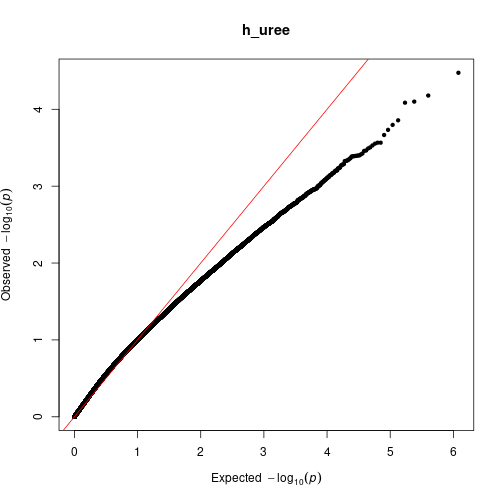
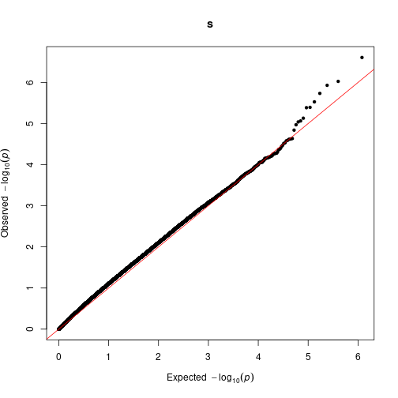

## Checking inflation for prsxpest summary stats
Before I suspect I was combining effects from limma incorrectly. So I re-rolled the regressions using mice and lm as the mice package seems to be intended to be used. Let's check inflation now within each pesticide:


```r
pesticide_interactions <- fread("prs_interaction_result.txt.gz")
for(cur_env in unique(pesticide_interactions$env)){
  qq(pesticide_interactions[env == cur_env]$GxEp,main = cur_env)
}
```



## Filtering sumstats based on within-exposure FDR

```r
pesticide_interactions[, c("GxEq") := .(p.adjust(GxEp,method="BH")) , by="env"]
pesticide_interactions[GxEq < 0.25][order(GxEq)]
```

```
##           cpg  env      Gest       Gse        Gt           Gp        Eest
## 1: cg13975855 fong -1.518858 0.3783645 -4.014273 8.529409e-05 0.004641015
## 2: cg17443080 herb -1.828985 0.5335531 -3.427934 7.426308e-04 0.007028214
## 3: cg13975855   cu -1.402291 0.3788691 -3.701254 2.816952e-04 0.003688723
## 4: cg17443080    s -1.784261 0.5351797 -3.333947 1.031011e-03 0.004577700
## 5: cg17320269 fong -1.456402 0.4132497 -3.524266 5.302399e-04 0.001262514
## 6: cg09274988 fong -1.496380 0.4126244 -3.626494 3.676100e-04 0.001328312
## 7: cg23014425    s -0.845107 0.3149894 -2.682970 7.953685e-03 0.003846887
## 8: cg02836478    s -2.020900 0.5394458 -3.746252 2.392255e-04 0.004711415
##            Ese        Et         Ep   GxEest     GxEse     GxEt         GxEp
## 1: 0.002540485 1.8268225 0.06927107 3.376453 0.5882916 5.739420 3.633034e-08
## 2: 0.003832959 1.8336259 0.06824166 4.779368 0.8539965 5.596472 7.383294e-08
## 3: 0.002664498 1.3843971 0.16794761 3.245721 0.6033306 5.379673 2.179335e-07
## 4: 0.003967512 1.1537962 0.25018209 4.786104 0.8933494 5.357483 2.475767e-07
## 5: 0.002774786 0.4549950 0.64962424 3.312384 0.6425373 5.155162 6.246340e-07
## 6: 0.002770958 0.4793694 0.63221872 3.195866 0.6415936 4.981138 1.399154e-06
## 7: 0.002312329 1.6636415 0.09793790 2.654958 0.5234392 5.072142 9.438147e-07
## 8: 0.003981877 1.1832146 0.23834336 4.540465 0.9027906 5.029367 1.175920e-06
##          GxEq
## 1: 0.01818155
## 2: 0.04433971
## 3: 0.13087824
## 4: 0.14867998
## 5: 0.15629936
## 6: 0.23340271
## 7: 0.23539614
## 8: 0.23539614
```
