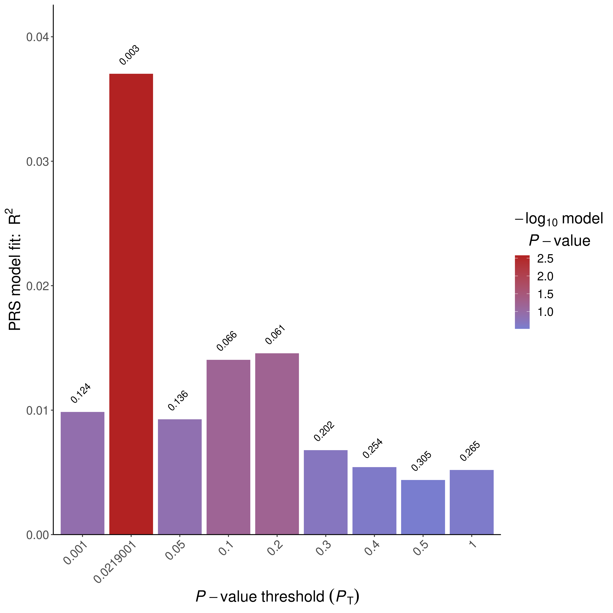
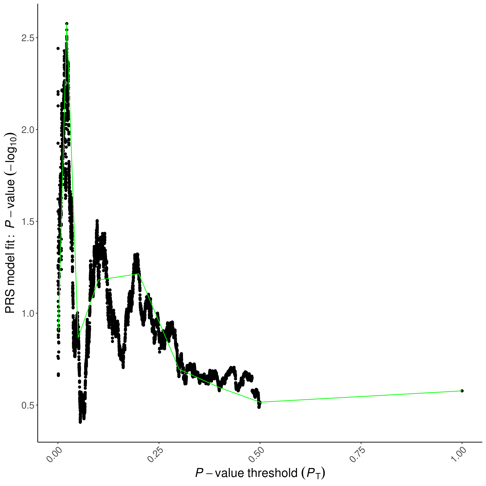
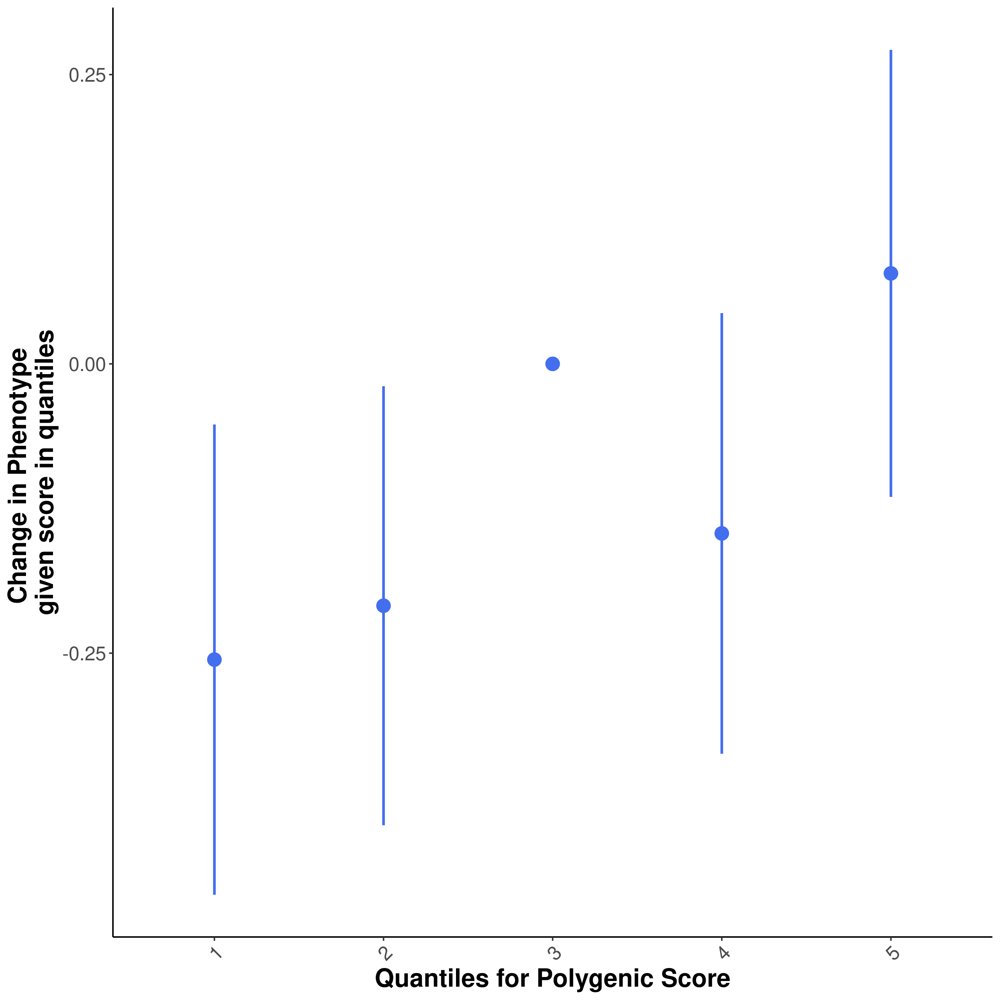

```{r setup, include=FALSE}
library(tidyverse)
library(data.table)
library(knitr)
knitr::opts_chunk$set(echo = TRUE)
```
# Step 0: Prepare covariates and input files
```{r}
IDs <- fread("~/genotype_qc/TERRE_QC/all_imputed_r2_30_rsid_hard_call.fam")[, .(FID = V1, IID = V2)]
covariate <- fread("../cis_mQTL_analyses/terre_data/covariates_10_methy_PC.txt")[id != "head_trauma_loc"]
covariate <- cbind(IDs, covariate %>% transpose(make.names = "id"))

PD <- fread("../cis_mQTL_analyses/terre_data/covariates_CTP_PD.txt")[id == "PD"]
PD <- cbind(IDs, PD %>% transpose(make.names = "id"))

head(covariate)
head(PD)
fwrite(PD, "TERRE.pheno", sep = "\t")
fwrite(covariate, "TERRE.covariate", sep = "\t")
```
```{r}
covariate
```


# Step 1: Run PRSice-2 on Nalls et al 2019 Sumstats
```{bash,eval=FALSE}
Rscript /home1/NEURO/casazza/PRSice.R \
    --prsice /home1/NEURO/casazza/PRSice_linux\
    --base /home1/NEURO/casazza/nalls_PD.QC.gz\
    --base-info INFO:0.8 \
    --base-maf MAF:0.01 \
    --cov TERRE.covariate \
    --beta  \
    --out TERRE_PRSice \
    -q 5\
    --all-score\
    --pheno TERRE.pheno \
    --snp SNP \
    --stat b \
    --pvalue p\
    --target /home1/NEURO/casazza/genotype_qc/TERRE_QC/all_imputed_r2_30_rsid_hard_call \
    --thread 32

```
# Step 2: Evaluate output
```{r, out.width="10%"}



```


# Step 3 run linear model at different thresholds for SNP inclusion
```{r}

```
