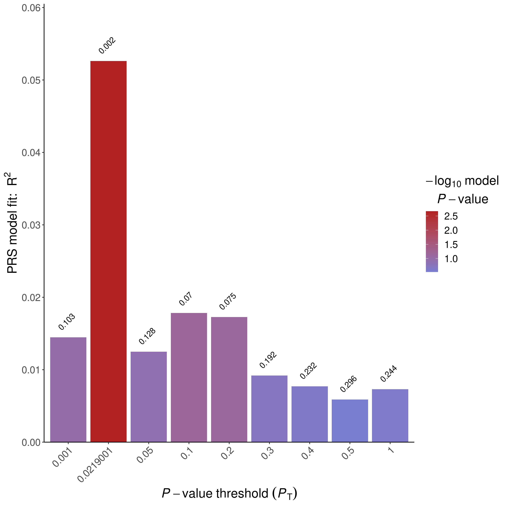
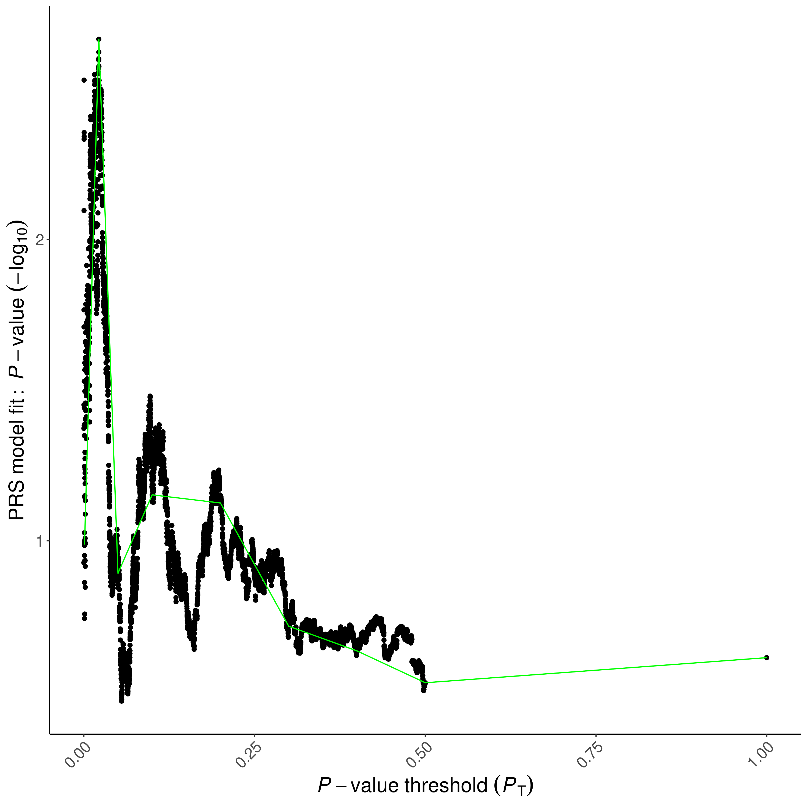
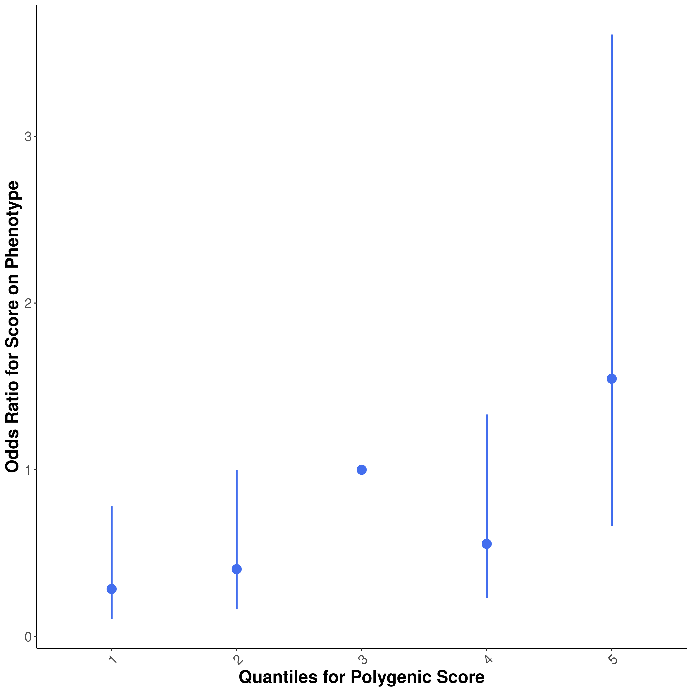
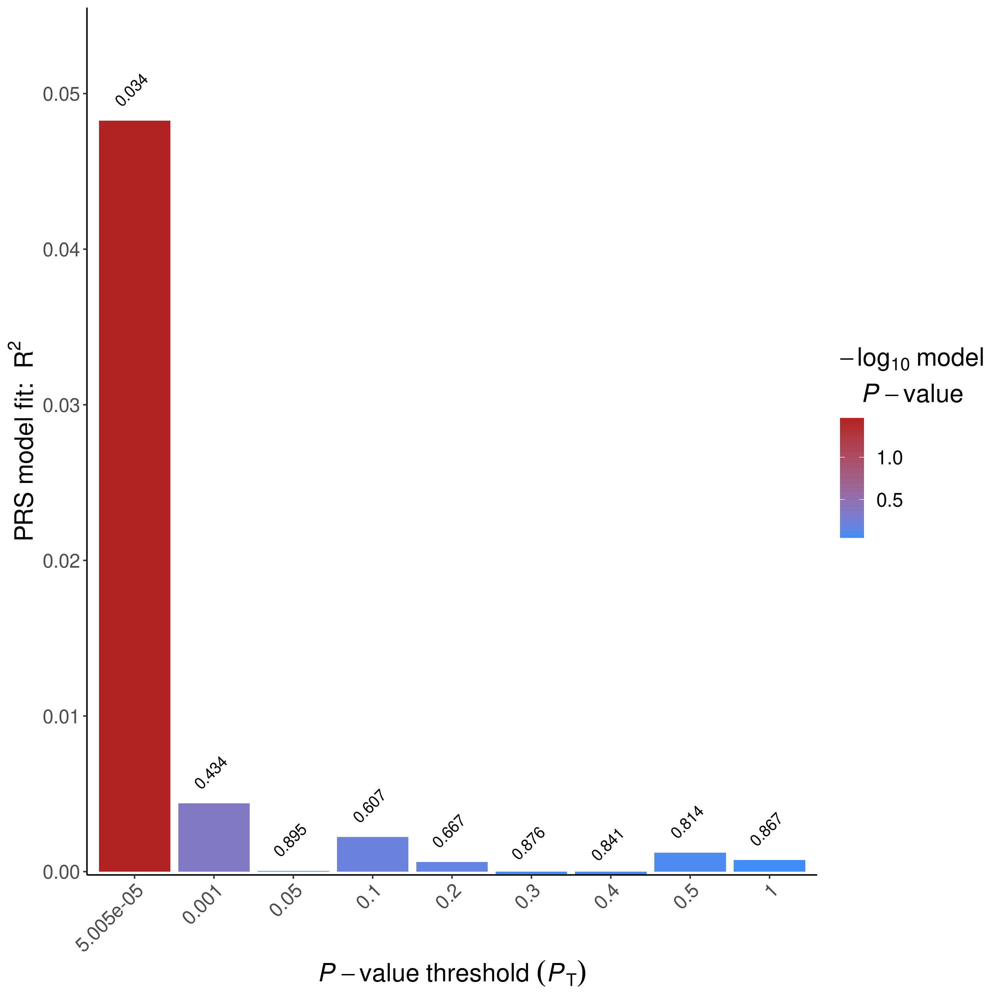
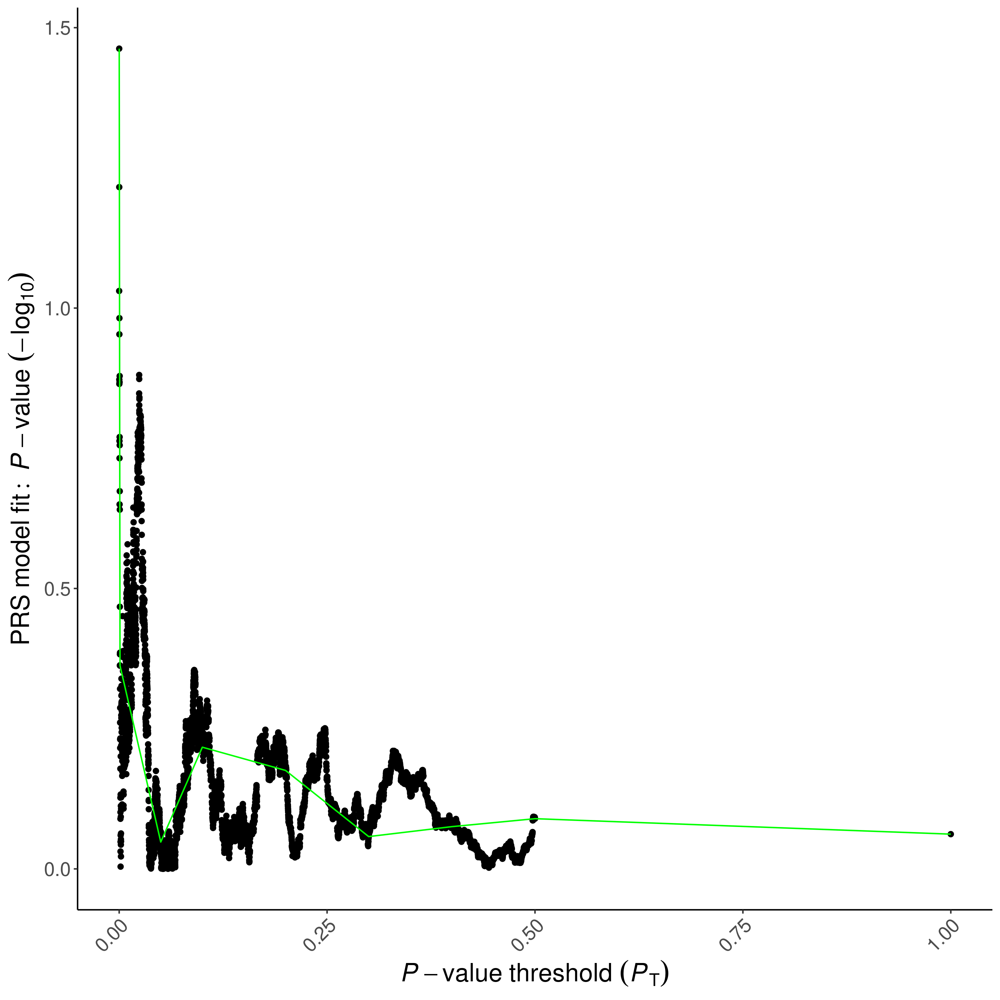
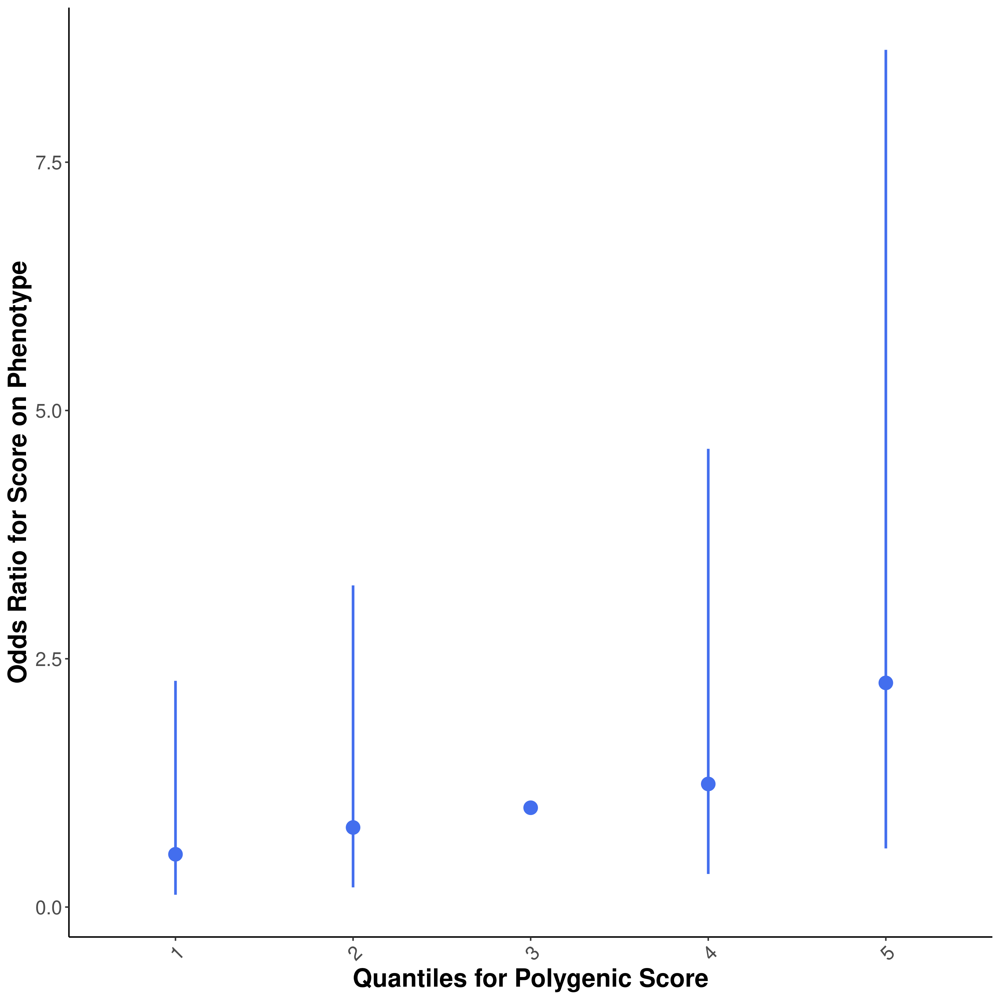
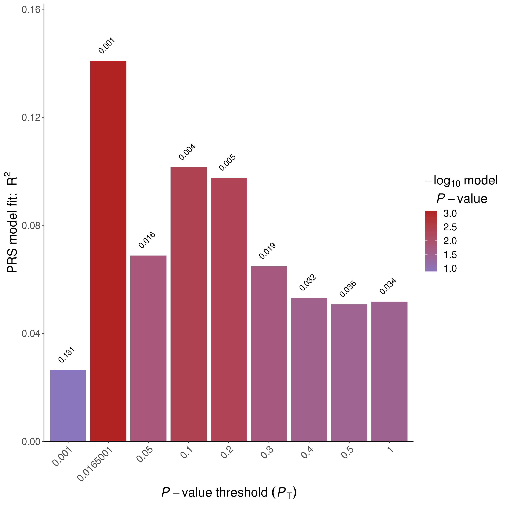
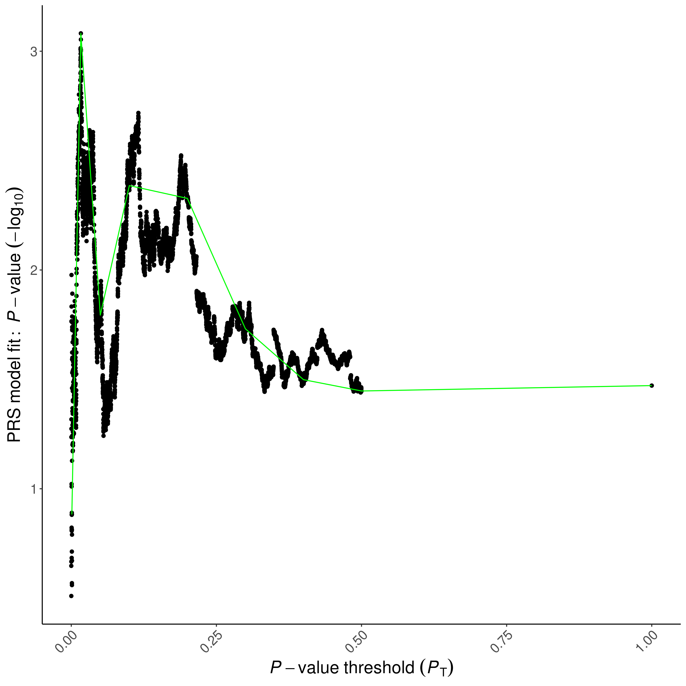
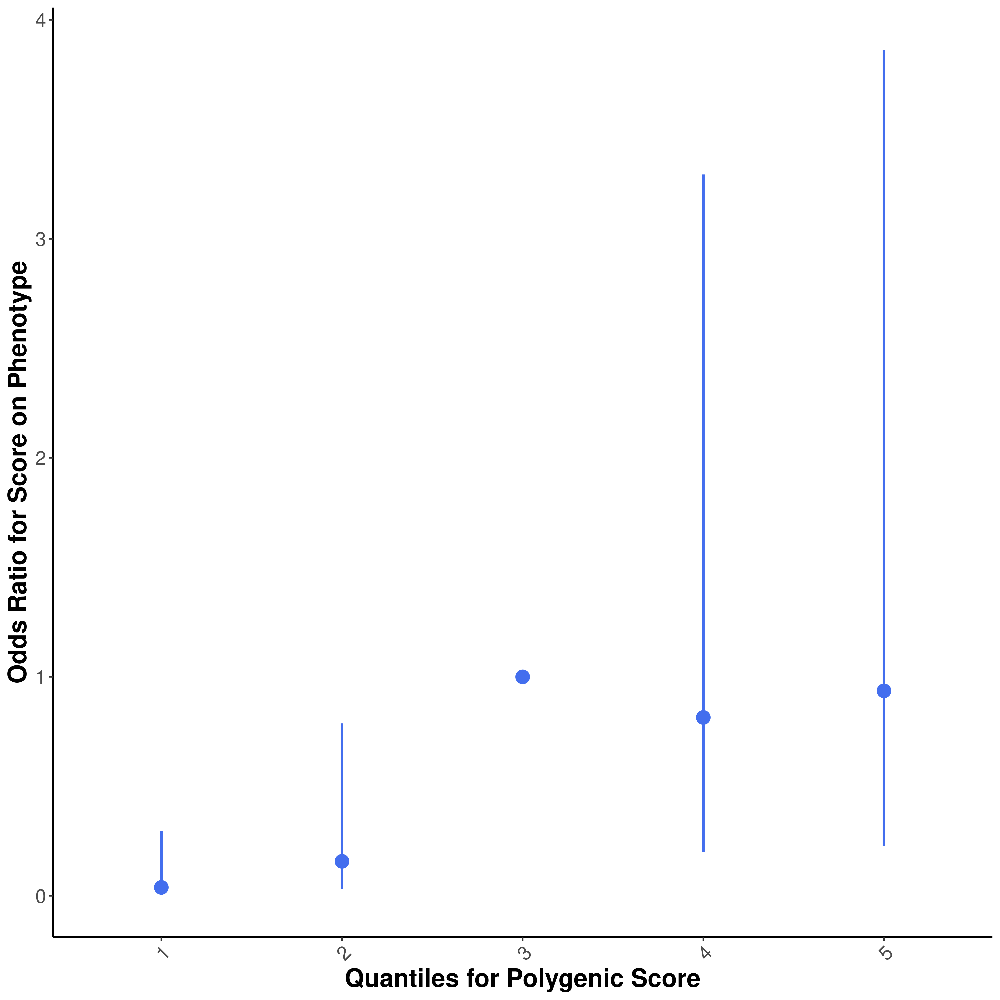

```{r setup, include=FALSE}
library(tidyverse)
library(ggrepel)
library(data.table)
library(knitr)
library(limma)
library(foreach)
library(doParallel)
Sys.setlocale("LC_MESSAGES", "en_US.utf8")
knitr::opts_chunk$set(echo = TRUE)
```

# Step 0: Prepare covariates and input files
```{r}
#@TODO change to compute PCs on mvalues

IDs <- fread("~/genotype_qc/TERRE_QC/all_imputed_r2_30_rsid_hard_call.fam")[, .(FID = V1, IID = V2)]
prsice_cov <- fread("prsice_cov_and_status_mvalues.txt")
prsice_cov <- prsice_cov[match(IDs$IID,prsice_cov$IID)]
all(IDs$IID ==prsice_cov$IID)
covariate <- cbind(IDs, prsice_cov[,-c(16,17,18)])

PD <- cbind(IDs,prsice_cov[,16])

head(covariate)
head(PD)
fwrite(PD, "TERRE.pheno", sep = "\t")
fwrite(covariate, "TERRE.covariate", sep = "\t")
```
```{r}
covariate
```


# Step 1: Run PRSice-2 on Nalls et al 2019 Sumstats
```{bash,eval=FALSE}
Rscript /home1/NEURO/casazza/PRSice.R \
    --prsice /home1/NEURO/casazza/PRSice_linux\
    --base /home1/NEURO/casazza/nalls_PD.QC.gz\
    --base-info INFO:0.8 \
    --base-maf MAF:0.01 \
    --cov TERRE.covariate \
    --binary-target T\
    --beta  \
    --out TERRE_PRSice \
    -q 5\
    --all-score\
    --pheno TERRE.pheno \
    --snp SNP \
    --stat b \
    --pvalue p\
    --target /home1/NEURO/casazza/genotype_qc/TERRE_QC/all_imputed_r2_30_rsid_hard_call \
    --thread 32


```
# Step 2: Evaluate output
```{r, out.width="400px"}











```
## Plotting PRSice Data on my own
```{r}
library(ggnewscale)
prsice_male_meta <- fread("prsice_nalls_male_data/TERRE_PRSice_nalls_male.prsice")
ggplot(prsice_male_meta[Threshold <= 0.5], aes(Threshold, Num_SNP, color = -log10(P))) +
  geom_point() +
  scale_y_continuous(breaks = c(seq(0, 1e5, 2.5e4), seq(2e5, 6e5, 1e5))) +
  theme_minimal()

prsice_female_meta <- fread("prsice_nalls_female_data/TERRE_PRSice_nalls_female.prsice")
ggplot(prsice_female_meta[Threshold <= 0.5], aes(Threshold, Num_SNP, color = -log10(P))) +
  geom_point() +
  scale_y_continuous(breaks = c(seq(0, 1e5, 2.5e4), seq(2e5, 6e5, 1e5))) +
  theme_minimal()

prsice_meta <- fread("prsice_data/TERRE_PRSice.prsice")
ggplot(mapping = aes(Threshold, R2, color = -log10(P))) +
  geom_point(data = prsice_female_meta, size = 1) +
  scale_color_gradient(low = "lightpink4", high = "lightpink") +
  labs(color = bquote("Female log"["10"] ~ "(P)")) +
  new_scale_color() +
  geom_point(data = prsice_male_meta, size = 1, aes(color = -log10(P))) +
  scale_color_gradient(low = "lightblue4", high = "lightblue") +
  labs(y = bquote("R"^2), x = "GWAS P-Value Threshold", color = bquote("Male log"["10"] ~ "(P)")) +
  theme_minimal() +
  theme(legend.position = "top")
ggplot(mapping = aes(Threshold, R2, color = -log10(P))) +
  geom_point(data = prsice_female_meta, size = 1) +
  scale_color_gradient(low = "lightpink4", high = "lightpink") +
  labs(color = bquote("Female log"["10"] ~ "(P)")) +
  new_scale_color() +
  geom_point(data = prsice_male_meta, size = 1, aes(color = -log10(P))) +
  scale_color_gradient(low = "lightblue4", high = "lightblue") +
  labs(color = bquote("Male log"["10"] ~ "(P)")) +
  new_scale_color() +
  geom_point(data = prsice_meta, size = 1, aes(color = -log10(P))) +
  scale_color_gradient(low = "gray40", high = "gray80") +
  labs(y = bquote("R"^2), x = "GWAS P-Value Threshold", color = bquote("Cross-sex -log"["10"] ~ "(P)")) +
  theme_minimal() +
  theme(legend.position = "top")
```

# Step 3 run linear model at different thresholds for SNP inclusion
```{r}
load("/home1/NEURO/SHARE_DECIPHER/processed_DNAm_data/TERRE_processed_2021/betas_combat.RData") # betas_sub
# Assign genotyping ID to data
original_covars <- fread("/home1/NEURO/SHARE_DECIPHER/terre_meta_master.csv")[, .(patient, IID = gsub("_PAE.*", "", IID))]
colnames(betas_combat) <- original_covars$IID[match(colnames(betas_combat), original_covars$patient)]
betas_combat <- betas_combat[, colnames(betas_combat) %in% covariate$IID]
```
Let's check how the data looks for the first 5 subjects:
```{r}
ggplot(betas_combat[, 1:5] %>% as.data.table(keep.rownames = T) %>% melt(id.vars = "rn", value.name = "betas", variable.name = "subject"), aes(betas, color = subject)) +
  geom_density()
```

### Match DNA, PRS, and metadata
```{r}
prsice_all <- fread("prsice_data/TERRE_PRSice.all_score")[match(colnames(betas_combat), IID), .(FID, IID, `Pt_0.0219001`, `Pt_5e-08`, `Pt_5.005e-05`, `Pt_0.00010005`, `Pt_0.00100005`, `Pt_0.0101501`, `Pt_0.1`, `Pt_0.2`, `Pt_0.3`, `Pt_0.4`, `Pt_0.5`, `Pt_1`)]
covariate <- covariate[match(colnames(betas_combat), IID)]
all(covariate$IID == colnames(betas_combat))
all(covariate$IID == prsice_all$IID)

covariate_male <- covariate[sex == 1] %>% select(-sex)
betas_male <- betas_combat[, covariate_male$IID]
prsice_male_all <- prsice_all[match(colnames(betas_male), IID), .(FID, IID, `Pt_0.0219001`, `Pt_5e-08`, `Pt_5.005e-05`, `Pt_0.00010005`, `Pt_0.00100005`, `Pt_0.0101501`, `Pt_0.1`, `Pt_0.2`, `Pt_0.3`, `Pt_0.4`, `Pt_0.5`, `Pt_1`)]
covariate_male <- covariate_male[match(colnames(betas_male), IID)]
all(covariate_male$IID == colnames(betas_male))
all(covariate_male$IID == prsice_male_all$IID)

covariate_female <- covariate[sex == 0] %>% select(-sex)
betas_female <- betas_combat[, covariate_female$IID]
prsice_female_all <- prsice_all[match(colnames(betas_female), IID), .(FID, IID, `Pt_0.0219001`, `Pt_5e-08`, `Pt_5.005e-05`, `Pt_0.00010005`, `Pt_0.00100005`, `Pt_0.0101501`, `Pt_0.1`, `Pt_0.2`, `Pt_0.3`, `Pt_0.4`, `Pt_0.5`, `Pt_1`)]
covariate_female <- covariate_female[match(colnames(betas_female), IID)]
all(covariate_female$IID == colnames(betas_female))
all(covariate_female$IID == prsice_female_all$IID)


covariate_male <- covariate[sex == 1] %>% select(-sex)
betas_male <- betas_combat[, covariate_male$IID]
prsice_male_nalls_all <- fread("prsice_nalls_male_data/TERRE_PRSice_nalls_male.all_score")[match(colnames(betas_male), IID), .(FID, IID, `Pt_0.0219001`, `Pt_5e-08`, `Pt_5.005e-05`, `Pt_0.00010005`, `Pt_0.00100005`, `Pt_0.0101501`, `Pt_0.1`, `Pt_0.2`, `Pt_0.3`, `Pt_0.4`, `Pt_0.5`, `Pt_1`)]
covariate_male <- covariate_male[match(colnames(betas_male), IID)]
all(covariate_male$IID == colnames(betas_male))
all(covariate_male$IID == prsice_male_nalls_all$IID)

covariate_female <- covariate[sex == 0] %>% select(-sex)
betas_female <- betas_combat[, covariate_female$IID]
prsice_female_nalls_all <- fread("prsice_nalls_female_data/TERRE_PRSice_nalls_female.all_score")[match(colnames(betas_female), IID), .(FID, IID, `Pt_0.0219001`, `Pt_5e-08`, `Pt_5.005e-05`, `Pt_0.00010005`, `Pt_0.00100005`, `Pt_0.0101501`, `Pt_0.1`, `Pt_0.2`, `Pt_0.3`, `Pt_0.4`, `Pt_0.5`, `Pt_1`)]
covariate_female <- covariate_female[match(colnames(betas_female), IID)]
all(covariate_female$IID == colnames(betas_female))
all(covariate_female$IID == prsice_female_nalls_all$IID)
```
### Run limma

```{r}
mvalues <- lumi::beta2m(betas_combat)
prs_mat <- prsice_all[, -c(1, 2)]
cov_mat <- covariate[, -c(1, 2)]

mvalues_male <- lumi::beta2m(betas_male)
prs_mat_male <- prsice_male_all[, -c(1, 2)]
cov_mat_male <- covariate_male[, -c(1, 2)]

mvalues_female <- lumi::beta2m(betas_female)
prs_mat_female <- prsice_female_all[, -c(1, 2)]
cov_mat_female <- covariate_female[, -c(1, 2)]

prs_mat_nalls_male <- prsice_male_nalls_all[, -c(1, 2)]
prs_mat_nalls_female <- prsice_female_nalls_all[, -c(1, 2)]
```

```{r}
registerDoParallel(ncol(prs_mat) / 2)
hits <- foreach(prs_thresh = colnames(prs_mat)) %dopar% {
  design_prs <- model.matrix(~., data = cbind(prs_mat[, ..prs_thresh], cov_mat))
  prs_fit <- lmFit(mvalues, design_prs)
  prs_fit <- eBayes(prs_fit)
  topTable(prs_fit, coef = 2, adjust.method = "bonf", p.value = 0.05, number = Inf, genelist = rownames(mvalues))
}
names(hits) <- colnames(prs_mat)
hits_by_thresh_bonf <- rbindlist(hits, idcol = "threshold", fill = TRUE)

registerDoParallel(ncol(prs_mat_male) / 2)
hits_male <- foreach(prs_thresh = colnames(prs_mat_male)) %dopar% {
  design_prs_male <- model.matrix(~., data = cbind(prs_mat_male[, ..prs_thresh], cov_mat_male))
  prs_fit_male <- lmFit(mvalues_male, design_prs_male)
  prs_fit_male <- eBayes(prs_fit_male)
  topTable(prs_fit_male, coef = 2, adjust.method = "bonf", p.value = 0.05, number = Inf, genelist = rownames(mvalues_male))
}
names(hits_male) <- colnames(prs_mat_male)
hits_by_thresh_bonf_male <- rbindlist(hits_male, idcol = "threshold", fill = TRUE)

registerDoParallel(ncol(prs_mat_female) / 2)
hits_female <- foreach(prs_thresh = colnames(prs_mat_female)) %dopar% {
  design_prs_female <- model.matrix(~., data = cbind(prs_mat_female[, ..prs_thresh], cov_mat_female))
  prs_fit_female <- lmFit(mvalues_female, design_prs_female)
  prs_fit_female <- eBayes(prs_fit_female)
  topTable(prs_fit_female, coef = 2, adjust.method = "bonf", p.value = 0.05, number = Inf, genelist = rownames(mvalues_female))
}
names(hits_female) <- colnames(prs_mat_female)
hits_by_thresh_bonf_female <- rbindlist(hits_female, idcol = "threshold", fill = TRUE)

registerDoParallel(ncol(prs_mat_male) / 2)
hits_nalls_male <- foreach(prs_thresh = colnames(prs_mat_nalls_male)) %dopar% {
  design_prs_nalls_male <- model.matrix(~., data = cbind(prs_mat_nalls_male[, ..prs_thresh], cov_mat_male))
  prs_fit_nalls_male <- lmFit(mvalues_male, design_prs_nalls_male)
  prs_fit_nalls_male <- eBayes(prs_fit_nalls_male)
  topTable(prs_fit_nalls_male, coef = 2, adjust.method = "bonf", p.value = 0.05, number = Inf, genelist = rownames(mvalues_male))
}
names(hits_nalls_male) <- colnames(prs_mat_nalls_male)
hits_by_thresh_bonf_nalls_male <- rbindlist(hits_nalls_male, idcol = "threshold", fill = TRUE)

registerDoParallel(ncol(prs_mat_female) / 2)
hits_nalls_female <- foreach(prs_thresh = colnames(prs_mat_nalls_female)) %dopar% {
  design_prs_nalls_female <- model.matrix(~., data = cbind(prs_mat_nalls_female[, ..prs_thresh], cov_mat_female))
  prs_fit_nalls_female <- lmFit(mvalues_female, design_prs_nalls_female)
  prs_fit_nalls_female <- eBayes(prs_fit_nalls_female)
  topTable(prs_fit_nalls_female, coef = 2, adjust.method = "bonf", p.value = 0.05, number = Inf, genelist = rownames(mvalues_female))
}
names(hits_nalls_female) <- colnames(prs_mat_nalls_female)
hits_by_thresh_bonf_nalls_female <- rbindlist(hits_nalls_female, idcol = "threshold", fill = TRUE)
```

### Plotting EWAS vs Threshold Experiment by Sex
```{r}
to_plot <- rbind(
  hits_by_thresh_bonf[, .(hits = .N, Sex = "Cross-sex"), by = threshold] %>%
    mutate(threshold = recode_factor(threshold, `Pt_0.0219001` = "0.0219", `Pt_5e-08` = "5e-8", `Pt_5.005e-05` = "5e-5", `Pt_0.00010005` = "1e-4", `Pt_0.00100005` = "1e-3", `Pt_0.0101501` = "1e-2", `Pt_0.1` = "0.1", `Pt_0.2` = "0.2", `Pt_0.3` = "0.3", `Pt_0.4` = "0.4", `Pt_0.5` = "0.5", `Pt_1` = "1.0")),
  hits_by_thresh_bonf_nalls_male[, .(hits = .N, Sex = "Male"), by = threshold] %>%
    mutate(threshold = recode_factor(threshold, `Pt_0.0219001` = "0.0219", `Pt_5e-08` = "5e-8", `Pt_5.005e-05` = "5e-5", `Pt_0.00010005` = "1e-4", `Pt_0.00100005` = "1e-3", `Pt_0.0101501` = "1e-2", `Pt_0.1` = "0.1", `Pt_0.2` = "0.2", `Pt_0.3` = "0.3", `Pt_0.4` = "0.4", `Pt_0.5` = "0.5", `Pt_1` = "1.0")),
  hits_by_thresh_bonf_nalls_female[, .(hits = .N, Sex = "Female"), by = threshold] %>%
    mutate(threshold = recode_factor(threshold, `Pt_0.0219001` = "0.0219", `Pt_5e-08` = "5e-8", `Pt_5.005e-05` = "5e-5", `Pt_0.00010005` = "1e-4", `Pt_0.00100005` = "1e-3", `Pt_0.0101501` = "1e-2", `Pt_0.1` = "0.1", `Pt_0.2` = "0.2", `Pt_0.3` = "0.3", `Pt_0.4` = "0.4", `Pt_0.5` = "0.5", `Pt_1` = "1.0"))
) %>% mutate(Sex = factor(Sex, levels = c("Cross-sex", "Male", "Female")))
plot_pos <- position_dodge(width = 1)
ggplot(to_plot, aes(threshold, hits, fill = Sex, label = hits)) +
  geom_text(position = plot_pos, vjust = -0.25) +
  geom_col(position = plot_pos) +
  labs(x = "GWAS P Value Threshold", y = "EWAS Hits") +
  scale_fill_manual(values = c("grey80", "lightblue", "lightpink")) +
  theme_minimal()
hits_by_thresh_bonf[, .(hits = .N, Sex = "Cross-sex"), by = threshold]
hits_by_thresh_bonf_nalls_male[, .(hits = .N), by = threshold]
hits_by_thresh_bonf_nalls_female[, .(hits = .N), by = threshold]
```
```{r}
display_venn <- function(x, ...) {
  library(VennDiagram)
  grid.newpage()
  venn_object <- venn.diagram(x, filename = NULL, ...)
  grid.draw(venn_object)
}
display_venn(list(both = hits_by_thresh_bonf[threshold == "Pt_5e-08"]$ID, male = hits_by_thresh_bonf_male[threshold == "Pt_5e-08"]$ID, female = hits_by_thresh_bonf_female[threshold == "Pt_5e-08"]$ID), fill = c("gray80", "lightblue", "lightpink"))

display_venn(list(both = hits_by_thresh_bonf[threshold == "Pt_5e-08"]$ID, male = hits_by_thresh_bonf_nalls_male[threshold == "Pt_5e-08"]$ID, female = hits_by_thresh_bonf_nalls_female[threshold == "Pt_5e-08"]$ID), fill = c("gray80", "lightblue", "lightpink"))
male_ids <- hits_by_thresh_bonf_nalls_male[threshold == "Pt_5e-08"]$ID
cross_ids <- hits_by_thresh_bonf[threshold == "Pt_5e-08"]$ID
male_ids[!male_ids %in% cross_ids]
```

```{r,eval=FALSE}
library(missMethyl)
gometh(hits_by_thresh_bonf[threshold == "Pt_5e-08"]$ID, array.type = "EPIC", all.cpg = rownames(mvalues))
```

```{r}
get_full_fit <- function(prs_mat,cov_mat,mvalues){
  top_design_prs <- model.matrix(~., data = cbind(prs_mat[, `Pt_5e-08`], cov_mat))
  top_prs_fit <- lmFit(mvalues, top_design_prs)
  top_prs_fit <- eBayes(top_prs_fit)
  top_prs_hits <- topTable(top_prs_fit, coef = 2, adjust.method = "bonf", number = Inf, genelist = rownames(mvalues))
}
top_prs_hits <- get_full_fit(prs_mati,cov_mat,mvalues)
top_male_prs_hits <- get_full_fit(prs_mat_nalls_male, cov_mat_male, mvalues_male)
top_female_prs_hits <- get_full_fit(prs_mat_nalls_female, cov_mat_female, mvalues_female)
```
```{r}
manifest <- IlluminaHumanMethylationEPICanno.ilm10b4.hg19::Other %>%
  as.data.frame() %>%
  rownames_to_column(var = "name")
prs_annot <- data.table(top_prs_hits)[manifest, gene := gsub(";.*", "", UCSC_RefGene_Name), on = c(ID = "name")]
prs_annot_male <- data.table(top_male_prs_hits)[manifest, gene := gsub(";.*", "", UCSC_RefGene_Name), on = c(ID = "name")]
prs_annot_female<- data.table(top_female_prs_hits)[manifest, gene := gsub(";.*", "", UCSC_RefGene_Name), on = c(ID = "name")]
plot_prs_hits <- function(prs_annot,label_color){
  ggplot(prs_annot, aes(logFC, -log10(P.Value))) +
    geom_point() +
    geom_point(
      data = subset(prs_annot, adj.P.Val < 0.05 & abs(logFC) > 0.03),
      color = label_color,
      mapping = aes(logFC, -log10(P.Value))
    ) +
    geom_hline(
      linetype = "dashed",
      yintercept = min(-log10(prs_annot$P.Value[prs_annot$adj.P.Val < 0.05]))
    ) +
    geom_vline(linetype = "dashed", xintercept = 0.03) +
    geom_vline(linetype = "dashed", xintercept = -0.03) +
    geom_text_repel(
      data = prs_annot %>% filter(abs(logFC) > 0.03 & adj.P.Val < 0.05),
      color = "dodgerblue",
      mapping = aes(logFC, -log10(P.Value), label = ifelse(gene != "", gene, ID)),
      size = 3,
      max.overlaps = 20
    ) +
    labs(y = bquote("log"[10] ~ "(P)"), x = quote(Delta ~ "M" ~ Methylation)) +
    theme_minimal()
}

plot_prs_hits(prs_annot,"gray40")
plot_prs_hits(prs_annot_male,"lightblue")
plot_prs_hits(prs_annot_female,"pink")
```
```{r}
manifest[manifest$name =="cg06846282",]
```

# Manhattan plot vs GWAS manhattan plot
```{r,eval=FALSE}
library(qqman)
cpg_pos <- IlluminaHumanMethylationEPICanno.ilm10b4.hg19::Locations %>%
  as.data.frame() %>%
  rownames_to_column(var = "name")
copy_annot <- prs_annot[cpg_pos, on = c(ID = "name")] %>%
  mutate(chr = as.numeric(recode(gsub("chr", "", chr),X="23",Y="24")))
to_plot <- copy_annot[, .(SNP = gene, CHR = chr, BP = pos, P = P.Value, FDR = adj.P.Val)][!is.na(P)]
manhattan(to_plot,
  annotatePval = max(to_plot[FDR < 0.05]$P),
  annotateTop = TRUE,
  genomewideline = min(-log10(to_plot[FDR < 0.05]$P)),
  suggestiveline = FALSE
)
manhattan(to_plot[CHR == 17],
  annotatePval = max(to_plot[FDR < 0.05]$P),
  annotateTop = FALSE,
  genomewideline = min(-log10(to_plot[FDR < 0.05]$P)),
  suggestiveline = FALSE
)
qq(to_plot$P)
```
```{r,eval=FALSE}
GWAS <- fread("~/nalls_PD.QC.gz")

manhattan(GWAS,
  annotatePval = 5e-8,
  bp = "POS",
  p = "p",
  suggestiveline = FALSE
)
```


## DMRs

```{r}
S4_to_dataframe <- function(s4obj) {
  nms <- slotNames(s4obj)
  lst <- lapply(nms, function(nm) slot(s4obj, nm))
  as.data.frame(setNames(lst, nms))
}
run_dmrcate <- function(prs_mat,cov_mat,mvalues){
  design_prs <- model.matrix(~., data = cbind(prs_mat[, `Pt_5e-08`], cov_mat))
  prs_annotated <- cpg.annotate(datatype = "array", object = mvalues, analysis.type = "differential", design = design_prs, coef = 2, what = "M", arraytype = "EPIC", fdr = 0.05)
  prs_dmr_res <- dmrcate(prs_annotated, lambda = 1000, C = 2)
  return(S4_to_dataframe(prs_dmr_res))
}
dmr_cross <- run_dmrcate(prs_mat, cov_mat, mvalues)
dmr_males <- run_dmrcate(prs_mat_nalls_male,cov_mat_male,mvalues_male)
dmr_female <- run_dmrcate(prs_mat_nalls_female,cov_mat_female,mvalues_female)
```
```{r}
annotation <- minfi::getAnnotation(IlluminaHumanMethylationEPICanno.ilm10b4.hg19)
```

```{r}
get_dmr_effects <- function(dmr, limma_res,mvalues) {
  dmr_coord <- str_match_all(as.character(dmr), "(chr.*):([0-9]*)-([0-9]*)")[[1]]
  cpgs <- as.data.table(annotation[annotation$chr == dmr_coord[2] & annotation$pos >= as.numeric(dmr_coord[3]) & annotation$pos <= as.numeric(dmr_coord[4]), ])
  res <- limma_res[cpgs,on=c("ID"="Name"),nomatch=0 ]
  dmr_1 <- as.data.frame(res[!is.na(res$logFC), ])
  dmr_methy <- reshape2::melt(lumi::m2beta(mvalues[dmr_1$ID, ]), stringsAsFactors = FALSE)
  to_plot <- merge(dmr_1, dmr_methy, by.x = "ID", by.y = "Var1")
  to_plot$DMR <- dmr
  to_plot
}
get_dmr_res <- function(dmr, limma_res) {
  dmr_coord <- str_match_all(as.character(dmr), "(chr.*):([0-9]*)-([0-9]*)")[[1]]
  cpgs <- annotation[annotation$chr == dmr_coord[2] & annotation$pos >= as.numeric(dmr_coord[3]) & annotation$pos <= as.numeric(dmr_coord[4]), ]
  res <- cbind(cpgs, limma_res[cpgs$Name, ])
  res$DMR <- dmr
  return(res)
}
plot_dmrs <- function(dmr_res,limma_res,prs_mat, mvalues, case_control) {
  to_plot <- rbindlist(lapply(dmr_res$coord, function(dmr) get_dmr_effects(dmr, limma_res,mvalues))) %>%
    mutate(SCORE1_AVG = scale(prs_mat[match(Var2,IDs$IID),`Pt_5e-08`]),PD = PD[match(Var2,IID)]$PD) %>%
    filter(!is.na(SCORE1_AVG))
  p1 <- ggplot(to_plot , aes(pos, value, color = SCORE1_AVG)) +
    geom_point() +
    scale_color_gradient(low = rev(case_control)[1], high = rev(case_control)[2]) +
    facet_wrap(~DMR, scales = "free", nrow = 2) +
    theme_minimal() +
    labs(color = "Normalized PD PRS")+
    theme(axis.text.x = element_text(angle = 90))
  p2 <- ggplot(to_plot %>% mutate(PD = ifelse(PD == 1, "CASE", "CONTROL")), aes(factor(pos), value, color = PD)) +
    geom_boxplot(position = position_dodge(0.75)) +
    scale_color_manual(values = case_control) +
    facet_wrap(~DMR, scales = "free", nrow = 2) +
    theme_minimal() +
    stat_summary(aes(group = PD), fun = mean, geom = "line") +
    labs(color = "PD status") +
    theme(axis.text.x = element_text(angle = 90))
  print(p1)
  print(p2)
}
plot_dmrs(dmr_cross, prs_annot, prs_mat,mvalues, rev(c("gray80", "gray40")))
plot_dmrs(dmr_males,prs_annot_male,prs_mat_male, mvalues_male,rev(c("light blue", "lightblue4")))
plot_dmrs(dmr_female, prs_annot_female, prs_mat_female, mvalues_female,rev(c("lightpink", "lightpink4")))
```
