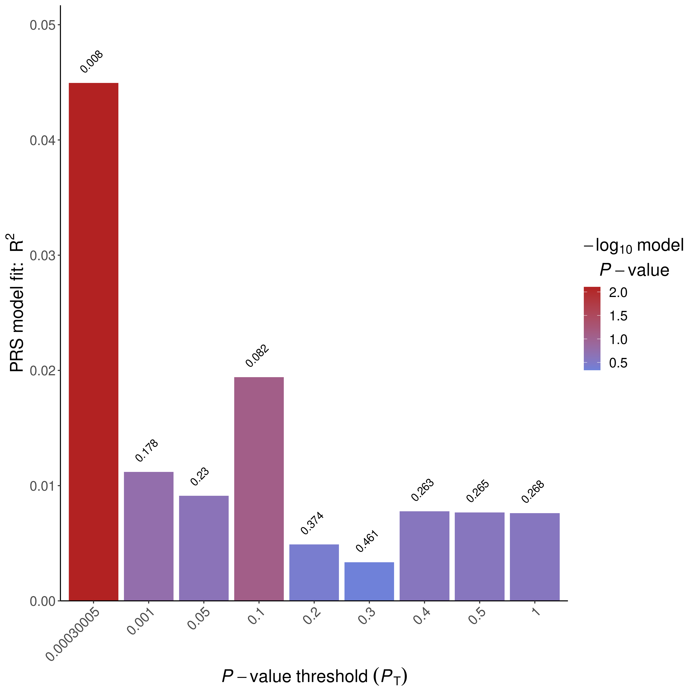
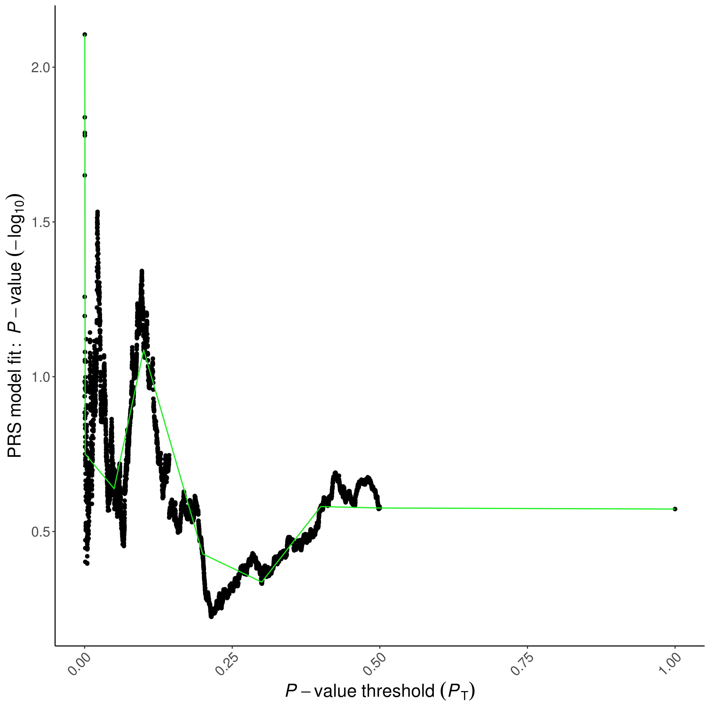
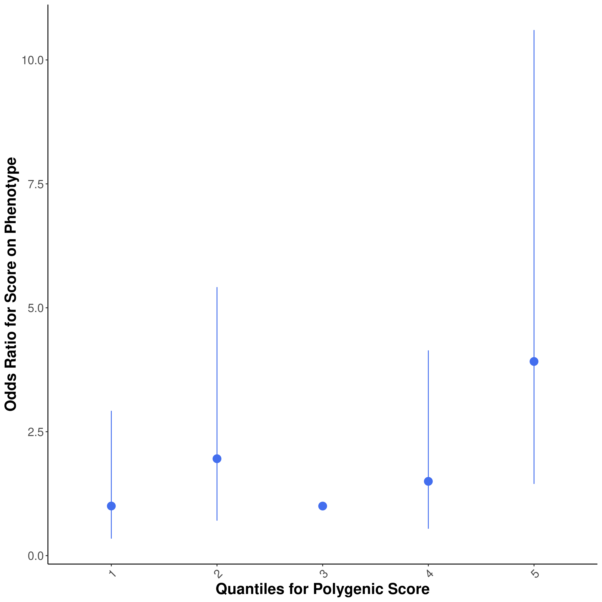
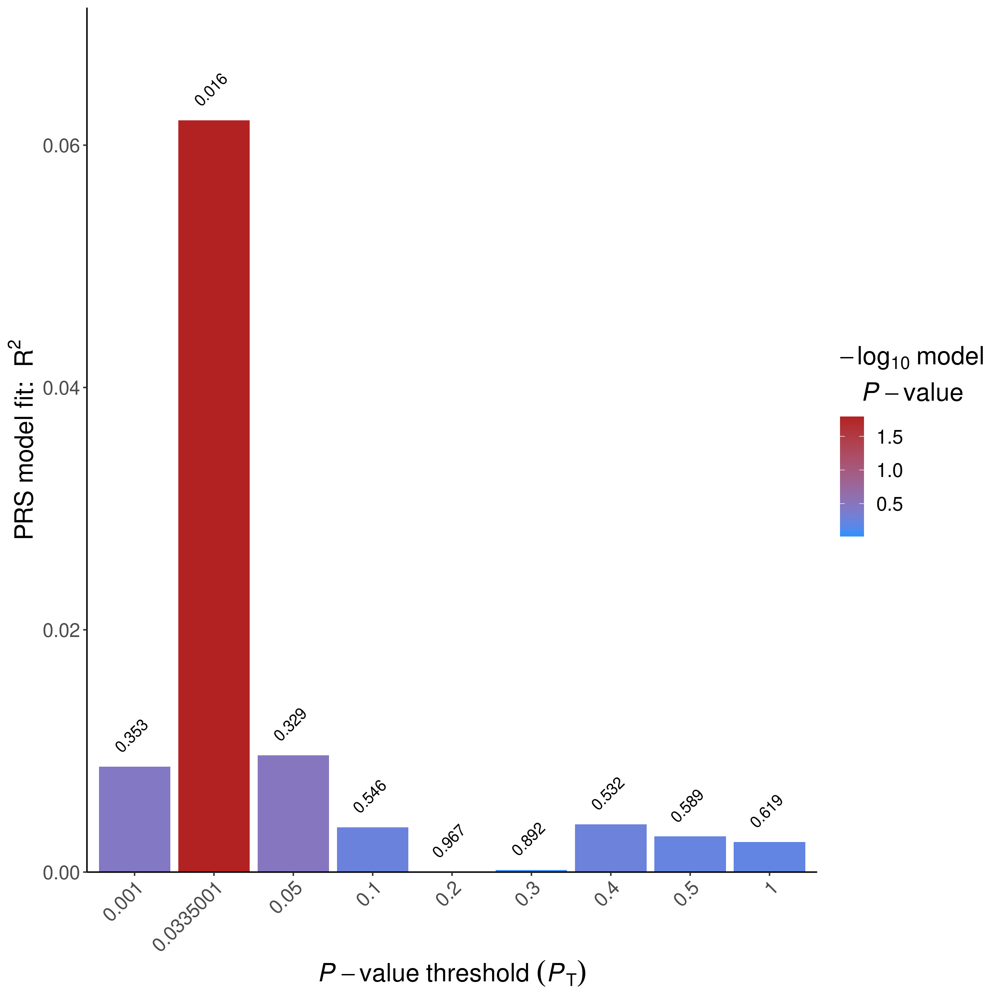
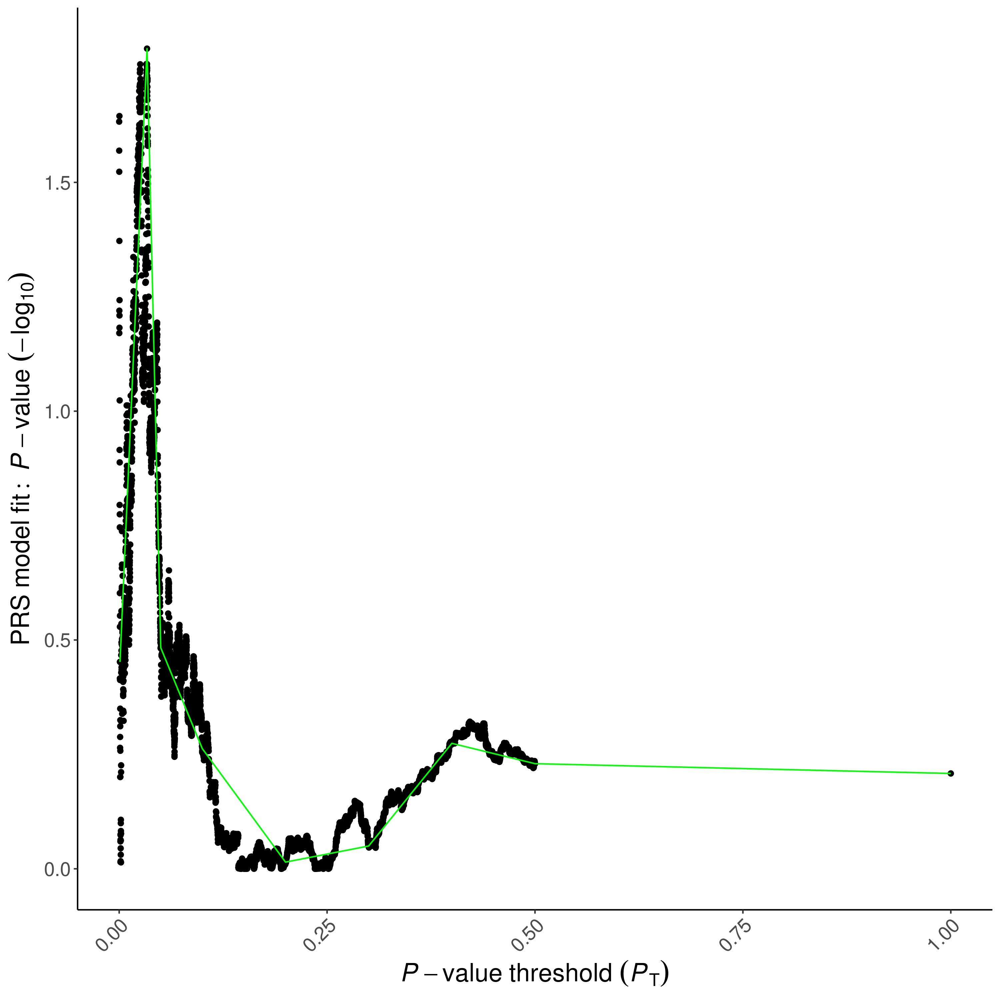
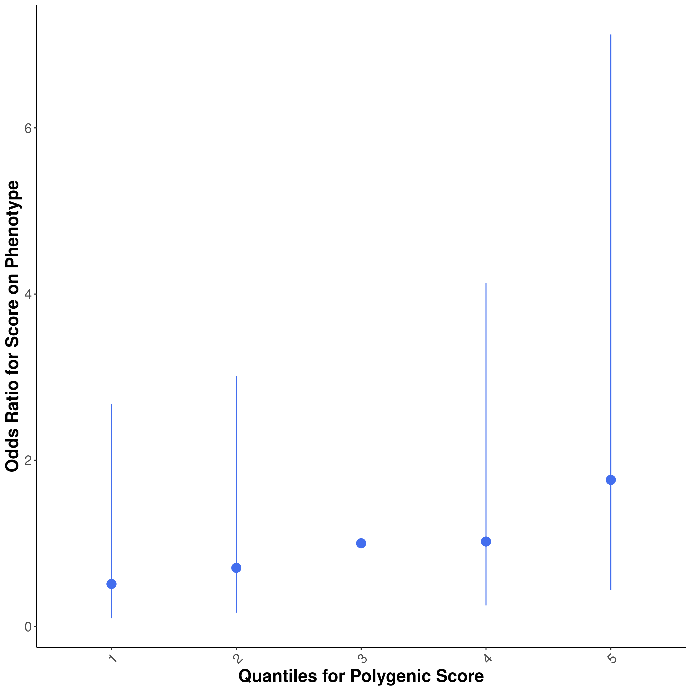
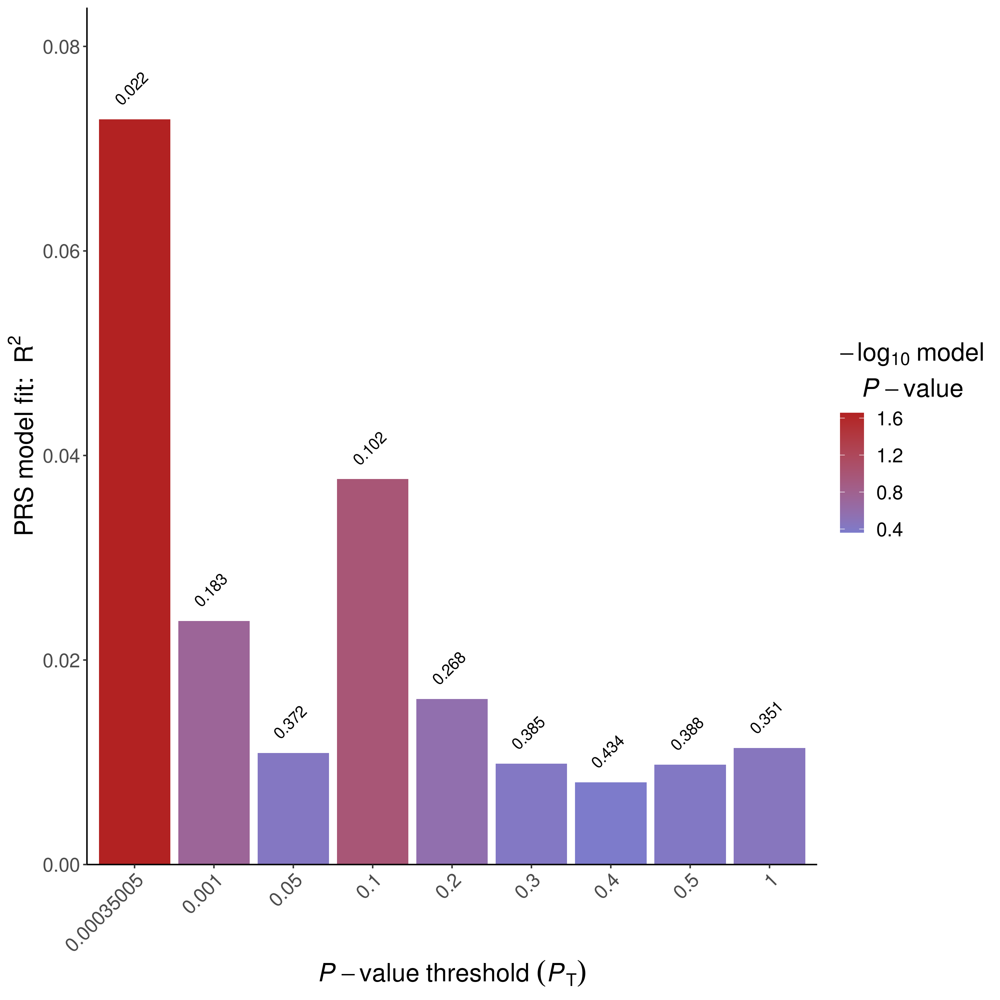
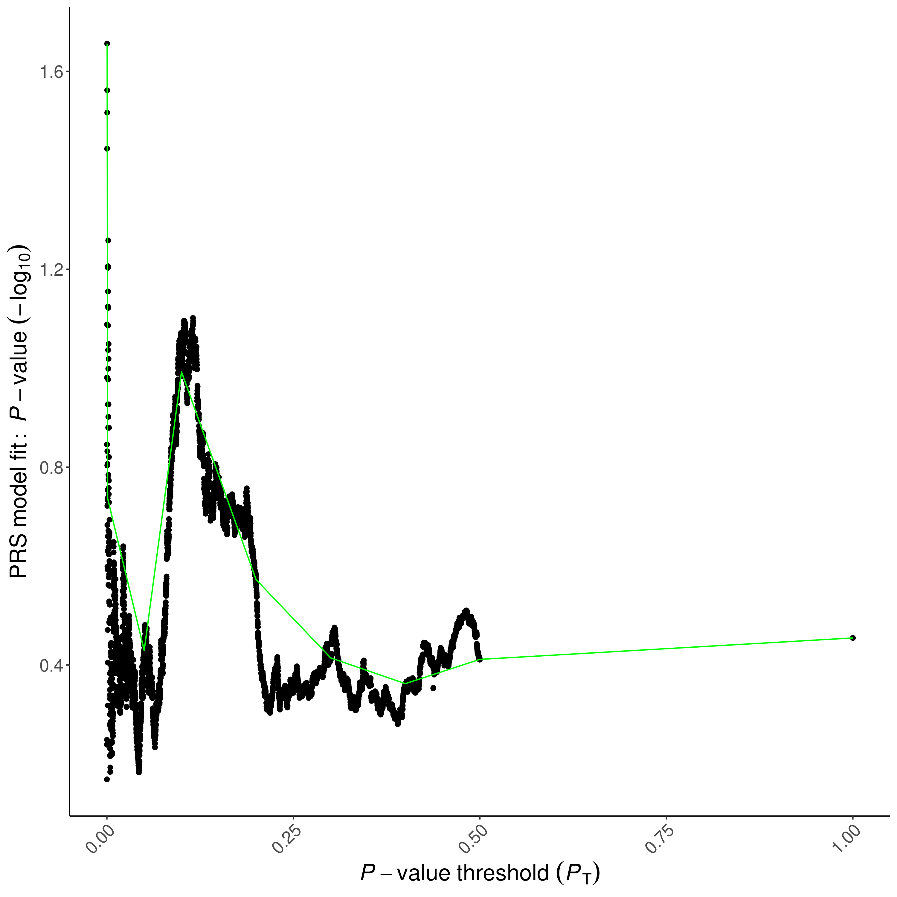
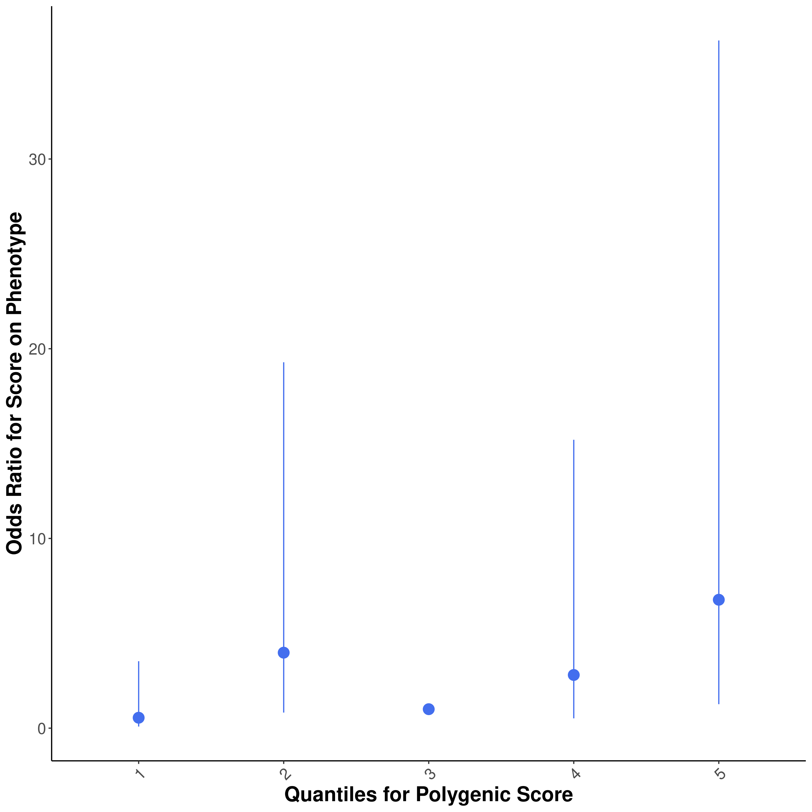

```{r setup, include=FALSE}
library(tidyverse)
library(ggrepel)
library(data.table)
library(knitr)
library(limma)
library(foreach)
library(doParallel)
Sys.setlocale("LC_MESSAGES", "en_US.utf8")
knitr::opts_chunk$set(echo = TRUE)
```

# Step 0: Prepare covariates and input files
```{r}
IDs <- fread("~/genotype_qc/TERRE_QC/all_imputed_r2_30_rsid_hard_call.fam")[, .(FID = V1, IID = V2)]
prsice_cov <- fread("prsice_cov_and_status_mvalues.txt")
prsice_cov <- prsice_cov[match(IDs$IID,prsice_cov$IID)]
all(IDs$IID ==prsice_cov$IID)
covariate <- cbind(IDs, prsice_cov[,-c(16,17,18)])

PD <- cbind(IDs,prsice_cov[,16])

head(covariate)
head(PD)
fwrite(na.omit(PD), "TERRE.pheno", sep = "\t")
fwrite(na.omit(covariate), "TERRE.covariate", sep = "\t")
```
```{r}
covariate
```


# Step 1: Run PRSice-2 on Nalls et al 2019 Sumstats
```{bash,eval=FALSE}
Rscript /home1/NEURO/casazza/PRSice.R \
    --prsice /home1/NEURO/casazza/PRSice_linux\
    --base /home1/NEURO/casazza/nalls_PD.QC.gz\
    --base-info INFO:0.8 \
    --base-maf MAF:0.01 \
    --cov TERRE.covariate \
    --binary-target T\
    --beta  \
    --ld /home1/NEURO/casazza/1000G_plink/EUR_phase3  \
    --out TERRE_PRSice \
    -q 5\
    --all-score\
    --pheno TERRE.pheno \
    --snp SNP \
    --stat b \
    --pvalue p\
    --target /home1/NEURO/casazza/genotype_qc/TERRE_QC/all_imputed_r2_30_rsid_hard_call \
    --thread 32
```
# Step 2: Evaluate output
```{r, out.width="400px"}











```
## Plotting PRSice Data on my own
```{r,fig.height=8,fig.width=5}
library(ggnewscale)
prsice_male_meta <- fread("prsice_nalls_male_data/TERRE_PRSice_nalls_no_chr17_male.prsice")
ggplot(prsice_male_meta[Threshold <= 0.5], aes(Threshold, Num_SNP, color = -log10(P))) +
  geom_point() +
  scale_y_continuous(breaks = c(seq(0, 1e5, 2.5e4), seq(2e5, 6e5, 1e5))) +
  theme_minimal()

prsice_female_meta <- fread("prsice_nalls_female_data/TERRE_PRSice_nalls_no_chr17_female.prsice")
ggplot(prsice_female_meta[Threshold <= 0.5], aes(Threshold, Num_SNP, color = -log10(P))) +
  geom_point() +
  scale_y_continuous(breaks = c(seq(0, 1e5, 2.5e4), seq(2e5, 6e5, 1e5))) +
  theme_minimal()

prsice_meta <- fread("prsice_data/TERRE_PRSice_nalls_no_chr17.prsice")
ggplot(mapping = aes(Threshold, R2, color = -log10(P))) +
  geom_point(data = prsice_female_meta, size = 1) +
  scale_color_gradient(low = "lightpink4", high = "lightpink") +
  labs(color = bquote("Female log"["10"] ~ "(P)")) +
  new_scale_color() +
  geom_point(data = prsice_male_meta, size = 1, aes(color = -log10(P))) +
  scale_color_gradient(low = "lightblue4", high = "lightblue") +
  labs(y = bquote("R"^2), x = "GWAS P-Value Threshold", color = bquote("Male -log"["10"] ~ "(P)")) +
  theme_minimal() +
  theme(legend.position = "top")
ggplot(mapping = aes(Threshold, R2, color = -log10(P))) +
  geom_point(data = prsice_female_meta, size = 1) +
  scale_color_gradient(low = "lightpink4", high = "lightpink",guide = guide_colorbar(order=3)) +
  labs(color = bquote("Female -log"["10"] ~ "(P)")) +
  new_scale_color() +
  geom_point(data = prsice_male_meta, size = 1, aes(color = -log10(P))) +
  scale_color_gradient(low = "lightblue4", high = "lightblue",guide = guide_colorbar(order=2)) +
  labs(color = bquote("Male -log"["10"] ~ "(P)")) +
  new_scale_color() +
  geom_point(data = prsice_meta, size = 1, aes(color = -log10(P))) +
  scale_color_gradient(low = "gray40", high = "gray80",guide = guide_colorbar(order=1)) +
  labs(y = bquote("R"^2), x = "GWAS P-Value Threshold", color = bquote("Cross-sex -log"["10"] ~ "(P)")) +
  theme_minimal() +
  theme(legend.position = "top",legend.title = element_text(size=7))

prsice_meta$Sex <- "Cross-sex"
prsice_male_meta$Sex <- "Male"
prsice_female_meta$Sex <- "Female"
prsice_plot <- rbind(prsice_meta,prsice_male_meta,prsice_female_meta) %>% mutate(Sex=factor(Sex,levels=c("Cross-sex","Male","Female")))

ggplot(prsice_plot[Threshold < 0.6],aes(Threshold,R2,color=-log10(P)))+
  geom_point()+
  facet_wrap(~Sex,ncol = 1,scales="free_x") +
  scale_color_stepsn(colors=rev(RColorBrewer::brewer.pal(5,"Spectral")))+
  labs(y = bquote("R"^2), x = "GWAS P-Value Threshold", color = bquote("-log"["10"] ~ "(P)")) +
  theme_minimal()

```

# Step 3 run linear model at different thresholds for SNP inclusion
This is updated to recently processed DNAm Data 20 outliers in DNAm removed:
```{r}
load("/home1/NEURO/SHARE_DECIPHER/processed_DNAm_data/2022/TERRE_processed_2022/1-TERRE_RG_filtered.RData") #PD_RG_filtered
# Assign genotyping ID to data
original_covars <- fread("/home1/NEURO/SHARE_DECIPHER/terre_meta_master.csv")[, .(patient, IID = gsub("_PAE.*", "", IID))]
betas_combat <- minfi::getBeta(PD_RG_filtered)
colnames(betas_combat) <- original_covars$IID[match(colnames(betas_combat), original_covars$patient)]
betas_combat <- betas_combat[, colnames(betas_combat) %in% covariate$IID]
```
Let's check how the data looks for the first 5 subjects:
```{r}
ggplot(betas_combat[, 1:5] %>% as.data.table(keep.rownames = T) %>% melt(id.vars = "rn", value.name = "betas", variable.name = "subject"), aes(betas, color = subject))+
  geom_density()
```

### Match DNA, PRS, and metadata @TODO fix this after update of PRS etc.
```{r}
# prsice_best=0.00030005
prsice_all <- fread("prsice_data/TERRE_PRSice_nalls_no_chr17.all_score")[match(colnames(betas_combat), IID,nomatch=0), .(FID, IID, `Pt_5e-08`, `Pt_5.005e-05`, `Pt_0.00010005`, `Pt_0.00100005`, `Pt_0.00030005`,`Pt_0.0101501`, `Pt_0.1`, `Pt_0.2`, `Pt_0.3`, `Pt_0.4`, `Pt_0.5`, `Pt_1`)]
covariate <- covariate[match(colnames(betas_combat), IID)]
all(covariate$IID == colnames(betas_combat))
all(covariate$IID == prsice_all$IID)

covariate_male <- covariate[sex == 1] %>% select(-sex)
betas_male <- betas_combat[, covariate_male$IID]
# best = 0.0335001
prsice_male_all <-fread("prsice_nalls_male_data/TERRE_PRSice_nalls_no_chr17_male.all_score")[match(colnames(betas_male), IID,nomatch=0), .(FID, IID, `Pt_5e-08`, `Pt_5.005e-05`, `Pt_0.00010005`, `Pt_0.00100005`, `Pt_0.0101501`, `Pt_0.0335001`, `Pt_0.1`, `Pt_0.2`, `Pt_0.3`, `Pt_0.4`, `Pt_0.5`, `Pt_1`)]

covariate_male <- covariate_male[match(colnames(betas_male), IID,nomatch=0)]
all(covariate_male$IID == colnames(betas_male))
all(covariate_male$IID == prsice_male_all$IID)

covariate_female <- covariate[sex == 0] %>% select(-sex) #%>% filter(IID %in% prsice_female_best$IID)
betas_female <- betas_combat[, covariate_female$IID]
#best = 0.00035005

prsice_female_all <- fread("prsice_nalls_female_data/TERRE_PRSice_nalls_no_chr17_female.all_score")[match(colnames(betas_female), IID,nomatch=0), .(FID, IID, `Pt_5e-08`, `Pt_5.005e-05`, `Pt_0.00010005`, `Pt_0.00035005`, `Pt_0.00100005`, `Pt_0.0101501`, `Pt_0.1`, `Pt_0.2`, `Pt_0.3`, `Pt_0.4`, `Pt_0.5`, `Pt_1`)]
covariate_female <- covariate_female[match(colnames(betas_female), IID,nomatch=0)]
all(covariate_female$IID == colnames(betas_female))
all(covariate_female$IID == prsice_female_all$IID)


```
### Run limma

```{r}
mvalues <- lumi::beta2m(betas_combat)
prs_mat <- prsice_all[, -c(1, 2)]
cov_mat <- covariate[, -c(1, 2)]

mvalues_male <- lumi::beta2m(betas_male)
prs_mat_male <- prsice_male_all[, -c(1, 2)]
cov_mat_male <- covariate_male[, -c(1, 2)]

mvalues_female <- lumi::beta2m(betas_female)
prs_mat_female <- prsice_female_all[, -c(1, 2)]
cov_mat_female <- covariate_female[, -c(1, 2)]
```

```{r}
registerDoParallel(ncol(prs_mat) / 4)
hits <- foreach(prs_thresh = colnames(prs_mat)) %dopar% {
  design_prs <- model.matrix(~., data = cbind(prs_mat[, ..prs_thresh], cov_mat))
  prs_fit <- lmFit(mvalues, design_prs)
  prs_fit <- eBayes(prs_fit)
  topTable(prs_fit, coef = 2, adjust.method = "BH", p.value = 0.05, number = Inf, genelist = rownames(mvalues))
}
names(hits) <- colnames(prs_mat)
hits_by_thresh_bonf <- rbindlist(hits, idcol = "threshold", fill = TRUE)

registerDoParallel(ncol(prs_mat_male) / 4)
hits_male <- foreach(prs_thresh = colnames(prs_mat_male)) %dopar% {
  design_prs_male <- model.matrix(~., data = cbind(prs_mat_male[, ..prs_thresh], cov_mat_male))
  prs_fit_male <- lmFit(mvalues_male, design_prs_male)
  prs_fit_male <- eBayes(prs_fit_male)
  topTable(prs_fit_male, coef = 2, adjust.method = "BH", p.value = 0.05, number = Inf, genelist = rownames(mvalues_male))
}
names(hits_male) <- colnames(prs_mat_male)
hits_by_thresh_bonf_male <- rbindlist(hits_male, idcol = "threshold", fill = TRUE)

registerDoParallel(ncol(prs_mat_female) / 4)
hits_female <- foreach(prs_thresh = colnames(prs_mat_female)) %dopar% {
  design_prs_female <- model.matrix(~., data = cbind(prs_mat_female[, ..prs_thresh], cov_mat_female))
  prs_fit_female <- lmFit(mvalues_female, design_prs_female)
  prs_fit_female <- eBayes(prs_fit_female)
  topTable(prs_fit_female, coef = 2, adjust.method = "BH", p.value = 0.05, number = Inf, genelist = rownames(mvalues_female))
}
names(hits_female) <- colnames(prs_mat_female)
hits_by_thresh_bonf_female <- rbindlist(hits_female, idcol = "threshold", fill = TRUE)

```

### Plotting EWAS vs Threshold Experiment by Sex
```{r}
to_plot <- rbind(
    hits_by_thresh_bonf[, .(hits = .N, Sex = "Cross-sex"), by = threshold],
    hits_by_thresh_bonf_male[, .(hits = .N, Sex = "Male"), by = threshold],
    hits_by_thresh_bonf_female[, .(hits = .N, Sex = "Female"), by = threshold]
  )%>%
  mutate(
    Sex = factor(Sex, levels = c("Cross-sex", "Male", "Female")),
    threshold=recode_factor(threshold, `Pt_0.0219001` = "0.0219", `Pt_5e-08` = "5e-8", `Pt_5.005e-05` = "5e-5", `Pt_0.00010005` = "1e-4",`Pt_0.00030005`="3.0e-4",`Pt_0.00035005`="3.5e-4", `Pt_0.00100005` = "1e-3", `Pt_0.0101501` = "1e-2", `Pt_0.1` = "0.1", `Pt_0.2` = "0.2", `Pt_0.3` = "0.3", `Pt_0.4` = "0.4", `Pt_0.5` = "0.5", `Pt_1` = "1.0")
  )
plot_pos <-position_dodge2(width = 0.9, preserve = "single")
ggplot(to_plot, aes(threshold, hits, fill = Sex, label = hits)) +
  geom_text(position = plot_pos, vjust = -0.25) +
  geom_col(position = plot_pos) +
  labs(x = "GWAS P Value Threshold", y = "EWAS Hits") +
  scale_fill_manual(values = c("grey80", "lightblue", "lightpink")) +
  theme_minimal()
hits_by_thresh_bonf[, .(hits = .N, Sex = "Cross-sex"), by = threshold]
hits_by_thresh_bonf_male[, .(hits = .N), by = threshold]
hits_by_thresh_bonf_female[, .(hits = .N), by = threshold]
```
```{r}
display_venn <- function(x, ...) {
  library(VennDiagram)
  grid.newpage()
  venn_object <- venn.diagram(x, filename = NULL, ...)
  grid.draw(venn_object)
}

display_venn(list(`Cross-sex` = hits_by_thresh_bonf[threshold == "Pt_5e-08"]$ID, Male = hits_by_thresh_bonf_male[threshold == "Pt_5e-08"]$ID, Female = hits_by_thresh_bonf_female[threshold == "Pt_5e-08"]$ID), fill = c("gray80", "lightblue", "lightpink"))
male_ids <- hits_by_thresh_bonf_male[threshold == "Pt_5e-08"]$ID
cross_ids <- hits_by_thresh_bonf[threshold == "Pt_5e-08"]$ID
male_ids[!male_ids %in% cross_ids]
```

```{r}
get_full_fit <- function(prs_mat,cov_mat,mvalues){
  top_design_prs <- model.matrix(~., data = cbind(prs_mat[, `Pt_5e-08`], cov_mat))
  top_prs_fit <- lmFit(mvalues, top_design_prs)
  top_prs_fit <- eBayes(top_prs_fit)
  top_prs_hits <- topTable(top_prs_fit, coef = 2, adjust.method = "BH", number = Inf, genelist = rownames(mvalues))
}
top_prs_hits <- get_full_fit(prs_mat,cov_mat,mvalues)
top_male_prs_hits <- get_full_fit(prs_mat_male, cov_mat_male, mvalues_male)
top_female_prs_hits <- get_full_fit(prs_mat_female, cov_mat_female, mvalues_female)
save(list=c("top_prs_hits","top_male_prs_hits","top_female_prs_hits"),file="prs_nalls_no_chr17_cross_w_sex_stratified.RData")
```

```{r}
load("prs_nalls_no_chr17_cross_w_sex_stratified.RData")
```
```{r}
manifest <- IlluminaHumanMethylationEPICanno.ilm10b4.hg19::Other %>%
  as.data.frame() %>%
  rownames_to_column(var = "name")
prs_annot <- data.table(top_prs_hits)[manifest, gene := gsub(";.*", "", UCSC_RefGene_Name), on = c(ID = "name")]
prs_annot_male <- data.table(top_male_prs_hits)[manifest, gene := gsub(";.*", "", UCSC_RefGene_Name), on = c(ID = "name")]
prs_annot_female<- data.table(top_female_prs_hits)[manifest, gene := gsub(";.*", "", UCSC_RefGene_Name), on = c(ID = "name")]
```


```{r}
prs_plot_data <- data.table(dnam = lumi::m2beta(mvalues["cg12609785",]), prs = prs_mat$`Pt_5e-08`,PD=ifelse(PD[match(colnames(mvalues),IID),]$PD == 1,"Case","Control"),Sex=factor(ifelse(cov_mat$sex ==1,"Male","Female"),levels=c("Male","Female")))
ggplot(prs_plot_data,aes(prs,dnam,color=Sex,shape = PD,group=Sex)) +
  geom_point(size=3)+
  geom_smooth(method="lm",se=F)+
  labs(y=bquote("Methylation"~beta),x="Parkinson's GRS")+
  scale_color_manual(values=c("Male"="lightblue","Female"="lightpink")) +
  theme_minimal(base_size=20)
```


```{r}
cpg_pos <- IlluminaHumanMethylationEPICanno.ilm10b4.hg19::Locations %>%
  as.data.frame() %>%
  rownames_to_column(var = "name")
male_annot_cpg <- (prs_annot_male %>% filter(adj.P.Val < 0.05) %>% left_join(cpg_pos,by=c("ID"="name")) %>% group_by(chr) %>% top_n(-10,P.Value))$ID
female_annot_cpg <- (prs_annot_female %>% filter(adj.P.Val < 0.05) %>% left_join(cpg_pos,by=c("ID"="name")) %>% group_by(chr) %>% top_n(-10,P.Value))$ID
library(hudson)
options(ggrepel.max.overlaps = Inf)
gmirror(
  prs_annot_male[,.(SNP=ID,CHR=gsub("chr","",cpg_pos[match(ID,cpg_pos$name),]$chr),POS=cpg_pos[match(ID,cpg_pos$name),]$pos,pvalue=P.Value)],
  prs_annot_female[,.(SNP=ID,CHR=gsub("chr","",cpg_pos[match(ID,cpg_pos$name),]$chr),POS=cpg_pos[match(ID,cpg_pos$name),]$pos,pvalue=P.Value)],
  annotate_snp = c(male_annot_cpg,female_annot_cpg),
  tline =  max(prs_annot_male[adj.P.Val<0.05]$P.Value),
  bline =  max(prs_annot_female[adj.P.Val<0.05]$P.Value),
  highlight_p = c(max(prs_annot_male[adj.P.Val<0.05]$P.Value)+1e-8,max(prs_annot_female[adj.P.Val<0.05]$P.Value)+1e-8),
  toptitle="Male",
  bottomtitle ="Female",
  highlighter="green",
  background="white"
)

```

# Manhattan plot of Cross-sex
```{r,eval=FALSE}
library(qqman)

copy_annot <- prs_annot[cpg_pos, on = c(ID = "name")] %>%
  mutate(chr = factor(chr,levels=paste0("chr",c(1:22,"X","Y"))))
to_plot <- copy_annot[, .(SNP = ID, chr,bp = pos, p = P.Value, FDR = adj.P.Val)][!is.na(p)]
data_cum <- to_plot %>%
  group_by(chr) %>%
  summarise(max_bp = max(bp)) %>%
  mutate(bp_add = dplyr::lag(cumsum(as.numeric(max_bp)), default = 0)) %>%
  select(chr, bp_add)
to_plot <- to_plot %>%
  left_join(data_cum, by = "chr") %>%
  mutate(bp_cum = bp + bp_add)
annotated <- (to_plot%>% filter(FDR < 0.05) %>% group_by(chr) %>% top_n(-10,p))$SNP
axis_set <- to_plot %>%
  group_by(chr) %>%
  summarize(center = mean(bp_cum))

ylim <- to_plot %>%
  filter(p == min(p)) %>%
  mutate(ylim = abs(floor(log10(p))) + 2) %>%
  pull(ylim)
ggplot(to_plot, aes(x = bp_cum, y = -log10(p),
                                  color = as_factor(chr))) +
  geom_hline(yintercept = -log10(max(to_plot[FDR < 0.05]$p)), color = "red") +
  geom_point() +
  geom_point(data=to_plot[FDR < 0.05],color="green")+
  geom_text_repel(data=to_plot[SNP %in% annotated],mapping=aes(label=SNP),color="black",size=3)+
  scale_x_continuous(label = axis_set$chr, breaks = axis_set$center) +
  scale_y_continuous(expand = c(0,0), limits = c(0, ylim)) +
  scale_color_manual(values = rep(c("#AAAAAA", "#4D4D4D"), unique(length(axis_set$chr)))) +
  labs(x = NULL,
       y = bquote("-log"[10]~"(p-value)")) +
  theme_classic() +
  theme(
    legend.position = "none",
    panel.grid.major.x = element_blank(),
    panel.grid.minor.x = element_blank(),
    axis.text.x = element_text(angle = 60, size = 8, vjust = 0.5)
  )
annotated17 <- (to_plot%>% filter(chr=="chr17",FDR < 0.05) %>% mutate(bins= cut(bp,breaks = seq(0,8e7,1e7))) %>% group_by(bins)  %>% top_n(-20,p))$SNP

ggplot(to_plot[chr == "chr17"], aes(x = bp, y = -log10(p),
                                  color = as_factor(chr))) +
  geom_hline(yintercept = -log10(max(to_plot[FDR < 0.05]$p)), color = "red") +
  geom_point() +
  geom_point(data=to_plot[chr == "chr17" & FDR < 0.05],color="green")+
  geom_text_repel(data=to_plot[SNP %in% annotated17],mapping=aes(label=SNP),color="black",size=3)+
  scale_y_continuous(expand = c(0,0), limits = c(0, ylim)) +
  scale_color_manual(values = rep(c("#AAAAAA", "#4D4D4D"), unique(length(axis_set$chr)))) +
  labs(x = "BP",
     y = bquote("-log"[10]~"(p-value)")) +
  theme_classic()+
  theme(
    legend.position = "none",
    axis.text.x = element_text(angle = 60, size = 8, vjust = 0.5)
  )
```
```{r}
prs_annot[adj.P.Val < 0.05][cpg_pos, on = c(ID = "name"),nomatch=0][order(as.numeric(gsub("chr","",chr)))]
prs_annot_male[adj.P.Val < 0.05][cpg_pos, on = c(ID = "name"),nomatch=0][order(as.numeric(gsub("chr","",chr)))]
prs_annot_female[adj.P.Val < 0.05][cpg_pos, on = c(ID = "name"),nomatch=0][order(as.numeric(gsub("chr","",chr)))]
```
```{r}
load("prs_nalls_no_chr17_cross_w_sex_stratified.RData")
top_prs_hits_chr17 <-top_prs_hits
top_male_prs_hits_chr17 <- top_male_prs_hits
top_female_prs_hits_chr17 <- top_female_prs_hits
load("prs_nalls_cross_w_sex_stratified.RData")
```
```{r}
sum(top_prs_hits[top_prs_hits$adj.P.Val < 0.05,]$ID
%in% top_prs_hits_chr17[top_prs_hits_chr17$adj.P.Val < 0.05,]$ID)
cor.test(top_prs_hits_chr17[top_prs_hits_chr17$adj.P.Val < 0.05,]$logFC,top_prs_hits[top_prs_hits$adj.P.Val < 0.05,]$logFC)

sum(top_male_prs_hits[top_male_prs_hits$adj.P.Val < 0.05,]$ID
%in% top_male_prs_hits_chr17[top_male_prs_hits_chr17$adj.P.Val < 0.05,]$ID)
cor.test(top_male_prs_hits_chr17[top_male_prs_hits_chr17$adj.P.Val < 0.05,]$logFC,top_male_prs_hits[top_male_prs_hits$adj.P.Val < 0.05,]$logFC)

sum(top_female_prs_hits[top_female_prs_hits$adj.P.Val < 0.05,]$ID
%in% top_female_prs_hits_chr17[top_female_prs_hits_chr17$adj.P.Val < 0.05,]$ID)
cor.test(top_female_prs_hits_chr17[top_female_prs_hits_chr17$adj.P.Val < 0.05,]$logFC,top_female_prs_hits[top_female_prs_hits$adj.P.Val < 0.05,]$logFC)
cor.test(top_prs_hits$logFC,top_prs_hits_chr17$logFC)
```
Exploring loci for PD in sumstats used for PRS:
```{r}
loci <- fread("~/nalls_PD.clumped")
```

```{r}
loci[,.(.N),by=.(CHR)][order(CHR)]
```
15 of 79 loci are in chromosome 17
PRSice calculated 38 SNPs when using CHR17, 32 when not using CHR17 (needless to say, same for males and females)
## Correspondance between scores
```{r}
cross_no_17 <- fread("prsice_data/TERRE_PRSice_nalls_no_chr17.all_score")
cross <- fread("prsice_data/TERRE_PRSice.all_score")
scaled_prs <- data.table(IID=cross$IID,`GRS`=scale(cross$`Pt_5e-08`),`GRS without Chromosome 17`=scale(cross_no_17[match(cross$IID,cross_no_17$IID)]$`Pt_5e-08`),,PD = ifelse(PD$PD == 1,"Case","Control"))
scaled_prs <- scaled_prs[covariate,on=.(IID),nomatch=0]
(cor_res <- cor.test(scaled_prs$GRS.V1,scaled_prs$`GRS without Chromosome 17.V1`,method="spearman"))
ggplot(scaled_prs,aes(x = `GRS.V1`,y=`GRS without Chromosome 17.V1`,shape=PD,color=factor(ifelse(sex==1,"Male","Female"),levels=c("Male","Female"))))+
  geom_point(size=3)+
  labs(x="Normalized GRS",y="Normalized GRS without Chromosome 17",color="Sex",shape="PD Status")+
  ggtitle(bquote(rho~"="~.(signif(cor_res$estimate,3))))+
  scale_color_manual(values=c("Male"="lightblue","Female"="lightpink")) +
  theme_minimal()+
  theme(axis.text.y=element_text(angle=90))
ggplot(scaled_prs,aes(x = `GRS.V1`,y=`GRS.V1` -  1.5*rbinom(nrow(scaled_prs),2,0.4),shape=PD,color=factor(ifelse(sex==1,"Male","Female"),levels=c("Male","Female"))))+
  geom_point(size=3)+
  labs(x="Normalized GRS",y="Normalized GRS without Chromosome 17",color="Sex",shape="PD Status")+
  ggtitle(bquote(rho~"="~.(signif(cor_res$estimate,3))))+
  scale_color_manual(values=c("Male"="lightblue","Female"="lightpink")) +
  theme_minimal()+
  theme(axis.text.y=element_text(angle=90))

corrplot::corrplot(cor(scaled_prs[,-c("FID","IID","PD")]))
```
