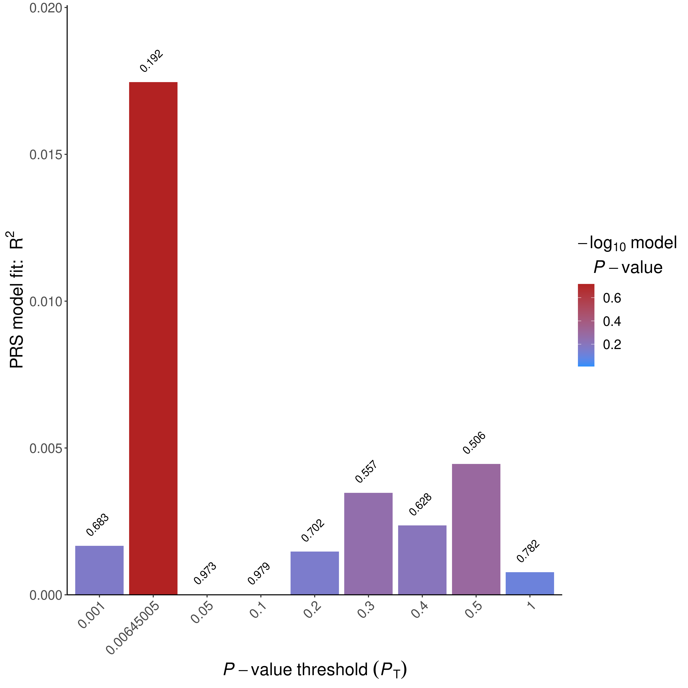
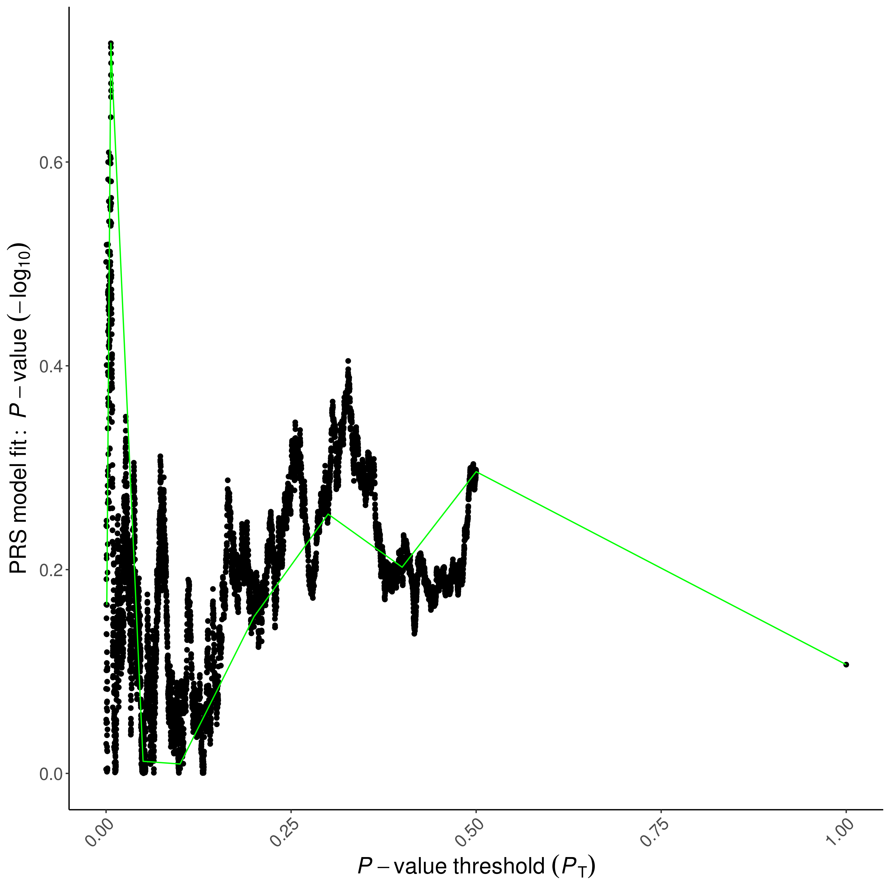
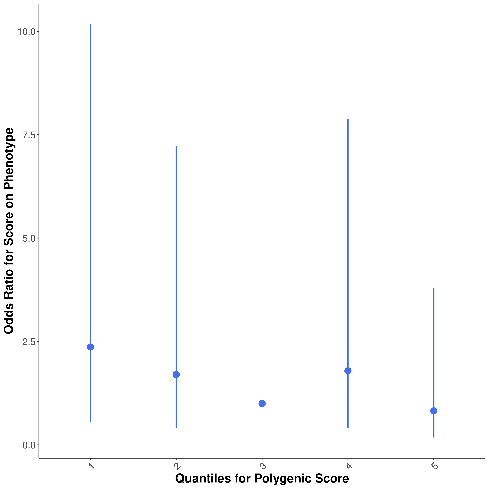
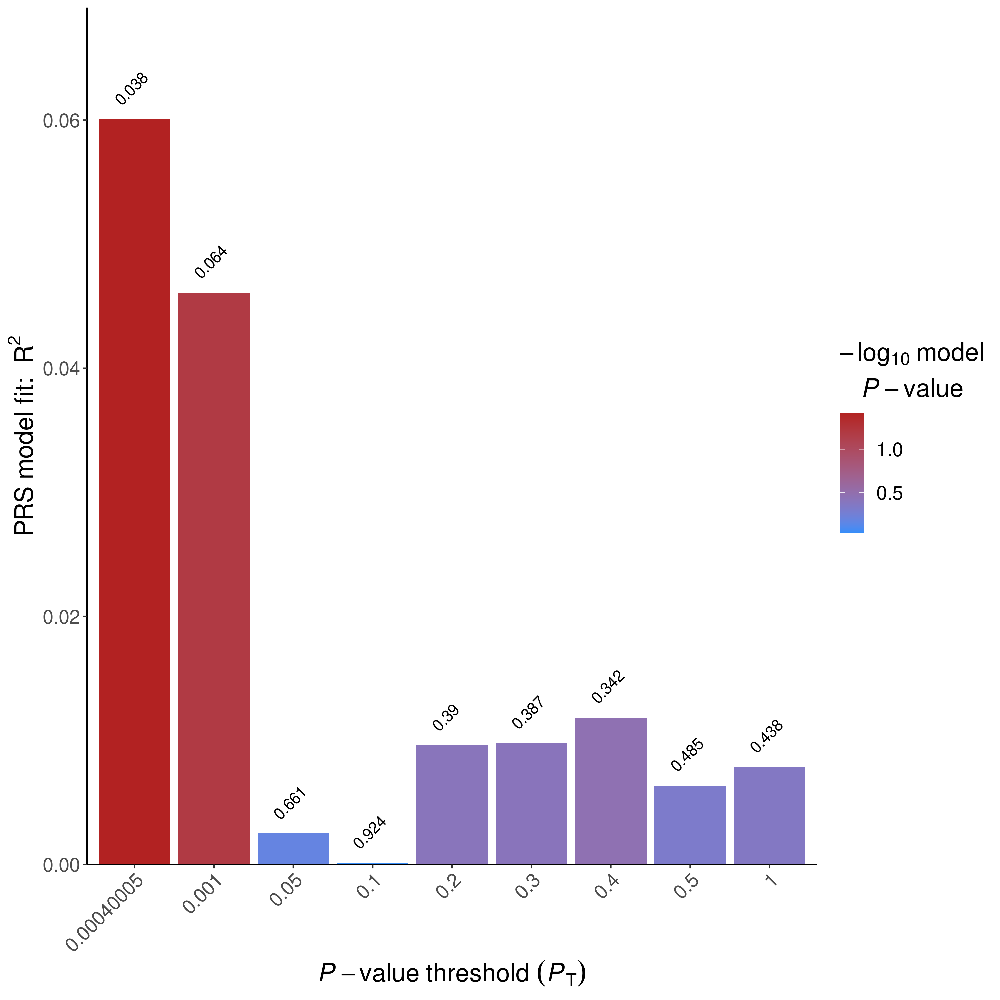
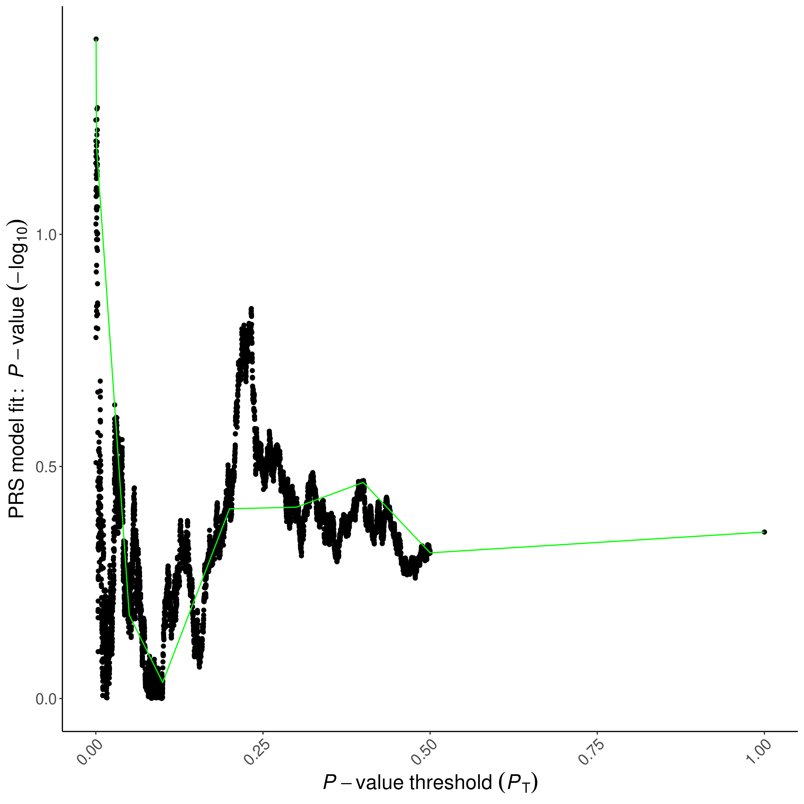
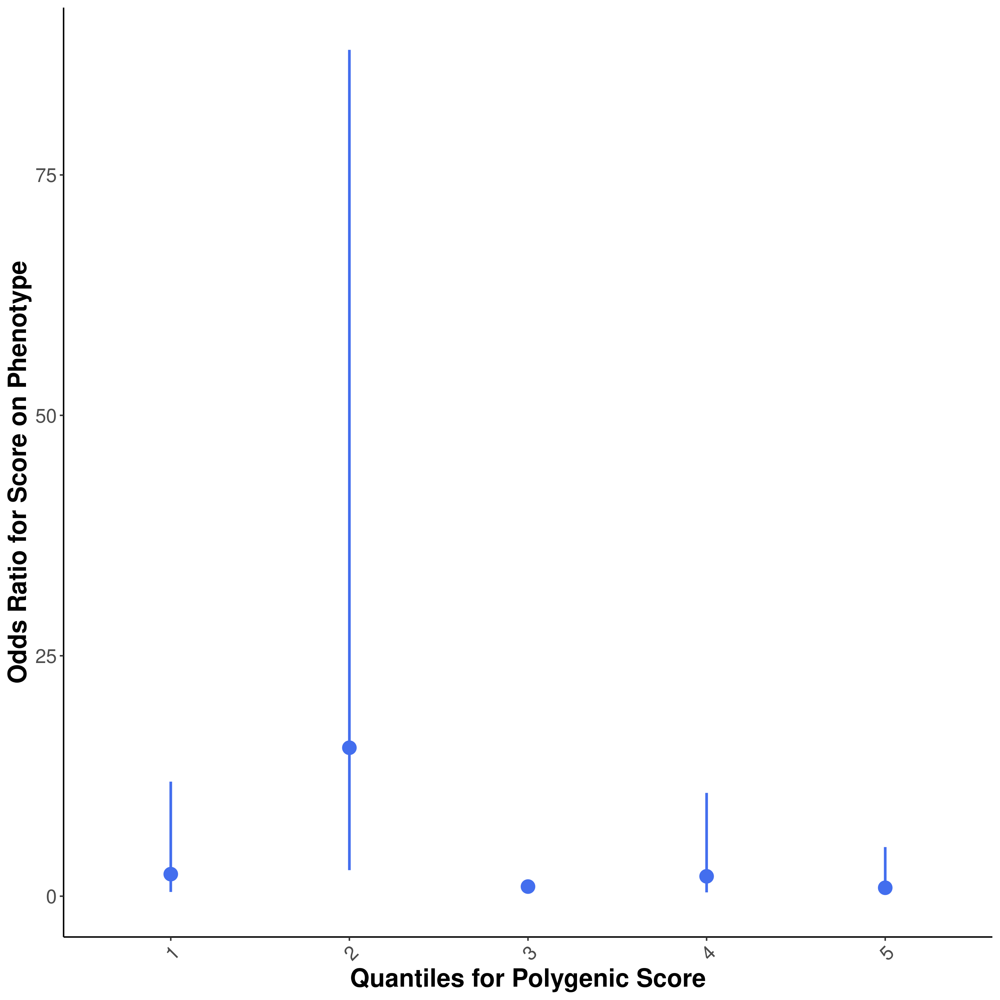

```{r setup, include=FALSE}
library(tidyverse)
library(ggrepel)
library(data.table)
library(knitr)
library(limma)
library(foreach)
library(doParallel)
library(RSpectra)
knitr::opts_chunk$set(echo = TRUE)
```
# Step 0: Prepare covariates and input files
```{r}
IDs <- fread("~/genotype_qc/TERRE_QC/all_imputed_r2_30_rsid_hard_call.fam")[, .(FID = V1, IID = V2)]
prsice_cov <- fread("prsice_cov_and_status_mvalues.txt")
prsice_cov <- prsice_cov[match(IDs$IID,prsice_cov$IID)]
all(IDs$IID ==prsice_cov$IID)
covariate <- cbind(IDs, prsice_cov[,-c(16,17,18)])

PD <- cbind(IDs,prsice_cov[,16])
head(covariate)
head(PD)
fwrite(PD[IID %in% covariate[sex == 1]$IID], "TERRE_male.pheno", sep = "\t")
fwrite(covariate[sex == 1] %>% select(-sex), "TERRE_male.covariate", sep = "\t")
fwrite(PD[IID %in% covariate[sex == 0]$IID], "TERRE_female.pheno", sep = "\t")
fwrite(covariate[sex == 0] %>% select(-sex), "TERRE_female.covariate", sep = "\t")
```
```{r}
covariate
```


# Step 1: Run PRSice-2 on Nalls et al 2019 Sumstats
```{bash,eval=FALSE}
Rscript /home1/NEURO/casazza/PRSice.R \
    --prsice /home1/NEURO/casazza/PRSice_linux\
    --base /home1/NEURO/casazza/Blauwendraat_male_female_GWAS/MALE_PD_filtered_sumstats_no_multi_allelics_RSID.QC.txt.gz\
    --base-info INFO:0.8 \
    --base-maf MAF:0.01 \
    --cov TERRE_male.covariate \
    --beta  \
    --binary-target T \
    --out TERRE_male_PRSice \
    -q 5\
    --all-score\
    --pheno TERRE_male.pheno \
    --snp SNP \
    --ld /home1/NEURO/casazza/1000G_plink/EUR_phase3\
    --stat b \
    --pvalue p\
    --target /home1/NEURO/casazza/genotype_qc/TERRE_QC/all_imputed_r2_30_rsid_hard_call_male \
    --thread 32
Rscript /home1/NEURO/casazza/PRSice.R \
    --prsice /home1/NEURO/casazza/PRSice_linux\
    --base /home1/NEURO/casazza/Blauwendraat_male_female_GWAS/FEMALE_PD_filtered_sumstats_no_multi_allelics_RSID.QC.txt.gz\
    --base-maf MAF:0.01 \
    --cov TERRE_female.covariate \
    --beta  \
    --binary-target T \
    --out TERRE_female_PRSice \
    -q 5\
    --all-score\
    --pheno TERRE_female.pheno \
    --snp SNP \
    --ld /home1/NEURO/casazza/1000G_plink/EUR_phase3\
    --stat b \
    --pvalue p\
    --target /home1/NEURO/casazza/genotype_qc/TERRE_QC/all_imputed_r2_30_rsid_hard_call_female \
    --thread 32
```
# Step 2: Evaluate output
```{r, out.width="400px"}






```
## Plotting PRSice Data on my own
```{r}
library(ggnewscale)
prsice_male_meta <- fread("prsice_male_data/TERRE_male_PRSice.prsice")
ggplot(prsice_male_meta[Threshold <= 0.5], aes(Threshold, Num_SNP, color = -log10(P))) +
  geom_point() +
  scale_y_continuous(breaks = c(seq(0, 1e5, 2.5e4), seq(2e5, 6e5, 1e5))) +
  theme_minimal()+
  theme(legend.position = "top")

prsice_female_meta <- fread("prsice_female_data/TERRE_female_PRSice.prsice")
ggplot(prsice_female_meta[Threshold <= 0.5], aes(Threshold, Num_SNP, color = -log10(P))) +
  geom_point() +
  scale_y_continuous(breaks = c(seq(0, 1e5, 2.5e4), seq(2e5, 6e5, 1e5))) +
  theme_minimal()+
  theme(legend.position = "top")

prsice_meta <- fread("prsice_data/TERRE_PRSice.prsice")
ggplot(mapping=aes(Threshold, R2, color = -log10(P))) +
  geom_point(data=prsice_female_meta,size = 1) +
  scale_color_gradient(low="lightpink4",high="lightpink")+
  labs(color= bquote("Female -log"["10"] ~ "(P)"))+
  new_scale_color() +
  geom_point(data=prsice_male_meta,size = 1,aes(color = -log10(P))) +
  scale_color_gradient(low="lightblue4",high="lightblue")+
  labs(y = bquote("R"^2), x = "GWAS P-Value Threshold", color = bquote("Male -log"["10"] ~ "(P)")) +
  theme_minimal()+
  theme(legend.position = "top")
ggplot(mapping=aes(Threshold, R2, color = -log10(P))) +
  geom_point(data=prsice_female_meta,size = 1) +
  scale_color_gradient(low="lightpink4",high="lightpink",guide=guide_colorbar(order=3))+
  labs(color = bquote("Female -log"["10"] ~ "(P)")) +
  new_scale_color() +
  geom_point(data=prsice_meta,size = 1,aes(color = -log10(P))) +
  scale_color_gradient(low="gray40",high="gray80",guide=guide_colorbar(order=1))+
  labs(color = bquote("Cross-sex -log"["10"] ~ "(P)")) +
  new_scale_color() +
  geom_point(data=prsice_male_meta,size = 1,aes(color = -log10(P))) +
  scale_color_gradient(low="lightblue4",high="lightblue",guide=guide_colorbar(order=2))+
  labs(y = bquote("R"^2), x = "GWAS P-Value Threshold", color = bquote("Male -log"["10"] ~ "(P)")) +
  theme_minimal()+
  theme(legend.position = "top",legend.title = element_text(size=7))

```
## Overlap in SNPs for optimal PRS
```{r}
# Get SNPs
male <- fread("/home1/NEURO/casazza/Blauwendraat_male_female_GWAS/MALE_PD_filtered_sumstats_no_multi_allelics_RSID.QC.txt.gz")
female <- fread("/home1/NEURO/casazza/Blauwendraat_male_female_GWAS/FEMALE_PD_filtered_sumstats_no_multi_allelics_RSID.QC.txt.gz")
all_sex <- fread("/home1/NEURO/casazza/nalls_PD.QC.gz")
```
```{r}
library(qqman)
library(hudson)
all_sex[,`:=`(BP=POS,P=p)]
male[,`:=`(P=p)]
female[,`:=`(P=p)]
manhattan(all_sex,suggestiveline = FALSE)
manhattan(male,col=c("lightblue4","lightblue"),suggestiveline = FALSE)
manhattan(female,col=c("lightpink4","lightpink"),suggestiveline = FALSE)
```

Plotting this
```{r}
male <- male[p < 0.00645005 & MAF > 0.01]
female <- female[p < 0.00040005 & MAF > 0.01]
all_sex <- all_sex[p < 0.00030005 & MAF > 0.01]
display_venn <- function(x, ...) {
  library(VennDiagram)
  grid.newpage()
  venn_object <- venn.diagram(x, filename = NULL, ...)
  grid.draw(venn_object)
}
display_venn(
  list(
    `Cross-sex` = all_sex$SNP,
    Male = male$SNP,
    Female = female$SNP
  ),
  fill = c("gray80", "lightblue", "lightpink")
)
```

# Step 3 run linear model at different thresholds for SNP inclusion
```{r}
load("/home1/NEURO/SHARE_DECIPHER/processed_DNAm_data/2022/TERRE_processed_2022/1-TERRE_RG_filtered.RData") #
# Assign genotyping ID to data
betas_combat <- minfi::getBeta(PD_RG_filtered)
original_covars <- fread("/home1/NEURO/SHARE_DECIPHER/terre_meta_master.csv")[, .(patient, IID = gsub("_PAE.*", "", IID))]
betas_combat <- betas_combat[, colnames(betas_combat) %in% original_covars$patient]
colnames(betas_combat) <- original_covars$IID[match(colnames(betas_combat), original_covars$patient)]
betas_combat <- betas_combat[, colnames(betas_combat) %in% covariate$IID]
```
Let's check how the data looks for the first 5 subjects:
```{r}
ggplot(betas_combat[, 1:5] %>% as.data.table(keep.rownames = T) %>% melt(id.vars = "rn", value.name = "betas", variable.name = "subject"), aes(betas, color = subject)) +
  geom_density()
```

### Match DNA, PRS, and metadata
```{r}
covariate_male <- covariate[sex == 1] %>% select(-sex)
betas_male <- betas_combat[,covariate_male$IID]
prsice_male_all <- fread("prsice_male_data/TERRE_male_PRSice.all_score")[match(colnames(betas_male), IID), .(FID, IID, `Pt_0.00675005`, `Pt_5e-08`, `Pt_5.005e-05`, `Pt_0.00010005`, `Pt_0.00100005`, `Pt_0.0101501`, `Pt_0.1`, `Pt_0.2`, `Pt_0.3`, `Pt_0.4`, `Pt_0.5`, `Pt_1`)]
covariate_male <- covariate_male[match(colnames(betas_male), IID)]
all(covariate_male$IID == colnames(betas_male))
all(covariate_male$IID == prsice_male_all$IID)

covariate_female <- covariate[sex == 0] %>% select(-sex)
betas_female <- betas_combat[,covariate_female$IID]
prsice_female_all <- fread("prsice_female_data/TERRE_female_PRSice.all_score")[match(colnames(betas_female), IID), .(FID, IID, `Pt_0.00040005`, `Pt_5e-08`, `Pt_5.005e-05`, `Pt_0.00010005`, `Pt_0.00100005`, `Pt_0.0101501`, `Pt_0.1`, `Pt_0.2`, `Pt_0.3`, `Pt_0.4`, `Pt_0.5`, `Pt_1`)]
covariate_female <- covariate_female[match(colnames(betas_female), IID)]
all(covariate_female$IID == colnames(betas_female))
all(covariate_female$IID == prsice_female_all$IID)
```
### Run limma

```{r}
mvalues_male <- lumi::beta2m(betas_male)
prs_mat_male <- prsice_male_all[, -c(1, 2)]
cov_mat_male <- covariate_male[, -c(1, 2)]

mvalues_female <- lumi::beta2m(betas_female)
prs_mat_female <- prsice_female_all[, -c(1, 2)]
cov_mat_female <- covariate_female[, -c(1, 2)]
```

```{r}
registerDoParallel(ncol(prs_mat_male) / 2)
hits_male <- foreach(prs_thresh = colnames(prs_mat_male)) %dopar% {
  design_prs_male <- model.matrix(~., data = cbind(prs_mat_male[, ..prs_thresh], cov_mat_male))
  prs_fit_male <- lmFit(mvalues_male, design_prs_male)
  prs_fit_male <- eBayes(prs_fit_male)
  topTable(prs_fit_male, coef = 2, adjust.method = "BH", p.value = 0.25, number = Inf, genelist = rownames(mvalues_male))
}
names(hits_male) <- colnames(prs_mat_male)
hits_by_thresh_bonf_male <- rbindlist(hits_male, idcol = "threshold", fill = TRUE)

registerDoParallel(ncol(prs_mat_female) / 2)
hits_female <- foreach(prs_thresh = colnames(prs_mat_female)) %dopar% {
  design_prs_female <- model.matrix(~., data = cbind(prs_mat_female[, ..prs_thresh], cov_mat_female))
  prs_fit_female <- lmFit(mvalues_female, design_prs_female)
  prs_fit_female <- eBayes(prs_fit_female)
  topTable(prs_fit_female, coef = 2, adjust.method = "BH", p.value = 0.25, number = Inf, genelist = rownames(mvalues_female))
}
names(hits_female) <- colnames(prs_mat_female)
hits_by_thresh_bonf_female <- rbindlist(hits_female, idcol = "threshold", fill = TRUE)
```
```{r}
hits_by_thresh_bonf_male[, .(hits = .N), by = threshold]


hits_by_thresh_bonf_female[, .(hits = .N), by = threshold]

male_plot <- hits_by_thresh_bonf_male[, .(Sex= "Male",hits = .N), by = threshold]
female_plot <- hits_by_thresh_bonf_female[, .(Sex= "Female",hits = .N), by = threshold]
to_plot <- rbind(male_plot,female_plot) %>%
  mutate(threshold = recode_factor(threshold,
   `Pt_5e-08` = "5e-8",
   `Pt_5.005e-05` = "5e-5",
   `Pt_0.00010005` = "1e-4",
   `Pt_0.00100005` = "1e-3",#female best
   `Pt_0.00675005` = "6.8e-3", #male best
   `Pt_0.0101501` = "1e-2",
   `Pt_0.1` = "0.1",
   `Pt_0.2` = "0.2",
   `Pt_0.3` = "0.3",
   `Pt_0.4` = "0.4",
   `Pt_0.5` = "0.5",
   `Pt_1` = "1.0"))

ggplot(to_plot, aes(threshold, hits, label = hits,fill=Sex)) +
  geom_text(position=position_dodge2(width=0.9,preserve="single"),vjust = -0.25) +
  geom_col(position=position_dodge2(width=0.9,preserve="single")) +
  scale_fill_manual(values=c("Male"="lightblue","Female"="lightpink"))+
  labs(x = "GWAS P Value Threshold", y = "EWAS Hits") +
  theme_minimal() +
  theme(axis.text.x = element_text(angle=45,hjust=1,vjust=1))
```
```{r}
prs_thresh <- "Pt_5.005e-05"
design_prs_female <- model.matrix(~., data = cbind(prs_mat_female[, ..prs_thresh], cov_mat_female))
prs_fit_female <- lmFit(mvalues_female, design_prs_female)
prs_fit_female <- eBayes(prs_fit_female)
top_female_ewas <- data.table(topTable(prs_fit_female, coef = 2, adjust.method = "BH", number = Inf, genelist = rownames(mvalues_female)))

prs_thresh <- "Pt_0.00100005"
design_prs_male <- model.matrix(~., data = cbind(prs_mat_male[, ..prs_thresh], cov_mat_male))
prs_fit_male <- lmFit(mvalues_male, design_prs_male)
prs_fit_male <- eBayes(prs_fit_male)
top_male_ewas <- data.table(topTable(prs_fit_male, coef = 2, adjust.method = "BH", number = Inf, genelist = rownames(mvalues_male)))
save(list=c("top_male_ewas","top_female_ewas"),file="prs_blau_sex_stratified.RData")
```
```{r}
load("prs_blau_sex_stratified.RData")
library(IlluminaHumanMethylationEPICanno.ilm10b4.hg19)
annotation <- minfi::getAnnotation(IlluminaHumanMethylationEPICanno.ilm10b4.hg19)
annotation$chr <- factor(annotation$chr,levels=c(paste0("chr",1:22),"chrX","chrY"))
top_male_ewas <- top_male_ewas[order(annotation[ID,]$chr,annotation[ID,]$pos)]
top_female_ewas <- top_female_ewas[order(annotation[ID,]$chr,annotation[ID,]$pos)]
```

```{r}
display_venn <- function(x, ...) {
  library(VennDiagram)
  grid.newpage()
  venn_object <- venn.diagram(x, filename = NULL, ...)
  grid.draw(venn_object)
}

display_venn(list(`Cross-sex` = hits_by_thresh_bonf[threshold == "Pt_5e-08"]$ID, Male = hits_by_thresh_bonf_male[threshold == "Pt_0.00100005"]$ID, Female = hits_by_thresh_bonf_female[threshold == "Pt_5.005e-05"]$ID), fill = c("gray80", "lightblue", "lightpink"))
male_ids <- hits_by_thresh_bonf_male[threshold == "Pt_5e-08"]$ID
cross_ids <- hits_by_thresh_bonf[threshold == "Pt_5e-08"]$ID
male_ids[!male_ids %in% cross_ids]
```
```{r}
library(hudson)
options(ggrepel.max.overlaps = Inf)

gmirror(
  top=top_male_ewas[,.(
      SNP=ID,
      CHR= gsub("chr","",annotation[top_male_ewas$ID,]$chr),
      POS = annotation[top_male_ewas$ID,]$pos,
      pvalue=P.Value
    )],
  bottom=top_female_ewas[,.(
      SNP=ID,
      CHR= gsub("chr","",annotation[top_female_ewas$ID,]$chr),
      POS = annotation[top_female_ewas$ID,]$pos,
      pvalue=P.Value
    )],
  annotate_p = c(max(top_male_ewas[adj.P.Val<0.25]$P.Value)+1e-8,max(top_female_ewas[adj.P.Val<0.25]$P.Value)+1e-8),
  tline =  max(top_male_ewas[adj.P.Val<0.25]$P.Value),
  bline =  max(top_female_ewas[adj.P.Val<0.25]$P.Value),
  highlight_p = c(max(top_male_ewas[adj.P.Val<0.25]$P.Value)+1e-8,max(top_female_ewas[adj.P.Val<0.25]$P.Value)+1e-8),
  toptitle="Male",
  bottomtitle ="Female",
  highlighter="green",
  background="white"
)
```
```{r}
volcanoplot(prs_fit_male,coef=2,highlight = 3,names = rownames(mvalues_male))
volcanoplot(prs_fit_female,coef=2,highlight=24,names=rownames(mvalues_female))
```
