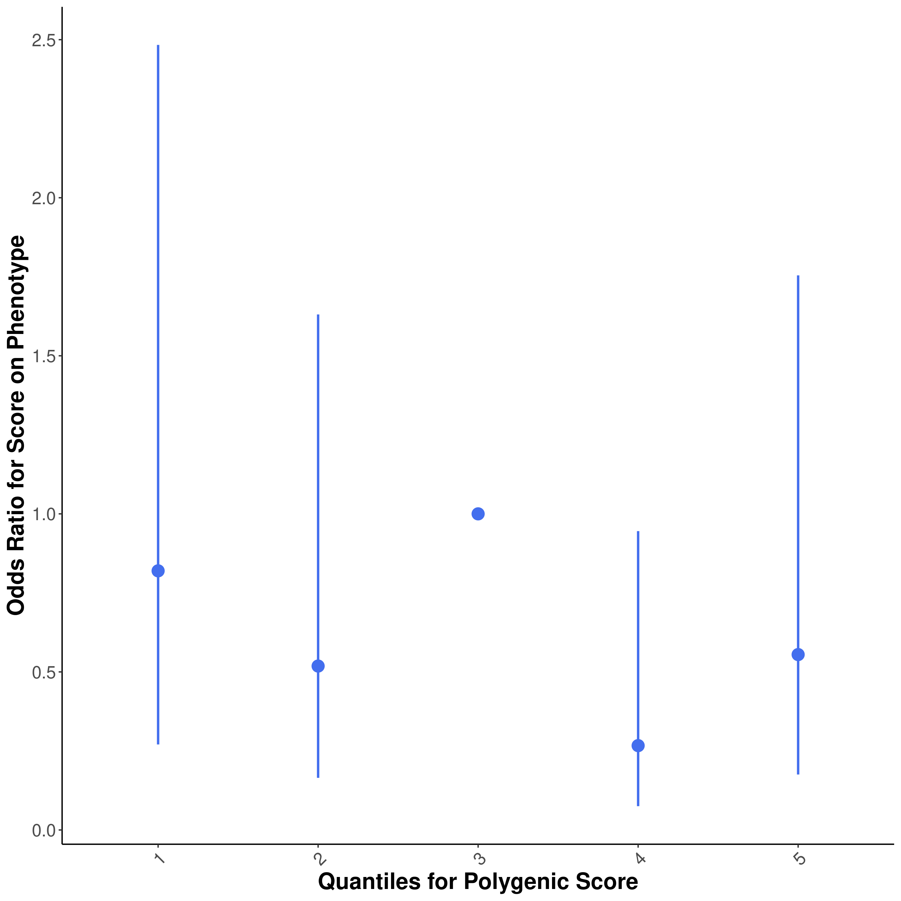

```{r setup, include=FALSE}
library(tidyverse)
library(ggrepel)
library(data.table)
library(knitr)
library(limma)
library(foreach)
library(doParallel)
library(RSpectra)
knitr::opts_chunk$set(echo = TRUE)
```
# Step 0: Prepare covariates and input files
```{r}
#@TODO change to compute PCs on mvalues
IDs <- fread("~/genotype_qc/TERRE_QC/all_imputed_r2_30_rsid_hard_call.fam")[, .(FID = V1, IID = V2)]
covariate <- fread("../cis_mQTL_analyses/terre_data/covariates_10_methy_PC.txt")[!grepl("head_trauma_loc|PC",id)]
covariate <- cbind(IDs, covariate %>% transpose(make.names = "id"))

PD <- fread("../cis_mQTL_analyses/terre_data/covariates_CTP_PD.txt")[id == "PD"]
PD <- cbind(IDs, PD %>% transpose(make.names = "id"))
covariate <- covariate[!duplicated(IID)]
PD <- PD[!duplicated(IID)]
head(covariate)
head(PD)
fwrite(PD[IID %in% covariate[men == 1]$IID], "TERRE_male.pheno", sep = "\t")
fwrite(covariate[men == 1] %>% select(-men), "TERRE_male.covariate", sep = "\t")
fwrite(PD[IID %in% covariate[men == 0]$IID], "TERRE_female.pheno", sep = "\t")
fwrite(covariate[men == 0] %>% select(-men), "TERRE_female.covariate", sep = "\t")
```
```{r}
covariate
```


# Step 1: Run PRSice-2 on Nalls et al 2019 Sumstats
```{bash,eval=FALSE}
Rscript /home1/NEURO/casazza/PRSice.R \
    --prsice /home1/NEURO/casazza/PRSice_linux\
    --base /home1/NEURO/casazza/Blauwendraat_male_female_GWAS/MALE_PD_filtered_sumstats_no_multi_allelics_RSID.QC.txt.gz\
    --base-info INFO:0.8 \
    --base-maf MAF:0.01 \
    --cov TERRE_male.covariate \
    --beta  \
    --binary-target T \
    --out TERRE_male_PRSice \
    -q 5\
    --all-score\
    --pheno TERRE_male.pheno \
    --snp SNP \
    --ld /home1/NEURO/casazza/1000G_plink/EUR_phase3\
    --stat b \
    --pvalue p\
    --target /home1/NEURO/casazza/genotype_qc/TERRE_QC/all_imputed_r2_30_rsid_hard_call_male \
    --thread 32
Rscript /home1/NEURO/casazza/PRSice.R \
    --prsice /home1/NEURO/casazza/PRSice_linux\
    --base /home1/NEURO/casazza/Blauwendraat_male_female_GWAS/FEMALE_PD_filtered_sumstats_no_multi_allelics_RSID.QC.txt.gz\
    --base-maf MAF:0.01 \
    --cov TERRE_female.covariate \
    --beta  \
    --binary-target T \
    --out TERRE_female_PRSice \
    -q 5\
    --all-score\
    --pheno TERRE_female.pheno \
    --snp SNP \
    --ld /home1/NEURO/casazza/1000G_plink/EUR_phase3\
    --stat b \
    --pvalue p\
    --target /home1/NEURO/casazza/genotype_qc/TERRE_QC/all_imputed_r2_30_rsid_hard_call_female \
    --thread 32
```
# Step 2: Evaluate output
```{r, out.width="400px"}





```
## Plotting PRSice Data on my own
```{r}
library(ggnewscale)
prsice_male_meta <- fread("prsice_male_data/TERRE_male_PRSice.prsice")
ggplot(prsice_male_meta[Threshold <= 0.5], aes(Threshold, Num_SNP, color = -log10(P))) +
  geom_point() +
  scale_y_continuous(breaks = c(seq(0, 1e5, 2.5e4), seq(2e5, 6e5, 1e5))) +
  theme_minimal()

prsice_female_meta <- fread("prsice_female_data/TERRE_female_PRSice.prsice")
ggplot(prsice_female_meta[Threshold <= 0.5], aes(Threshold, Num_SNP, color = -log10(P))) +
  geom_point() +
  scale_y_continuous(breaks = c(seq(0, 1e5, 2.5e4), seq(2e5, 6e5, 1e5))) +
  theme_minimal()

prsice_meta <- fread("prsice_data/TERRE_PRSice.prsice")
ggplot(mapping=aes(Threshold, R2, color = -log10(P))) +
  geom_point(data=prsice_female_meta,size = 1) +
  scale_color_gradient(low="darkred",high="pink")+
  new_scale_color() +
  geom_point(data=prsice_male_meta,size = 1,aes(color = -log10(P))) +
  scale_color_gradient(low="darkblue",high="lightblue2")+
  labs(y = bquote("R"^2), x = "GWAS P-Value Threshold", color = bquote("-log"["10"] ~ "(P)")) +
  theme_minimal()
ggplot(mapping=aes(Threshold, R2, color = -log10(P))) +
  geom_point(data=prsice_female_meta,size = 1) +
  scale_color_gradient(low="darkred",high="pink")+
  new_scale_color() +
  geom_point(data=prsice_male_meta,size = 1,aes(color = -log10(P))) +
  scale_color_gradient(low="darkblue",high="lightblue2")+
  new_scale_color() +
  geom_point(data=prsice_meta,size = 1,aes(color = -log10(P))) +
  labs(y = bquote("R"^2), x = "GWAS P-Value Threshold", color = bquote("-log"["10"] ~ "(P)")) +
  theme_minimal()
```

# Step 3 run linear model at different thresholds for SNP inclusion
```{r}
load("/home1/NEURO/SHARE_DECIPHER/processed_DNAm_data/TERRE_processed_2021/betas_combat.RData") # betas_sub
# Assign genotyping ID to data
original_covars <- fread("/home1/NEURO/SHARE_DECIPHER/terre_meta_master.csv")[, .(patient, IID = gsub("_PAE.*", "", IID))]
colnames(betas_combat) <- original_covars$IID[match(colnames(betas_combat), original_covars$patient)]
betas_combat <- betas_combat[, colnames(betas_combat) %in% covariate$IID]
```
Let's check how the data looks for the first 5 subjects:
```{r}
ggplot(betas_combat[, 1:5] %>% as.data.table(keep.rownames = T) %>% melt(id.vars = "rn", value.name = "betas", variable.name = "subject"), aes(betas, color = subject)) +
  geom_density()
```

### Match DNA, PRS, and metadata
```{r}
covariate_male <- covariate[men == 1] %>% select(-men)
betas_male <- betas_combat[,covariate_male$IID]
prsice_male_all <- fread("prsice_male_data/TERRE_male_PRSice.all_score")[match(colnames(betas_male), IID), .(FID, IID, `Pt_0.0219001`, `Pt_5e-08`, `Pt_5.005e-05`, `Pt_0.00010005`, `Pt_0.00100005`, `Pt_0.0101501`, `Pt_0.1`, `Pt_0.2`, `Pt_0.3`, `Pt_0.4`, `Pt_0.5`, `Pt_1`)]
covariate_male <- covariate_male[match(colnames(betas_male), IID)]
all(covariate_male$IID == colnames(betas_male))
all(covariate_male$IID == prsice_male_all$IID)

covariate_female <- covariate[men == 0] %>% select(-men)
betas_female <- betas_combat[,covariate_female$IID]
prsice_female_all <- fread("prsice_female_data/TERRE_female_PRSice.all_score")[match(colnames(betas_female), IID), .(FID, IID, `Pt_0.0219001`, `Pt_5e-08`, `Pt_5.005e-05`, `Pt_0.00010005`, `Pt_0.00100005`, `Pt_0.0101501`, `Pt_0.1`, `Pt_0.2`, `Pt_0.3`, `Pt_0.4`, `Pt_0.5`, `Pt_1`)]
covariate_female <- covariate_female[match(colnames(betas_female), IID)]
all(covariate_female$IID == colnames(betas_female))
all(covariate_female$IID == prsice_female_all$IID)
```
### Run limma

```{r}
mvalues_male <- lumi::beta2m(betas_male)
prs_mat_male <- prsice_male_all[, -c(1, 2)]
cov_mat_male <- covariate_male[, -c(1, 2)]

mvalues_female <- lumi::beta2m(betas_female)
prs_mat_female <- prsice_female_all[, -c(1, 2)]
cov_mat_female <- covariate_female[, -c(1, 2)]
```

```{r}
registerDoParallel(ncol(prs_mat_male) / 2)
hits_male <- foreach(prs_thresh = colnames(prs_mat_male)) %dopar% {
  design_prs_male <- model.matrix(~., data = cbind(prs_mat_male[, ..prs_thresh], cov_mat_male))
  prs_fit_male <- lmFit(mvalues_male, design_prs_male)
  prs_fit_male <- eBayes(prs_fit_male)
  topTable(prs_fit_male, coef = 2, adjust.method = "none", p.value = 0.05, number = Inf, genelist = rownames(mvalues_male))
}
names(hits_male) <- colnames(prs_mat_male)
hits_by_thresh_bonf_male <- rbindlist(hits_male, idcol = "threshold", fill = TRUE)

registerDoParallel(ncol(prs_mat_female) / 2)
hits_female <- foreach(prs_thresh = colnames(prs_mat_female)) %dopar% {
  design_prs_female <- model.matrix(~., data = cbind(prs_mat_female[, ..prs_thresh], cov_mat_female))
  prs_fit_female <- lmFit(mvalues_female, design_prs_female)
  prs_fit_female <- eBayes(prs_fit_female)
  topTable(prs_fit_female, coef = 2, adjust.method = "none", p.value = 0.05, number = Inf, genelist = rownames(mvalues_female))
}
names(hits_female) <- colnames(prs_mat_female)
hits_by_thresh_bonf_female <- rbindlist(hits_female, idcol = "threshold", fill = TRUE)
```
```{r}
hits_by_thresh_bonf_male[, .(hits = .N), by = threshold]
ggplot(hits_by_thresh_bonf_male[, .(hits = .N), by = threshold] %>% mutate(threshold = recode_factor(threshold, `Pt_0.0219001` = "0.0219", `Pt_5e-08` = "5e-8", `Pt_5.005e-05` = "5e-5", `Pt_0.00010005` = "1e-4", `Pt_0.00100005` = "1e-3", `Pt_0.0101501` = "1e-2", `Pt_0.1` = "0.1", `Pt_0.2` = "0.2", `Pt_0.3` = "0.3", `Pt_0.4` = "0.4", `Pt_0.5` = "0.5", `Pt_1` = "1.0")), aes(threshold, hits, label = hits)) +
  geom_text(vjust = -0.25) +
  geom_col() +
  labs(x = "GWAS P Value Threshold", y = "EWAS Hits") +
  theme_minimal()


hits_by_thresh_bonf_female[, .(hits = .N), by = threshold]
ggplot(hits_by_thresh_bonf_female[, .(hits = .N), by = threshold] %>% mutate(threshold = recode_factor(threshold, `Pt_0.0219001` = "0.0219", `Pt_5e-08` = "5e-8", `Pt_5.005e-05` = "5e-5", `Pt_0.00010005` = "1e-4", `Pt_0.00100005` = "1e-3", `Pt_0.0101501` = "1e-2", `Pt_0.1` = "0.1", `Pt_0.2` = "0.2", `Pt_0.3` = "0.3", `Pt_0.4` = "0.4", `Pt_0.5` = "0.5", `Pt_1` = "1.0")), aes(threshold, hits, label = hits)) +
  geom_text(vjust = -0.25) +
  geom_col() +
  labs(x = "GWAS P Value Threshold", y = "EWAS Hits") +
  theme_minimal()
```
