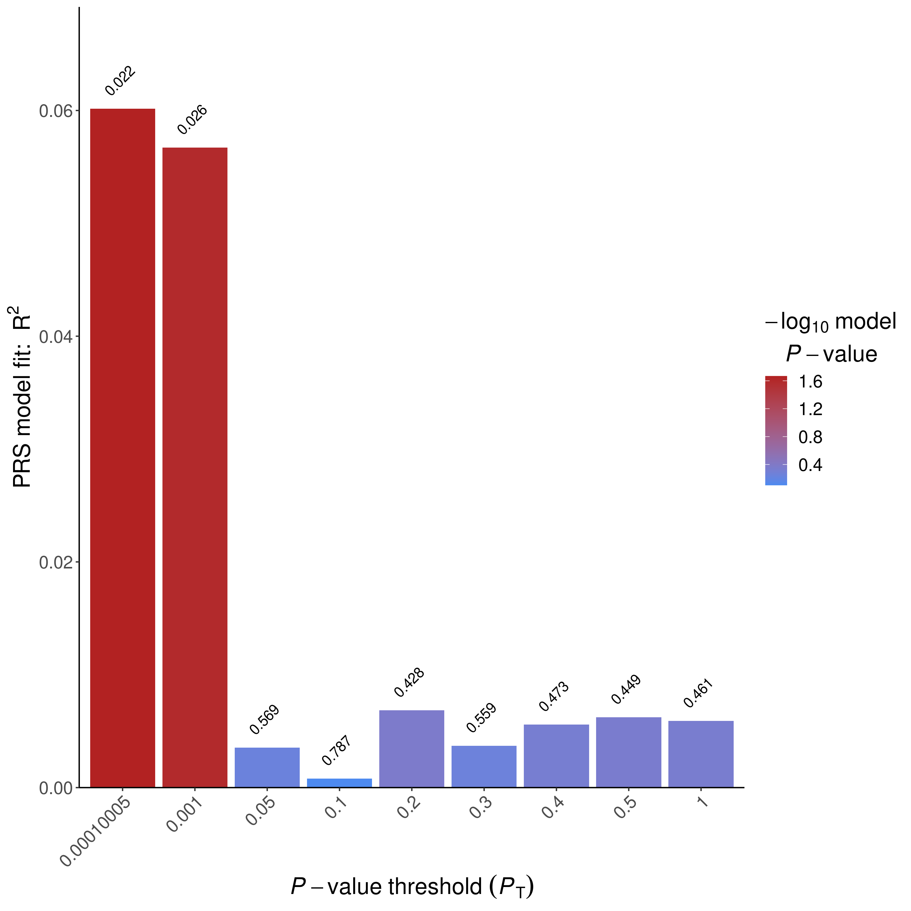

PRSice sex-stratified
================

# Step 0: Prepare covariates and input files

``` r
IDs <- fread("~/genotype_qc/TERRE_QC/all_imputed_r2_30_rsid_hard_call.fam")[, .(FID = V1, IID = V2)]
covariate <- fread("../cis_mQTL_analyses/terre_data/covariates_10_methy_PC.txt")[id != "head_trauma_loc"]
covariate <- cbind(IDs, covariate %>% transpose(make.names = "id"))

PD <- fread("../cis_mQTL_analyses/terre_data/covariates_CTP_PD.txt")[id == "PD"]
PD <- cbind(IDs, PD %>% transpose(make.names = "id"))
covariate <- covariate[!duplicated(IID)]
PD <- PD[!duplicated(IID)]
head(covariate)
```

    ##          FID       IID          PC1       PC2        PC3        PC4        PC5
    ## 1: PAE_015_1 PAE_015_1  -7.03264917  8.057218 -1.1892932   7.680491 -4.3100504
    ## 2: PAE_015_2 PAE_015_2  10.58721134  8.624483 -2.4599118  -0.673395  0.1088861
    ## 3: PAE_015_3 PAE_015_3   8.92736676  7.675730 -1.8317991   2.280433 -1.8181081
    ## 4: PAE_037_1 PAE_037_1  -0.06600985 -4.239611  0.4591169   2.324907 -6.0032639
    ## 5: PAE_037_2 PAE_037_2   2.24229994 -3.128131  6.2919567   6.159199  5.4985993
    ## 6: PAE_037_3 PAE_037_3 -21.97379292  4.993849 -5.0696918 -15.341385 -0.5031651
    ##           PC6       PC7        PC8        PC9        PC10          V3
    ## 1:  3.7019364 -1.705740  1.9124255 -0.5864368 -0.41608154 -0.04530380
    ## 2: -1.8585109 -1.320930 -1.0983885 -0.8055798  1.22520130 -0.07638310
    ## 3:  4.5074378 -2.019942  0.1664676  2.1014179 -2.13724595  0.00291674
    ## 4:  5.8307433  1.913521  1.1002500 -1.4405261 -0.10823954  0.02952700
    ## 5: -2.0491117 -2.030263 -2.0831077 -0.3149775 -0.19753391  0.02969210
    ## 6: -0.4946656 -2.511126 -2.3577727  2.2627508 -0.05729025  0.01579970
    ##             V4          V5      age men
    ## 1:  0.00875784 -0.00251219 56.22998   1
    ## 2:  0.01037420 -0.03894880 60.13689   1
    ## 3:  0.02180150  0.01303290 58.09446   1
    ## 4: -0.00408671  0.00811965 73.64271   0
    ## 5: -0.02416570 -0.02666510 75.90965   0
    ## 6:  0.04695520  0.05616860 75.84668   0

``` r
head(PD)
```

    ##          FID       IID PD
    ## 1: PAE_015_1 PAE_015_1  0
    ## 2: PAE_015_2 PAE_015_2  0
    ## 3: PAE_015_3 PAE_015_3  1
    ## 4: PAE_037_1 PAE_037_1  1
    ## 5: PAE_037_2 PAE_037_2  0
    ## 6: PAE_037_3 PAE_037_3  0

``` r
fwrite(PD[IID %in% covariate[men == 1]$IID], "TERRE_male.pheno", sep = "\t")
fwrite(covariate[men == 1] %>% select(-men), "TERRE_male.covariate", sep = "\t")
fwrite(PD[IID %in% covariate[men == 0]$IID], "TERRE_female.pheno", sep = "\t")
fwrite(covariate[men == 0] %>% select(-men), "TERRE_female.covariate", sep = "\t")
```

``` r
covariate
```

    ##            FID       IID          PC1        PC2        PC3        PC4
    ##   1: PAE_015_1 PAE_015_1  -7.03264917   8.057218 -1.1892932  7.6804906
    ##   2: PAE_015_2 PAE_015_2  10.58721134   8.624483 -2.4599118 -0.6733950
    ##   3: PAE_015_3 PAE_015_3   8.92736676   7.675730 -1.8317991  2.2804332
    ##   4: PAE_037_1 PAE_037_1  -0.06600985  -4.239611  0.4591169  2.3249073
    ##   5: PAE_037_2 PAE_037_2   2.24229994  -3.128131  6.2919567  6.1591991
    ##  ---
    ## 241: PAE_604_3 PAE_604_3  10.92477832   8.135720  5.4413797 -6.9671935
    ## 242: PAE_604_4 PAE_604_4   8.99908327   5.422101  5.4763081 -1.6292101
    ## 243: PAE_623_2 PAE_623_2 -11.56325217 -15.926213  4.5826028 -4.9899042
    ## 244: PAE_652_2 PAE_652_2  -7.20731283 -16.961343 -9.4614013 -5.3316739
    ## 245: PAE_652_3 PAE_652_3 -13.08511696 -18.737425  0.8786771 -0.8225876
    ##             PC5        PC6        PC7        PC8        PC9       PC10
    ##   1: -4.3100504  3.7019364 -1.7057397  1.9124255 -0.5864368 -0.4160815
    ##   2:  0.1088861 -1.8585109 -1.3209301 -1.0983885 -0.8055798  1.2252013
    ##   3: -1.8181081  4.5074378 -2.0199416  0.1664676  2.1014179 -2.1372460
    ##   4: -6.0032639  5.8307433  1.9135206  1.1002500 -1.4405261 -0.1082395
    ##   5:  5.4985993 -2.0491117 -2.0302626 -2.0831077 -0.3149775 -0.1975339
    ##  ---
    ## 241:  9.1301257  5.2281240 -0.2522033  1.5687913 -0.2783727  1.3299875
    ## 242: -5.5858751 -4.2163950  1.1466702 -0.2100942 -1.4269395 -0.5337795
    ## 243: -2.9969255 -0.9507375 -0.6454093  1.9120981  1.5514008  0.5228948
    ## 244:  2.0355945  1.6939029 -1.3403652 -0.3418679  0.6723842  0.2808460
    ## 245:  6.7523450 -4.6575242  1.1036263 -0.2747632 -3.7139110  1.3510379
    ##               V3          V4          V5      age men
    ##   1: -0.04530380  0.00875784 -0.00251219 56.22998   1
    ##   2: -0.07638310  0.01037420 -0.03894880 60.13689   1
    ##   3:  0.00291674  0.02180150  0.01303290 58.09446   1
    ##   4:  0.02952700 -0.00408671  0.00811965 73.64271   0
    ##   5:  0.02969210 -0.02416570 -0.02666510 75.90965   0
    ##  ---
    ## 241:  0.05126360 -0.02965190 -0.06904540 74.59548   1
    ## 242:  0.13972400 -0.11876200 -0.14161800 75.55921   1
    ## 243: -0.03615590 -0.02229510 -0.04420550 50.67214   0
    ## 244:  0.02219500 -0.02890760 -0.00347380 71.79192   0
    ## 245: -0.04783330 -0.01125360  0.01105620 69.76591   0

# Step 1: Run PRSice-2 on Nalls et al 2019 Sumstats

``` bash
Rscript /home1/NEURO/casazza/PRSice.R \
    --prsice /home1/NEURO/casazza/PRSice_linux\
    --base /home1/NEURO/casazza/Blauwendraat_male_female_GWAS/MALE_PD_filtered_sumstats_no_multi_allelics_RSID.QC.txt.gz\
    --base-info INFO:0.8 \
    --base-maf MAF:0.01 \
    --cov TERRE_male.covariate \
    --beta  \
    --binary-target T \
    --out TERRE_male_PRSice \
    -q 5\
    --all-score\
    --pheno TERRE_male.pheno \
    --snp SNP \
    --stat b \
    --pvalue p\
    --target /home1/NEURO/casazza/genotype_qc/TERRE_QC/all_imputed_r2_30_rsid_hard_call_male \
    --thread 32
Rscript /home1/NEURO/casazza/PRSice.R \
    --prsice /home1/NEURO/casazza/PRSice_linux\
    --base /home1/NEURO/casazza/Blauwendraat_male_female_GWAS/FEMALE_PD_filtered_sumstats_no_multi_allelics_RSID.QC.txt.gz\
    --base-maf MAF:0.01 \
    --cov TERRE_female.covariate \
    --beta  \
    --binary-target T \
    --out TERRE_female_PRSice \
    -q 5\
    --all-score\
    --pheno TERRE_female.pheno \
    --snp SNP \
    --stat b \
    --pvalue p\
    --target /home1/NEURO/casazza/genotype_qc/TERRE_QC/all_imputed_r2_30_rsid_hard_call_female \
    --thread 32
```

# Step 2: Evaluate output

``` r

```


``` r

```


``` r

```


``` r

```


``` r

```


``` r

```


\#\# Plotting PRSice Data on my own

``` r
library(ggnewscale)
prsice_male_meta <- fread("prsice_male_data/TERRE_male_PRSice.prsice")
ggplot(prsice_male_meta[Threshold <= 0.5], aes(Threshold, Num_SNP, color = -log10(P))) +
  geom_point() +
  scale_y_continuous(breaks = c(seq(0, 1e5, 2.5e4), seq(2e5, 6e5, 1e5))) +
  theme_minimal()
```

<!-- -->

``` r
prsice_female_meta <- fread("prsice_female_data/TERRE_female_PRSice.prsice")
ggplot(prsice_female_meta[Threshold <= 0.5], aes(Threshold, Num_SNP, color = -log10(P))) +
  geom_point() +
  scale_y_continuous(breaks = c(seq(0, 1e5, 2.5e4), seq(2e5, 6e5, 1e5))) +
  theme_minimal()
```

<!-- -->

``` r
prsice_meta <- fread("prsice_data/TERRE_PRSice.prsice")
ggplot(mapping=aes(Threshold, R2, color = -log10(P))) +
  geom_point(data=prsice_female_meta,size = 1) +
  scale_color_gradient(low="darkred",high="pink")+
  new_scale_color() +
  geom_point(data=prsice_male_meta,size = 1,aes(color = -log10(P))) +
  scale_color_gradient(low="darkblue",high="lightblue2")+
  labs(y = bquote("R"^2), x = "GWAS P-Value Threshold", color = bquote("-log"["10"] ~ "(P)")) +
  theme_minimal()
```

<!-- -->

``` r
ggplot(mapping=aes(Threshold, R2, color = -log10(P))) +
  geom_point(data=prsice_female_meta,size = 1) +
  scale_color_gradient(low="darkred",high="pink")+
  new_scale_color() +
  geom_point(data=prsice_male_meta,size = 1,aes(color = -log10(P))) +
  scale_color_gradient(low="darkblue",high="lightblue2")+
  new_scale_color() +
  geom_point(data=prsice_meta,size = 1,aes(color = -log10(P))) +
  labs(y = bquote("R"^2), x = "GWAS P-Value Threshold", color = bquote("-log"["10"] ~ "(P)")) +
  theme_minimal()
```

<!-- -->

# Step 3 run linear model at different thresholds for SNP inclusion

``` r
load("/home1/NEURO/SHARE_DECIPHER/processed_DNAm_data/TERRE_processed_2021/betas_combat.RData") # betas_sub
# Assign genotyping ID to data
original_covars <- fread("/home1/NEURO/SHARE_DECIPHER/terre_meta_master.csv")[, .(patient, IID = gsub("_PAE.*", "", IID))]
colnames(betas_combat) <- original_covars$IID[match(colnames(betas_combat), original_covars$patient)]
betas_combat <- betas_combat[, colnames(betas_combat) %in% covariate$IID]
```

Let’s check how the data looks for the first 5 subjects:

``` r
ggplot(betas_combat[, 1:5] %>% as.data.table(keep.rownames = T) %>% melt(id.vars = "rn", value.name = "betas", variable.name = "subject"), aes(betas, color = subject)) +
  geom_density()
```

<!-- -->

### Match DNA, PRS, and metadata

``` r
covariate_male <- covariate[men == 1] %>% select(-men)
betas_male <- betas_combat[,covariate_male$IID]
prsice_male_all <- fread("prsice_male_data/TERRE_male_PRSice.all_score")[match(colnames(betas_male), IID), .(FID, IID, `Pt_0.0219001`, `Pt_5e-08`, `Pt_5.005e-05`, `Pt_0.00010005`, `Pt_0.00100005`, `Pt_0.0101501`, `Pt_0.1`, `Pt_0.2`, `Pt_0.3`, `Pt_0.4`, `Pt_0.5`, `Pt_1`)]
covariate_male <- covariate_male[match(colnames(betas_male), IID)]
all(covariate_male$IID == colnames(betas_male))
```

    ## [1] TRUE

``` r
all(covariate_male$IID == prsice_male_all$IID)
```

    ## [1] TRUE

``` r
covariate_female <- covariate[men == 0] %>% select(-men)
betas_female <- betas_combat[,covariate_female$IID]
prsice_female_all <- fread("prsice_female_data/TERRE_female_PRSice.all_score")[match(colnames(betas_female), IID), .(FID, IID, `Pt_0.0219001`, `Pt_5e-08`, `Pt_5.005e-05`, `Pt_0.00010005`, `Pt_0.00100005`, `Pt_0.0101501`, `Pt_0.1`, `Pt_0.2`, `Pt_0.3`, `Pt_0.4`, `Pt_0.5`, `Pt_1`)]
covariate_female <- covariate_female[match(colnames(betas_female), IID)]
all(covariate_female$IID == colnames(betas_female))
```

    ## [1] TRUE

``` r
all(covariate_female$IID == prsice_female_all$IID)
```

    ## [1] TRUE

### Run limma

``` r
mvalues_male <- lumi::beta2m(betas_male)
```

    ## Setting options('download.file.method.GEOquery'='auto')

    ## Setting options('GEOquery.inmemory.gpl'=FALSE)

    ## No methods found in package 'RSQLite' for request: 'dbListFields' when loading 'lumi'

``` r
prs_mat_male <- prsice_male_all[, -c(1, 2)]
cov_mat_male <- covariate_male[, -c(1, 2)]

mvalues_female <- lumi::beta2m(betas_female)
prs_mat_female <- prsice_female_all[, -c(1, 2)]
cov_mat_female <- covariate_female[, -c(1, 2)]
```

``` r
registerDoParallel(ncol(prs_mat_male) / 2)
hits_male <- foreach(prs_thresh = colnames(prs_mat_male)) %dopar% {
  design_prs_male <- model.matrix(~., data = cbind(prs_mat_male[, ..prs_thresh], cov_mat_male))
  prs_fit_male <- lmFit(mvalues_male, design_prs_male)
  prs_fit_male <- eBayes(prs_fit_male)
  topTable(prs_fit_male, coef = 2, adjust.method = "none", p.value = 0.05, number = Inf, genelist = rownames(mvalues_male))
}
names(hits_male) <- colnames(prs_mat_male)
hits_by_thresh_bonf_male <- rbindlist(hits_male, idcol = "threshold", fill = TRUE)

registerDoParallel(ncol(prs_mat_female) / 2)
hits_female <- foreach(prs_thresh = colnames(prs_mat_female)) %dopar% {
  design_prs_female <- model.matrix(~., data = cbind(prs_mat_female[, ..prs_thresh], cov_mat_female))
  prs_fit_female <- lmFit(mvalues_female, design_prs_female)
  prs_fit_female <- eBayes(prs_fit_female)
  topTable(prs_fit_female, coef = 2, adjust.method = "none", p.value = 0.05, number = Inf, genelist = rownames(mvalues_female))
}
names(hits_female) <- colnames(prs_mat_female)
hits_by_thresh_bonf_female <- rbindlist(hits_female, idcol = "threshold", fill = TRUE)
```

``` r
hits_by_thresh_bonf_male[, .(hits = .N), by = threshold]
```

    ##         threshold  hits
    ##  1:  Pt_0.0219001 35432
    ##  2:      Pt_5e-08 45580
    ##  3:  Pt_5.005e-05 45890
    ##  4: Pt_0.00010005 43981
    ##  5: Pt_0.00100005 40236
    ##  6:  Pt_0.0101501 41364
    ##  7:        Pt_0.1 40736
    ##  8:        Pt_0.2 47544
    ##  9:        Pt_0.3 43671
    ## 10:        Pt_0.4 42038
    ## 11:        Pt_0.5 42222
    ## 12:          Pt_1 40896

``` r
ggplot(hits_by_thresh_bonf_male[, .(hits = .N), by = threshold] %>% mutate(threshold = recode_factor(threshold, `Pt_0.0219001` = "0.0219", `Pt_5e-08` = "5e-8", `Pt_5.005e-05` = "5e-5", `Pt_0.00010005` = "1e-4", `Pt_0.00100005` = "1e-3", `Pt_0.0101501` = "1e-2", `Pt_0.1` = "0.1", `Pt_0.2` = "0.2", `Pt_0.3` = "0.3", `Pt_0.4` = "0.4", `Pt_0.5` = "0.5", `Pt_1` = "1.0")), aes(threshold, hits, label = hits)) +
  geom_text(vjust = -0.25) +
  geom_col() +
  labs(x = "GWAS P Value Threshold", y = "EWAS Hits") +
  theme_minimal()
```

<!-- -->

``` r
hits_by_thresh_bonf_female[, .(hits = .N), by = threshold]
```

    ##         threshold  hits
    ##  1:  Pt_0.0219001 38715
    ##  2:      Pt_5e-08 44325
    ##  3:  Pt_5.005e-05 37452
    ##  4: Pt_0.00010005 31756
    ##  5: Pt_0.00100005 36757
    ##  6:  Pt_0.0101501 45535
    ##  7:        Pt_0.1 38261
    ##  8:        Pt_0.2 40866
    ##  9:        Pt_0.3 41042
    ## 10:        Pt_0.4 42015
    ## 11:        Pt_0.5 41569
    ## 12:          Pt_1 45641

``` r
ggplot(hits_by_thresh_bonf_female[, .(hits = .N), by = threshold] %>% mutate(threshold = recode_factor(threshold, `Pt_0.0219001` = "0.0219", `Pt_5e-08` = "5e-8", `Pt_5.005e-05` = "5e-5", `Pt_0.00010005` = "1e-4", `Pt_0.00100005` = "1e-3", `Pt_0.0101501` = "1e-2", `Pt_0.1` = "0.1", `Pt_0.2` = "0.2", `Pt_0.3` = "0.3", `Pt_0.4` = "0.4", `Pt_0.5` = "0.5", `Pt_1` = "1.0")), aes(threshold, hits, label = hits)) +
  geom_text(vjust = -0.25) +
  geom_col() +
  labs(x = "GWAS P Value Threshold", y = "EWAS Hits") +
  theme_minimal()
```

<!-- -->
